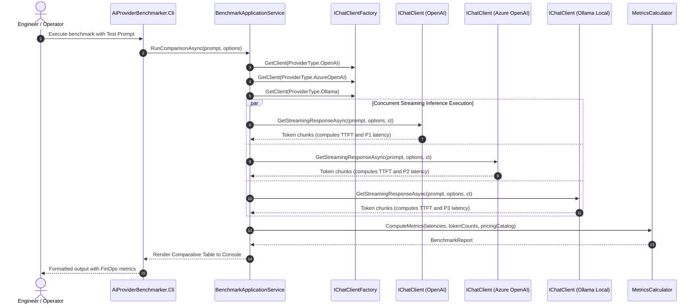

# Module 01: Connectivity Fundamentals and Unified Abstraction with `Microsoft.Extensions.AI` — Study Guide and Engineering Specification

> **Status:** Official Study & Architecture Specification  
> **.NET Version:** .NET 10 (LTS)  
> **Language:** C# 14  
> **Core Package:** `Microsoft.Extensions.AI.Abstractions` / `Microsoft.Extensions.AI`  
> **Associated Capstone Project:** `src/Module01/AiProviderBenchmarker/` (`AiProviderBenchmarker.Cli`)  
> **Complementary Didactic Project:** `src/Module01/SimpleChatDemo/` (`SimpleChatDemo`)

---

## 1. Overview and Learning Goals

### 1.1 The Real-World Market Challenge
Historically, software systems consuming large language models have suffered from severe **Vendor Lock-in**. Developers directly coupled application code to proprietary vendor SDKs (e.g., OpenAI SDK, Anthropic proprietary library, or Google Cloud SDK).

When an enterprise needs to:
1. Switch models to cut operational costs (FinOps);
2. Implement dynamic failover when a cloud region or provider datacenter experiences downtime;
3. Empirically benchmark latency, response quality, and cost across multiple AI suppliers;

Engineering teams find themselves forced to refactor dozens of business classes, convert incompatible DTOs, and rewrite token streaming pipelines.

The unified **`Microsoft.Extensions.AI` (MEAI)** library, consolidated in .NET 10 LTS, resolves this challenge at the infrastructure layer by establishing the industry-standard interface **`IChatClient`**, serving the same architectural role that `ILogger` and `IHttpClientFactory` serve for logging and HTTP communication in the .NET ecosystem.

### 1.2 Skills Acquired Upon Completing this Module
- Master the lifecycle, methods, and mechanics of the `IChatClient` interface.
- Configure and instantiate heterogeneous providers (OpenAI, Azure OpenAI, Ollama, Anthropic) behind a single unified abstraction.
- Understand the complete anatomy of `ChatOptions` and the statistical and financial impact of sampling hyperparameters (`Temperature`, `TopP`, `TopK`, `MaxTokens`, `Seed`).
- Consume model responses via asynchronous streaming (`IAsyncEnumerable<StreamingChatCompletionUpdate>`) with near-zero Garbage Collector (GC) allocations.
- Empirically calculate core AI engineering metrics: **TTFT (Time To First Token)**, **TPS (Tokens Per Second)**, **Total Latency**, and **Cost Per Request**.
- Model a Clean Architecture solution applying Factory, Strategy, and SOLID principles to AI model consumption.

---

## 2. In-Depth Theoretical Foundations

### 2.1 The Architecture of `Microsoft.Extensions.AI` (MEAI)
MEAI is conceptually structured into two core packages:
1. **`Microsoft.Extensions.AI.Abstractions`**: Contains pure interfaces, DTOs, and foundational abstractions (`IChatClient`, `ChatMessage`, `ChatResponse`, `ChatOptions`, `IEmbeddingGenerator`). It has no heavy transitive dependencies, enabling core domain libraries to depend solely on this package.
2. **`Microsoft.Extensions.AI`**: Implements the compositional pipeline via `ChatClientBuilder`, delegating middlewares (`DelegatingChatClient`), distributed caching, rate limiting, and native instrumentation with OpenTelemetry.

```text
+-------------------------------------------------------------------------------+
|                         YOUR DOMAIN / USE CASE                                |
|                                   │                                           |
|                                   ▼  Consumes                                 |
|                         [ IChatClient ]                                       |
+───────────────────────────────────┼───────────────────────────────────────────+
                                    │ Implemented by / Adapted to
                                    ▼
       ┌────────────────────────────┼───────────────────────────┐
       ▼                            ▼                           ▼
[ OpenAIClientAdapter ]    [ AzureOpenAIAdapter ]     [ OllamaChatClient ]
       │                            │                           │
       ▼                            ▼                           ▼
 OpenAI API (Cloud)        Azure AI Foundry (Cloud)     Ollama Runtime (Local)
```

### 2.2 Anatomy of the `IChatClient` Contract
The interface defines two foundational methods for conversational generation:

```csharp
public interface IChatClient : IDisposable
{
    // Monolithic Execution (Buffered): Awaits full response synthesis
    Task<ChatResponse> GetResponseAsync(
        IEnumerable<ChatMessage> chatMessages,
        ChatOptions? options = null,
        CancellationToken cancellationToken = default);

    // Streaming Execution (Reactive): Yields chunks as tokens are generated
    IAsyncEnumerable<StreamingChatCompletionUpdate> GetStreamingResponseAsync(
        IEnumerable<ChatMessage> chatMessages,
        ChatOptions? options = null,
        CancellationToken cancellationToken = default);

    // Returns underlying services or capability metadata
    object? GetService(Type serviceType, object? serviceKey = null);
}
```

### 2.3 Inference Parameters and Hyperparameters in `ChatOptions`
Every inference call dispatched to an LLM can be modulated to control determinism, creativity, and cost:

| Parameter | Type | Technical Behavior and Architectural Impact |
| :--- | :--- | :--- |
| **`Temperature`** | `float?` (0.0 to 2.0) | Controls the entropy of the logit probability distribution. Values near `0.0` make sampling almost greedy (deterministic, prioritizing highest-probability tokens). High values (> `0.8`) increase randomness and token diversity. |
| **`TopP` (Nucleus Sampling)** | `float?` (0.0 to 1.0) | Filters candidate tokens whose cumulative probability reaches threshold $P$. E.g., `0.9` discards the 10% most improbable tokens from the long tail. Engineering rule of thumb: adjust `Temperature` **OR** `TopP`, rarely both concurrently. |
| **`TopK`** | `int?` | Restricts sampling strictly to the $K$ most likely tokens in the vocabulary (commonly supported in Anthropic and Gemini models). |
| **`MaxOutputTokens`** | `int?` | Absolute ceiling of tokens the model is permitted to generate before stopping with `FinishReason.Length`. Protects against runaway generation loops and unexpected billing spikes. |
| **`StopSequences`** | `IList<string>` | List of sentinel strings. If the model generates any of these sequences, generation halts immediately. |
| **`Seed`** | `long?` | Pseudo-random seed to foster determinism and reproducibility in regression testing (supported by OpenAI and Azure OpenAI). |

### 2.4 Fundamental Metrics of LLM Performance and FinOps
When evaluating an inference provider, four quantitative metrics establish application SLA:

1. **TTFT (Time To First Token)**:
   $$TTFT = T_{\text{first\_token}} - T_{\text{request\_start}}$$
   - Measures prompt evaluation time (*prompt prefill*), network roundtrip, and queue latency at the provider. It is the primary driver of perceived responsiveness by human users.
2. **Total Latency ($T_{\text{total}}$)**:
   $$T_{\text{total}} = T_{\text{response\_end}} - T_{\text{request\_start}}$$
3. **Generation Throughput (TPS - Tokens Per Second)**:
   $$TPS = \frac{\text{Completion Tokens}}{T_{\text{total}} - TTFT}$$
   - Measures raw hardware decoding throughput on GPUs/NPUs, excluding initial connection and prefill latency.
4. **Inference Financial Cost**:
   $$\text{Total Cost} = \left(\frac{\text{PromptTokens}}{1000} \times \text{Price}_{\text{in}}\right) + \left(\frac{\text{CompletionTokens}}{1000} \times \text{Price}_{\text{out}}\right)$$

### 2.5 Internal Mechanics in .NET 10 Runtime: Concurrency and Allocation
- **Low-Allocation Streaming**: In .NET 10, using `IAsyncEnumerable<StreamingChatCompletionUpdate>` allows applications to process and render tokens via SSE (*Server-Sent Events*) without allocating a contiguous string buffer in managed heap memory (*Large Object Heap - LOH*).
- **Non-blocking Concurrency**: When benchmarking 3 providers, calls should never run sequentially. Utilize `Task.WhenAll` across multiple asynchronous channels, allowing the .NET `ThreadPool` to process streams cooperatively without thread contention.
- **Client Thread-Safety & Lifecycle**: Instances of `IChatClient` are thread-safe for concurrent invocations of `GetResponseAsync`, but instances of `ChatOptions` should **not** be shared across concurrent executions if properties are mutated.

### 2.6 Common Production Gotchas & Anti-Patterns
> [!WARNING]
> **Anti-Pattern 1: Blocking asynchronous calls with `.Result` or `.Wait()`.**  
> LLM calls are I/O intensive and prone to high latency spikes (from hundreds of milliseconds to several seconds). Blocking synchronous threads causes thread starvation under load. Always use `await`.

> [!WARNING]
> **Anti-Pattern 2: Failing to propagate the `CancellationToken`.**  
> If an end-user navigates away or disconnects an HTTP request and the token is not passed to `GetResponseAsync(..., ct)`, the LLM will continue generating tokens on the provider side and you will still be billed for them.

> [!WARNING]
> **Anti-Pattern 3: Hardcoding API keys in code or source repositories.**  
> Secrets must reside exclusively in environment variables, `.NET User Secrets` (in development), or Azure Key Vault (in production), adhering to Factor III of the Twelve-Factor App.

---

## 3. Architectural Principles and Patterns Mapping

### 3.1 Applied SOLID Principles

| Principle | Practical Application in Module 01 |
| :--- | :--- |
| **SRP (Single Responsibility)** | Distinct classes for: (1) Orchestrating comparative benchmarking (`BenchmarkRunner`); (2) Computing metrics and costs (`MetricsCalculator`); (3) Rendering terminal results (`ConsoleMetricsRenderer`). |
| **OCP (Open/Closed)** | The benchmark engine accepts any new AI provider implementing `IChatClient` without modifying existing execution code. |
| **LSP (Liskov Substitution)** | `OllamaChatClient`, `AzureOpenAIClient`, or `OpenAIChatClient` can be substituted freely under the `IChatClient` reference while preserving identical domain behavior. |
| **ISP (Interface Segregation)** | Application code depends strictly on `IChatClient` (for chat), avoiding coupling to `IEmbeddingGenerator` or monolithic vendor SDKs. |
| **DIP (Dependency Inversion)** | High-level use cases depend on the `IChatClient` abstraction and an `IChatClientFactory`, resolved via .NET's native Dependency Injection container. |

### 3.2 Design Patterns
- **Factory Pattern (`IChatClientFactory`)**: Encapsulates client instantiation logic from environment configuration and vendor-specific parameters.
- **Strategy Pattern (`ICostCalculationStrategy`)**: Decoupled pricing calculation strategies based on model and provider catalogs.

### 3.3 The Twelve-Factor App & Twelve-Factor Agent
- **Factor III (Config)**: Settings such as `API_KEY`, `ENDPOINT`, and `MODEL_ID` are read from environment variables with fallback to `appsettings.Development.json`.
- **Factor IV (Backing Services)**: AI providers are treated as attached backing resources, swappable without code modifications.
- **Twelve-Factor Agent - Factor 1 (Deterministic Logic vs Stochastic Model)**: Engineering metric computation (latency, cost, TPS) is 100% deterministic and auditable in C# code, while generated model output is treated as stochastic payload.

### 3.4 Architectural Diagram



---

## 4. Cognitive Learning Checkpoints

Before writing code for the Capstone Project, self-assess using these conceptual questions:

### Checkpoint 1: Difference Between `GetResponseAsync` and `GetStreamingResponseAsync`
**Question:** In which enterprise scenario is it mandatory to use `GetStreamingResponseAsync` instead of `GetResponseAsync`, and what memory pitfall must be avoided when rendering data in the UI?  
> **Technical Answer:** Streaming is mandatory in human-facing interfaces (chatbots, assistants) to minimize perceived latency: the user reads the first token in hundreds of milliseconds (low TTFT) rather than waiting dozens of seconds for full completion. The memory pitfall is repeatedly concatenating strings with the `+` operator in streaming loops, causing memory fragmentation in the Garbage Collector. The correct approach is to use character buffers (`ValueStringBuilder` / `StringBuilder`) or stream chunks directly to the HTTP output stream.

### Checkpoint 2: Nucleus Sampling (`TopP`) vs `Temperature`
**Question:** If your production model is generating overly creative or hallucinated answers in financial audit reports, which parameter should you prioritize adjusting and why?  
> **Technical Answer:** Lower `Temperature` to values near `0.0` (making generation greedy and focused on highest-likelihood tokens) and/or lock `TopP` at `0.1` to `0.2` (restricting candidate vocabulary to the top probability mass). Financial tasks demand low stochasticity.

### Checkpoint 3: Isolation and Swappability with `IChatClient`
**Question:** If your application uses `Microsoft.Extensions.AI`, what needs to be changed in domain and application layers if the enterprise migrates from direct OpenAI to private Azure OpenAI?  
> **Technical Answer:** Absolutely zero lines of domain or application code should change. Only the infrastructure DI composition layer (the `ConfigureServices` method or `IChatClientFactory`) switches client instantiation from `new OpenAIClient(...).AsChatClient(...)` to `new AzureOpenAIClient(...).AsChatClient(...)`. This proves strict adherence to the Liskov Substitution Principle (LSP) and Dependency Inversion Principle (DIP).

### Checkpoint 4: Resilience and Timeouts
**Question:** Why is relying solely on default `HttpClient` timeouts flawed when making calls to advanced reasoning models?  
> **Technical Answer:** Complex reasoning models (such as OpenAI o1 / o3 or DeepSeek R1) generate internal "reasoning tokens" before outputting visible tokens, which can exceed the default 100-second timeout of classical `HttpClient`. Timeouts must be explicitly configured per use case via `CancellationTokenSource.CancelAfter(TimeSpan)` and sized dynamically based on requested `MaxOutputTokens`.

### Checkpoint 5: Accurate Throughput (TPS) Calculation
**Question:** Why is the formula $TPS = \frac{\text{TotalTokens}}{\text{TotalLatency}}$ technically inaccurate for measuring GPU inference speed?  
> **Technical Answer:** Because total latency includes network transit and prompt ingestion (*prompt evaluation time / TTFT*). To measure raw output decoding speed of the GPU, TTFT must be subtracted from total time, evaluating only completion tokens: $TPS = \frac{\text{CompletionTokens}}{T_{\text{total}} - TTFT}$.

---

## 5. Recommended Reading & Microsoft Learn Grounding

Consult the official Microsoft technical documentation:

1. **Official Chat Abstraction in .NET**:
   - [IChatClient concepts in .NET](https://learn.microsoft.com/dotnet/ai/ichatclient)
   - [Microsoft.Extensions.AI.IChatClient API Reference](https://learn.microsoft.com/dotnet/api/microsoft.extensions.ai.ichatclient?view=net-11.0-pp)
2. **Inference Options and Parameters**:
   - [ChatOptions Class Reference](https://learn.microsoft.com/dotnet/api/microsoft.extensions.ai.chatoptions?view=net-11.0-pp)
   - [ChatMessage and ChatRole Definitions](https://learn.microsoft.com/dotnet/api/microsoft.extensions.ai.chatmessage?view=net-11.0-pp)
3. **Asynchronous Patterns in .NET**:
   - [IAsyncEnumerable and Asynchronous Streams in C#](https://learn.microsoft.com/dotnet/csharp/asynchronous-programming/generate-consume-asynchronous-stream)
   - [Dependency Injection in Modern .NET](https://learn.microsoft.com/dotnet/core/extensions/dependency-injection)

---

## 6. Capstone Project Technical Specification

### 6.1 Project Name and Purpose
- **Identifier:** `AiProviderBenchmarker.Cli`
- **Business Scenario:** The Engineering and FinOps team of a fintech needs to select the optimal AI model for their new customer service assistant. The application dispatches test prompts concurrently across three providers (e.g., OpenAI `gpt-4o-mini`, Azure OpenAI, and local Ollama `phi-4`), streaming tokens in real time and rendering an analytical table with SLA and cost metrics.

### 6.2 Functional Requirements (FRs)
- **FR-01 (Multiple Providers):** Support configuration for at least three heterogeneous providers (e.g., OpenAI, Azure OpenAI, and Ollama) behind the common `IChatClient` interface.
- **FR-02 (Unified Parameterization):** Allow setting shared `ChatOptions` across all providers (`Temperature`, `TopP`, `MaxOutputTokens`).
- **FR-03 (Parallel Execution):** Dispatch the same prompt across configured providers concurrently so that slow providers do not block metrics collection from faster ones.
- **FR-04 (Streaming and Measurement):** Capture token chunks via `GetStreamingResponseAsync`, recording the exact timestamp of the first chunk to compute TTFT.
- **FR-05 (FinOps Cost Estimation):** Compute estimated USD cost per inference based on reported prompt and completion token counts and pricing tables.
- **FR-06 (Comparative Reporting):** Render a formatted console table displaying: Provider/Model, TTFT (ms), Total Latency (s), Input Tokens, Output Tokens, TPS (Tokens/s), and Estimated Cost ($).

### 6.3 Non-Functional Requirements (NFRs)
- **NFR-01 (Target Platform):** .NET 10 (LTS) using C# 14.
- **NFR-02 (Clean Architecture):** Strict layer separation (Domain, Application, Infrastructure, Presentation).
- **NFR-03 (Key Security):** API keys must not be hardcoded in the repository; they must be read via environment variables or User Secrets.
- **NFR-04 (Graceful Cancellation):** Full cancellation support via `Ctrl+C` (`CancellationToken`) aborting pending HTTP requests.
- **NFR-05 (Testability):** Business and estimation services must be 100% testable via unit tests using `IChatClient` mocks.

### 6.4 Recommended Solution Directory Structure

```text
src/Module01/AiProviderBenchmarker/
├── AiProviderBenchmarker.slnx
├── src/
│   ├── AiProviderBenchmarker.Domain/              # Entities, Enums, Domain Interfaces
│   │   ├── Model/
│   │   │   ├── BenchmarkResult.cs
│   │   │   ├── ProviderMetric.cs
│   │   │   └── ProviderType.cs
│   │   └── Services/
│   │       └── ICostEstimator.cs
│   │
│   ├── AiProviderBenchmarker.Application/         # Use Cases, DTOs, Orchestration
│   │   ├── Common/
│   │   │   └── IChatClientFactory.cs
│   │   └── UseCases/
│   │       ├── RunBenchmarkCommand.cs
│   │       └── RunBenchmarkHandler.cs
│   │
│   ├── AiProviderBenchmarker.Infrastructure/      # Adapters and Client Implementations
│   │   ├── Configuration/
│   │   │   └── AiProvidersOptions.cs
│   │   ├── Factories/
│   │   │   └── ChatClientFactory.cs
│   │   └── Pricing/
│   │       └── ModelPricingCatalog.cs
│   │
│   └── AiProviderBenchmarker.Cli/                 # Console App, DI, Spectre.Console UI
│       ├── Program.cs
│       ├── appsettings.json
│       └── UI/
│           └── TableRenderer.cs
│
└── tests/
    └── AiProviderBenchmarker.Tests/               # xUnit Unit Tests
        ├── UseCases/
        │   └── RunBenchmarkHandlerTests.cs
        └── Pricing/
            └── CostEstimatorTests.cs
```

### 6.5 Interface and Entity Contracts (Domain & Application)

#### Approved Provider Enum
```csharp
namespace AiProviderBenchmarker.Domain.Model;

public enum ProviderType
{
    OpenAi,
    AzureOpenAi,
    Ollama,
    Anthropic
}
```

#### Provider Metric Result Record
```csharp
namespace AiProviderBenchmarker.Domain.Model;

public record ProviderMetric(
    ProviderType Provider,
    string ModelName,
    TimeSpan TimeToFirstToken,
    TimeSpan TotalDuration,
    int InputTokens,
    int OutputTokens,
    decimal EstimatedCostUsd,
    string GeneratedTextSnippet,
    bool Success,
    string? ErrorMessage = null)
{
    public double TokensPerSecond => 
        TotalDuration.TotalSeconds > TimeToFirstToken.TotalSeconds && OutputTokens > 0
            ? OutputTokens / (TotalDuration.TotalSeconds - TimeToFirstToken.TotalSeconds)
            : 0.0;
}
```

#### AI Client Factory Contract
```csharp
using Microsoft.Extensions.AI;
using AiProviderBenchmarker.Domain.Model;

namespace AiProviderBenchmarker.Application.Common;

public interface IChatClientFactory
{
    IChatClient CreateClient(ProviderType providerType);
    IEnumerable<ProviderType> GetConfiguredProviders();
}
```

#### Cost Estimator Contract (FinOps)
```csharp
using AiProviderBenchmarker.Domain.Model;

namespace AiProviderBenchmarker.Domain.Services;

public interface ICostEstimator
{
    decimal CalculateCost(ProviderType provider, string modelName, int inputTokens, int outputTokens);
}
```

#### Benchmark Use Case Contract
```csharp
using AiProviderBenchmarker.Domain.Model;
using Microsoft.Extensions.AI;

namespace AiProviderBenchmarker.Application.UseCases;

public record RunBenchmarkCommand(
    string Prompt,
    ChatOptions Options,
    IReadOnlyList<ProviderType> ProvidersToBenchmark);

public interface IRunBenchmarkUseCase
{
    Task<IReadOnlyList<ProviderMetric>> ExecuteAsync(
        RunBenchmarkCommand command, 
        IProgress<(ProviderType Provider, string Chunk)>? streamProgress = null,
        CancellationToken cancellationToken = default);
}
```

### 6.6 Definition of Done (DoD)
- [ ] Solution compiles cleanly in .NET 10 with `<Nullable>enable</Nullable>` and zero warnings or errors.
- [ ] Integrates at least three distinct providers (e.g., OpenAI, Azure OpenAI, and local Ollama) behind `IChatClient`.
- [ ] Concurrent execution verified without blocking serialized calls.
- [ ] TTFT, TPS, Latency, and Cost metrics computed per the formulas in Section 2.4.
- [ ] Cancellation via `CancellationToken` (Ctrl+C) cancels running requests gracefully without unhandled exceptions.
- [ ] Unit test suite covers happy paths, cost calculation, and error isolation (single provider failure does not crash the benchmark).

---

## 7. Step-by-Step Build Roadmap

Follow this roadmap to build the capstone project incrementally:

1. **Phase 1: Solution Initialization & Structure**
   - Create solution directory under `src/Module01/`:
     ```bash
     mkdir -p src/Module01/AiProviderBenchmarker
     cd src/Module01/AiProviderBenchmarker
     dotnet new sln -n AiProviderBenchmarker
     ```
   - Create class libraries and console app (`Domain`, `Application`, `Infrastructure`, `Cli`, `Tests`).
   - Install essential NuGet packages:
     - `Microsoft.Extensions.AI` and `Microsoft.Extensions.AI.Abstractions`
     - `Microsoft.Extensions.Hosting` and `Microsoft.Extensions.Configuration`
     - `Spectre.Console` (for terminal rendering)
     - `xUnit`, `FluentAssertions`, and `NSubstitute` in tests.

2. **Phase 2: Domain Layer & Costing Logic**
   - Implement records and enums (`ProviderType`, `ProviderMetric`).
   - Implement pricing catalog and `CostEstimator` with unit tests covering token pricing rules.

3. **Phase 3: Infrastructure Layer & Client Adapters**
   - Configure `AiProvidersOptions` bound to `appsettings.json` and environment variables.
   - Implement `ChatClientFactory` instantiating adapters for OpenAI, Azure, and Ollama (`OllamaChatClient`).

4. **Phase 4: Concurrent Execution Use Case**
   - Implement `RunBenchmarkHandler` with `Task.WhenAll`.
   - Implement timing wrapper:
     - Start `Stopwatch`.
     - Invoke `client.GetStreamingResponseAsync(...)`.
     - Capture arrival of first chunk to set `TimeToFirstToken`.
     - Iterate remaining chunks accumulating tokens and text.
     - Stop `Stopwatch` and compute metrics.

5. **Phase 5: Console Interface & Presentation**
   - Implement CLI with `Spectre.Console`.
   - Render live progress and output final table sorted by latency or cost.

6. **Phase 6: Testing, Execution, and Final Validation**
   - Run unit tests covering error isolation and metrics calculation:
     ```bash
     dotnet test src/Module01/AiProviderBenchmarker/AiProviderBenchmarker.slnx
     ```
   - Run interactive CLI:
     ```bash
     dotnet run --project src/Module01/AiProviderBenchmarker/src/AiProviderBenchmarker.Cli
     ```
   - Run CLI with specific providers and options:
     ```bash
     dotnet run --project src/Module01/AiProviderBenchmarker/src/AiProviderBenchmarker.Cli -- --providers Simulated,Ollama --max-tokens 200
     ```
   - Run the complementary didactic demo (`SimpleChatDemo`):
     ```bash
     dotnet run --project src/Module01/SimpleChatDemo
     ```
