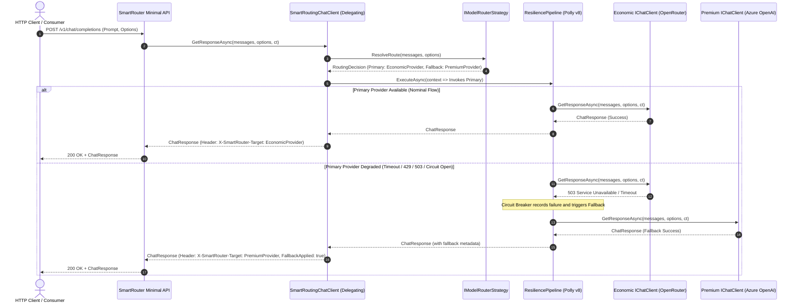

# Module 02: Unified Model Gateway, Dynamic Routing, and OpenRouter — Study Guide and Engineering Specification

> **Status:** Official Study & Architecture Specification  
> **.NET Version:** .NET 10 (LTS)  
> **Language:** C# 14  
> **Core Packages:** `Microsoft.Extensions.AI`, `Microsoft.Extensions.Resilience`, `Polly.Core`  
> **Associated Capstone Project:** `src/Module02/SmartRouter/` (`SmartRouter.Gateway`)

---

## 1. Overview and Learning Goals

### 1.1 The Real-World Market Challenge
In mission-critical enterprise environments, relying on a single Artificial Intelligence provider for all workloads represents a severe architectural flaw. Organizations simultaneously face three acute operational challenges:

1. **Instability and Availability Fluctuations (Downtime & Throttling)**: Leading cloud providers and AI startups frequently experience traffic spikes, unscheduled outages, and aggressive rate limits (*HTTP 429 Too Many Requests* and *HTTP 503 Service Unavailable*). If a critical application is tied to a single endpoint, business operations stall.
2. **Financial Inefficiency (Inadequate FinOps)**: Treating all queries identically — dispatching everything from simple classification prompts to deep financial balance-sheet evaluations to top-tier models (such as GPT-4o or Claude 3.5 Sonnet) — balloons operational costs. Low-complexity queries must be routed to high-throughput, low-cost models (such as Llama 3.3 70B, DeepSeek Chat, or GPT-4o-mini).
3. **Multi-Provider Integration Complexity**: Managing dozens of disparate HTTP clients, authentication flows, and vendor-specific payload schemas creates tightly coupled, redundant code that is expensive to maintain.

Modern software engineering addresses these challenges through an **Enterprise AI Gateway with Dynamic Routing and Semantic Resilience**. Combining unified model aggregators like **OpenRouter** with **`Microsoft.Extensions.AI` (MEAI)** abstractions and modern **Polly v8 (`Microsoft.Extensions.Resilience`)** policies allows developers to build an intelligent, transparent gateway: it evaluates incoming prompt complexity, routes requests to the most cost-effective tier, and, upon any SLA breach or infrastructure failure, imperceptibly fails over to high-availability contingency clouds (such as Azure OpenAI).

### 1.2 Skills Acquired Upon Completing this Module
- Master the **Decorator Pattern** within the .NET AI stack using the `DelegatingChatClient` base class and `ChatClientBuilder`.
- Integrate the open ecosystem of **OpenRouter** as an attached backing inference service using `IChatClient` contracts.
- Implement **Runtime Dynamic Model Routing** based on context token size, syntactic complexity, and latency bounds.
- Apply **Polly v8 / .NET Resilience Pipelines** at the semantic AI layer (`IChatClient`), configuring **Circuit Breakers**, **Timeouts**, and **Transparent Fallbacks**.
- Understand the architectural distinction between HTTP transport resilience and semantic AI resilience.
- Design and expose an enterprise **ASP.NET Core Minimal API (.NET 10)** acting as an AI reverse proxy with reactive SSE streaming (`text/event-stream`).
- Apply Clean Architecture and SOLID principles to enterprise AI gateways with decoupled observability and automated testability.

---

## 2. In-Depth Theoretical Foundations

### 2.1 Anatomy of the Compositional Pipeline: `DelegatingChatClient` and `ChatClientBuilder`

In `Microsoft.Extensions.AI`, behavioral composition mirrors the proven design of `HttpMessageHandler` in ASP.NET Core. Extensibility is rooted in two foundational abstractions:

```csharp
public abstract class DelegatingChatClient : IChatClient
{
    protected DelegatingChatClient(IChatClient innerClient)
    {
        InnerClient = innerClient ?? throw new ArgumentNullException(nameof(innerClient));
    }

    protected IChatClient InnerClient { get; }

    public virtual Task<ChatResponse> GetResponseAsync(
        IEnumerable<ChatMessage> chatMessages, 
        ChatOptions? options = null, 
        CancellationToken cancellationToken = default)
        => InnerClient.GetResponseAsync(chatMessages, options, cancellationToken);

    public virtual IAsyncEnumerable<StreamingChatCompletionUpdate> GetStreamingResponseAsync(
        IEnumerable<ChatMessage> chatMessages, 
        ChatOptions? options = null, 
        CancellationToken cancellationToken = default)
        => InnerClient.GetStreamingResponseAsync(chatMessages, options, cancellationToken);

    public virtual object? GetService(Type serviceType, object? serviceKey = null)
        => InnerClient.GetService(serviceType, serviceKey);

    public virtual void Dispose() => InnerClient.Dispose();
}
```

The `ChatClientBuilder` class enables chaining multiple decorators into a linear execution pipeline:

```csharp
IChatClient client = new ChatClientBuilder(baseChatClient)
    .UseLogging()
    .UseOpenTelemetry()
    .Use(inner => new SmartRoutingChatClient(inner, fallbackClient, routerStrategy))
    .Build();
```

Each stage in this pipeline can inspect `chatMessages`, mutate `ChatOptions` (e.g., swapping `ModelId`), measure latency, intercept exceptions, or short-circuit executions prior to network transit.

```text
[ Domain Request ]
        │
        ▼
┌───────────────────────────────┐
│ LoggingChatClient (Decorator) │ ── Logs invocation and payload
└──────────────┬────────────────┘
               │
               ▼
┌───────────────────────────────┐
│ SmartRoutingChatClient        │ ── Evaluates prompt and selects route:
│ (Custom DelegatingChatClient) │    - Primary: OpenRouter (DeepSeek / Llama)
└──────────────┬────────────────┘    - Fallback: Azure OpenAI (GPT-4o)
               │
      ┌────────┴────────┐
  (Success)         (Failure / Timeout / Circuit Open)
      ▼                 ▼
[ OpenRouter API ]  [ Azure OpenAI API ]
```

### 2.2 The OpenRouter Ecosystem as a Universal Aggregator

**OpenRouter** serves as a unified routing layer for both open-source and proprietary models. It standardizes the OpenAI REST API (`/v1/chat/completions`), exposing hundreds of models under a unified transport protocol.

#### Technical Particulars of OpenRouter
1. **Fully Qualified Model Identifiers**: Models follow the format `provider/model-name` (e.g., `deepseek/deepseek-chat`, `meta-llama/llama-3.3-70b-instruct`, `anthropic/claude-3.5-haiku`).
2. **Mandatory Governance Headers**:
   - `HTTP-Referer`: Identifies the consumer application URL for dashboard metrics.
   - `X-Title`: Human-readable application title displayed in corporate logs.
3. **Remote Dynamic Routing via `openrouter/auto`**: OpenRouter provides an auto-routing endpoint that picks the cheapest and fastest provider for a prompt. However, in enterprise systems engineering, deterministic local routing is preferred because it keeps governance, routing rules, and audit trails firmly under corporate control.

### 2.3 Resilience in .NET: Polly v8 vs Semantic AI Resilience

.NET 8, 9, and 10 integrate **Polly v8** through `Microsoft.Extensions.Resilience`. Polly's v8 engine was built from the ground up for **Zero Allocation** and **High Throughput**, centered on the unified `ResiliencePipeline` abstraction.

There is a fundamental architectural distinction every .NET AI Architect must understand:

| Dimension | Transport-Level Resilience (HTTP) | Semantic AI-Level Resilience (`IChatClient`) |
| :--- | :--- | :--- |
| **Execution Layer** | `HttpMessageHandler` / `IHttpClientFactory` | `DelegatingChatClient` or Application Use Case |
| **Action Scope** | Retries of the exact same HTTP payload to the exact same URL | Dynamic reconfiguration of model, parameters, and cloud credentials |
| **Domain Awareness** | Observes only raw status codes (e.g., 503, 429) and bytes | Inspects message history, token counts, and user intent |
| **Failover Capability** | Cannot switch providers cleanly without complex HttpClient hacks | Seamlessly switches from `deepseek/deepseek-chat` (OpenRouter) to `gpt-4o-mini` (Azure) natively |
| **Streaming Handling** | Difficult to recover cleanly if SSE stream breaks mid-transit | Can drop partial state and restart stream on backup client |

#### ResiliencePipeline Strategies for AI Gateways
1. **Circuit Breaker**: Halts requests to a provider failing repeatedly, preventing resource exhaustion and high end-user latency.
   - *Closed State*: Normal operations; all requests pass through.
   - *Open State*: Consecutive failure threshold exceeded; requests fail fast with `BrokenCircuitException`, immediately activating fallback.
   - *Half-Open State*: After a cooldown duration (*BreakDuration*), canary requests are dispatched to verify if the provider has recovered.
2. **Strategic Timeout**: Enforces an acceptable SLA threshold. Economic models via OpenRouter should respond rapidly; if SLA is exceeded, the call is canceled and the backup provider takes over.
3. **Fallback Strategy**: If primary execution throws a transient exception (`HttpRequestException`, `TimeoutRejectedException`, or `BrokenCircuitException`), the pipeline routes to a contingency delegate consuming the secondary `IChatClient`.

### 2.4 Dynamic Model Routing Patterns

A dynamic router evaluates deterministic heuristics before invoking a model. Core enterprise strategies include:

1. **Cost / Syntactic Complexity Routing**:
   - Computes total prompt character count or estimated token volume (`chatMessages`).
   - If total context is short (< 1,000 characters) without complex reasoning directives, routes to an economic model (e.g., `deepseek/deepseek-chat` or local Ollama).
   - If the prompt is long or complex, routes directly to the corporate flagship model (e.g., Azure OpenAI / OpenAI).
2. **System Directive Routing**:
   - Inspects `ChatRole.System` messages or request metadata (`ChatOptions.AdditionalProperties["route-tier"] = "premium"`) to force bypassing the economic tier.
3. **Health-Adaptive Routing**:
   - The gateway monitors a sliding window of provider average latency and failure rates. If average latency exceeds SLA over the last 60 seconds, priority requests preemptively route to the secondary provider.

### 2.5 Trade-offs, Advantages, and Production Pitfalls (*Gotchas & Anti-patterns*)

> [!WARNING]
> **Anti-Pattern 1: Aggressive Hedging with Duplicate Billing**  
> The *Hedging* pattern dispatches the same request to two providers concurrently, taking the fastest response and canceling the other. While common in HTTP services, in commercial LLMs **both providers will bill for prompt ingestion tokens** even if the connection is canceled immediately. In AI FinOps, **Timeout-based Fallback** is preferred over blind Hedging.

> [!WARNING]
> **Anti-Pattern 2: Partial Fallback Breaking SSE Streaming**  
> If an end-user client is reading an active `text/event-stream` and the primary provider drops after 10 tokens have been sent, seamlessly continuing from the second provider without duplicate text is non-trivial.  
> **Recommended Solution**: Buffer the initial tokens (e.g., wait for initial characters before flushing HTTP body) or implement a clean stream restart emitting a sentinel SSE event.

> [!WARNING]
> **Anti-Pattern 3: Omitting Full Model Identifiers in Aggregators**  
> Sending only `gpt-4o-mini` to OpenRouter may fail or resolve ambiguously because multiple data centers host variants of the same model. Always specify fully qualified canonical names (e.g., `openai/gpt-4o-mini` or `deepseek/deepseek-chat`).

---

## 3. Architectural Principles and Patterns Mapping

### 3.1 Applied SOLID Principles

| Principle | Practical Application in Module 02 |
| :--- | :--- |
| **SRP (Single Responsibility)** | Strict separation: (1) `SmartRoutingChatClient` manages delegation and fallback; (2) `IModelRouterStrategy` evaluates prompts and selects routes; (3) `IProviderHealthTracker` tracks availability and latency metrics; (4) Options classes handle configuration. |
| **OCP (Open/Closed)** | New routing heuristics (e.g., embedding-based semantic classification) are added by implementing new `IModelRouterStrategy` classes without altering `SmartRoutingChatClient`. |
| **LSP (Liskov Substitution)** | Both OpenRouter and Azure OpenAI clients, as well as the composite `SmartRoutingChatClient`, implement `IChatClient`. The presentation layer consumes `IChatClient` without knowing internal routing topologies. |
| **ISP (Interface Segregation)** | Focused interfaces: `IModelRouterStrategy` exposes only routing resolution; `IChatClient` handles conversation; contracts remain cleanly separated from telemetry. |
| **DIP (Dependency Inversion)** | The Minimal API and application use cases depend strictly on `IChatClient` registered in DI, isolating SDK implementations in the infrastructure layer. |

### 3.2 Design Patterns
1. **Decorator Pattern (`DelegatingChatClient`)**: Envelops concrete AI clients with intercepting behaviors (Dynamic Routing, Polly Resilience, Logging, and Telemetry).
2. **Strategy Pattern (`IModelRouterStrategy`)**: Route selection heuristics are decoupled from execution clients, allowing runtime configuration via `appsettings.json`.
3. **Circuit Breaker Pattern (Polly v8)**: Isolates provider outages, protecting backend resources from thread starvation and cascading failures.
4. **Fallback Pattern**: Guaranteed contingency execution engaging secondary providers when retries fail or circuits open.

### 3.3 The Twelve-Factor App & Twelve-Factor Agent
- **Factor III (Config)**: Gateway endpoints and provider API keys are bound via environment variables and configuration options (`SmartRouterOptions`).
- **Factor IV (Backing Services)**: OpenRouter and Azure OpenAI are treated as attached backing resources, swappable without code changes.
- **Factor IX (Disposability)**: Fast startup and graceful shutdown via cooperative cancellation tokens in ASP.NET Core and Polly pipelines.
- **Factor XI (Logs as Event Streams)**: Routing decisions (selected tier, fallback applied, circuit state transitions) are emitted as structured logs with correlation identifiers.
- **Twelve-Factor Agent - Factor 1 (Deterministic Logic vs Stochastic Model)**: Route selection, circuit breaker triggers, and fallback rules are 100% deterministic and auditable in C# code.
- **Twelve-Factor Agent - Factor 10 (Idempotency and Fault Tolerance)**: Transient failures are absorbed transparently with Correlation IDs for end-to-end traceability.

### 3.4 Architectural Diagram of Routing and Resilience



---

## 4. Cognitive Learning Checkpoints

Validate your conceptual understanding before writing code:

### Checkpoint 1: Resilience Level — HTTP Transport vs `IChatClient`
**Question:** Why is a standard retry policy on the `HttpClient` connecting to OpenRouter insufficient to solve an enterprise AI outage?  
> **Technical Answer:** An `HttpClient` retry repeats the exact same HTTP payload against the exact same endpoint. If a model on OpenRouter is out of capacity or an account quota is exhausted, HTTP retries will fail repeatedly, adding latency and failing the user. Semantic resilience at the `IChatClient` level intercepts failures and reroutes calls to an entirely different provider (e.g., Azure OpenAI), altering endpoints, credentials, and model schemas cleanly.

### Checkpoint 2: How `DelegatingChatClient` Handles Streaming
**Question:** When implementing a `DelegatingChatClient` to record invocation duration, what is a common pitfall in `GetStreamingResponseAsync`?  
> **Technical Answer:** Wrapping `InnerClient.GetStreamingResponseAsync` in a `try/finally` block and calling `Stopwatch.Stop()` immediately after the method returns is flawed. Because the method returns an `IAsyncEnumerable<T>`, it returns an asynchronous iterator immediately before tokens are generated. The `Stopwatch` must only stop after all chunks have been enumerated via an `await foreach` loop that yields items with `yield return`.

### Checkpoint 3: The Internal Mechanics of Polly v8's Circuit Breaker
**Question:** What are the three states of a Circuit Breaker and what is the direct consequence of the *Open* state on application operational latency?  
> **Technical Answer:** The states are: *Closed* (normal traffic), *Open* (requests fail fast after crossing the error ratio threshold), and *Half-Open* (allows canary requests to test recovery). The consequence of the *Open* state is that calls fail immediately with `BrokenCircuitException` without wasting network roundtrips. This allows instant (< 1ms) fallback execution, preserving consumer SLAs.

### Checkpoint 4: Special Header Resolution in OpenRouter
**Question:** What is the technical impact of omitting `HTTP-Referer` and `X-Title` headers in high-volume traffic to OpenRouter?  
> **Technical Answer:** OpenRouter uses these headers to categorize, audit, and apply model ranking policies. Omitting them can lead to stricter rate limits (throttling), loss of analytics visibility in organizational cost management dashboards, and immediate request rejection on certain free or promotional tiers.

### Checkpoint 5: Context and Options Preservation on Failover
**Question:** When failing over from an OpenRouter model (`deepseek/deepseek-chat`) to Azure OpenAI (`gpt-4o-mini`), what adjustments should be made to `ChatOptions`?  
> **Technical Answer:** The model identifier (`ChatOptions.ModelId`) must be remapped to the Deployment Name registered in the Azure OpenAI resource. Additionally, if the target model does not support specific hyperparameters (such as `TopK`), the fallback adapter must sanitize incompatible properties to prevent *HTTP 400 Bad Request* responses.

### Checkpoint 6: Dependency Injection of Multiple `IChatClient` Instances
**Question:** How should multiple `IChatClient` instances be registered in .NET's native DI container (`IServiceCollection`) without type collisions?  
> **Technical Answer:** Use **Keyed Services** (`AddKeyedSingleton`), native since .NET 8 and optimized in .NET 10. Register individual providers with distinct keys (e.g., `RouterServiceAiKey.Economic` and `RouterServiceAiKey.Premium`), and register the primary unified `SmartRoutingChatClient` as the default non-keyed `IChatClient`.

---

## 5. Recommended Reading & Microsoft Learn Grounding

Consult official Microsoft documentation for deeper study:

1. **`Microsoft.Extensions.AI` Abstractions and Middlewares**:
   - [Official Custom IChatClient Middleware Documentation](https://learn.microsoft.com/dotnet/ai/ichatclient#custom-ichatclient-middleware)
   - [ChatClientBuilder Concepts in .NET](https://learn.microsoft.com/dotnet/api/microsoft.extensions.ai.chatclientbuilder)
2. **Resilience with Polly v8 in .NET**:
   - [HTTP Resilience in .NET with Microsoft.Extensions.Resilience](https://learn.microsoft.com/dotnet/core/resilience/http-resilience)
   - [Circuit Breaker and Retry Patterns with Polly](https://learn.microsoft.com/dotnet/architecture/microservices/implement-resilient-applications/implement-circuit-breaker-pattern)
3. **Modern API Construction & Dependency Injection**:
   - [Minimal APIs in ASP.NET Core](https://learn.microsoft.com/aspnet/core/fundamentals/minimal-apis)
   - [Keyed Services in .NET Dependency Injection](https://learn.microsoft.com/dotnet/core/extensions/dependency-injection#keyed-services)
4. **Provider and Aggregator Integration**:
   - [OpenRouter API Quickstart Documentation](https://openrouter.ai/docs/quick-start)
   - [Azure OpenAI Service REST API Reference](https://learn.microsoft.com/azure/ai-services/openai/reference)

---

## 6. Capstone Project Technical Specification

### 6.1 Project Name and Purpose
- **Identifier:** `SmartRouter.Gateway`
- **Solution Path:** `src/Module02/SmartRouter/`
- **Business Scenario:** A financial enterprise processes thousands of daily requests across internal departments (customer service, ticket triage, technical support, legal analysis). Technology leadership mandates:
  1. Drastically reduced operational costs (FinOps) by routing routine prompts to economic models (e.g., Ollama / OpenRouter).
  2. A guaranteed 99.9% uptime SLA through transparent failover to a private corporate cluster in Azure OpenAI / OpenAI.
  3. A unified Minimal API compatible with industry standards supporting both buffered chat and reactive SSE streaming.

### 6.2 Functional Requirements (FRs)
- **RF-01 (Unified Gateway)**: Expose Minimal API endpoints for monolithic chat completions (`POST /v1/chat/completions`) and reactive SSE streaming (`POST /v1/chat/stream`).
- **RF-02 (Dynamic Heuristic Routing)**: Implement an `IModelRouterStrategy` evaluating prompt length. If prompt size is below threshold (< 1,000 characters) without explicit high-tier directives, route to the economic provider. Large or explicit prompts route directly to the premium tier.
- **RF-03 (Automated Failover with Polly v8)**: If the primary provider fails due to network outage, timeout (`TimeoutSeconds = 15s`), or HTTP errors (429, 500, 502, 503), the gateway fails over to the secondary provider, completing the user request successfully.
- **RF-04 (Intelligent Circuit Breaker)**: Configure a circuit that trips open when the primary provider's failure ratio reaches 50% across a 30-second sampling window with minimum throughput of 5 calls. While open, requests bypass the primary provider entirely.
- **RF-05 (Diagnostic Routing Headers)**: HTTP responses must include diagnostic headers:
  - `X-SmartRouter-Target`: Provider enum identifier (`EconomicProvider` or `PremiumProvider`).
  - `X-SmartRouter-FallbackApplied`: Boolean string (`true`/`false`) indicating whether fallback occurred.
  - `X-SmartRouter-Latency-Ms`: Total processing elapsed latency in milliseconds.
- **RF-06 (Health & Diagnostic Endpoints)**: Expose `/health` (gateway readiness), `/health/circuit` (real-time circuit breaker telemetry), and `/health/providers` (provider health report with optional `?live=true` active probe).

### 6.3 Non-Functional Requirements (NFRs)
- **RNF-01 (Target Platform)**: .NET 10 LTS compiled with C# 14, `<Nullable>enable</Nullable>`, and zero compilation warnings.
- **RNF-02 (Clean Architecture)**: Strict isolation across Domain, Application, Infrastructure, and Presentation (Gateway).
- **RNF-03 (Low-Allocation Resilience)**: Polly v8 pipelines configured via `ResiliencePipelineBuilder` with static instance reuse.
- **RNF-04 (Secret Management)**: No hardcoded credentials; configuration loaded via `IOptions<SmartRouterOptions>`.
- **RNF-05 (Automated Testability)**: Fully testable through unit and integration tests using simulated clients (`SimulatedProviderChatClient`) and `WebApplicationFactory`.

### 6.4 Solution Directory Structure

```text
src/Module02/SmartRouter/
├── SmartRouter.slnx
├── SmartRouter.http
├── src/
│   ├── SmartRouter.Domain/                   # Domain Models, Enums, Strategy Interfaces
│   │   ├── Enums/
│   │   │   ├── RouteTier.cs
│   │   │   └── ProviderKind.cs
│   │   ├── Models/
│   │   │   ├── RoutingDecision.cs
│   │   │   ├── ProviderHealthSnapshot.cs
│   │   │   ├── ProviderHealthStatus.cs
│   │   │   └── RouterServiceAiKey.cs
│   │   └── Strategies/
│   │       └── IModelRouterStrategy.cs
│   │
│   ├── SmartRouter.Application/              # Use Cases, DTOs, Application Contracts
│   │   ├── Common/
│   │   │   └── ISmartRouterService.cs
│   │   ├── DTOs/
│   │   │   ├── ChatMessageDto.cs
│   │   │   ├── ChatRequestDto.cs
│   │   │   ├── ChatResponseDto.cs
│   │   │   ├── CircuitStatusDto.cs
│   │   │   ├── ProviderHealthItemDto.cs
│   │   │   └── ProvidersHealthReportDto.cs
│   │   └── UseCases/
│   │       └── SmartRouterService.cs
│   │
│   ├── SmartRouter.Infrastructure/           # Middlewares, Polly v8, Clientes, Health
│   │   ├── Clients/
│   │   │   └── SmartRoutingChatClient.cs     # Custom DelegatingChatClient
│   │   ├── Configuration/
│   │   │   ├── SmartRouterOptions.cs
│   │   │   └── AiProviderConfig.cs
│   │   ├── Health/
│   │   │   └── ProviderHealthTracker.cs
│   │   ├── Mock/
│   │   │   └── SimulatedProviderChatClient.cs
│   │   ├── Resilience/
│   │   │   └── SmartRouterResilienceFactory.cs
│   │   ├── Strategies/
│   │   │   └── HeuristicModelRouterStrategy.cs
│   │   └── Extensions/
│   │       └── ServiceCollectionExtensions.cs
│   │
│   └── SmartRouter.Gateway/                  # Minimal APIs, Scalar/OpenAPI, SSE
│       ├── Program.cs
│       ├── Endpoints/
│       │   ├── ChatEndpoints.cs
│       │   └── DiagnosticEndpoints.cs
│       ├── appsettings.json
│       └── appsettings.Development.json
│
└── tests/
    └── SmartRouter.Tests/                    # Unit and Integration Tests (21 tests)
        ├── Clients/
        │   └── SmartRoutingChatClientTests.cs
        ├── Configuration/
        │   └── SmartRouterOptionsValidationTests.cs
        ├── Endpoints/
        │   └── GatewayIntegrationTests.cs
        ├── Resilience/
        │   └── CircuitBreakerFallbackTests.cs
        └── Strategies/
            └── HeuristicModelRouterStrategyTests.cs
```

### 6.5 Core Interface Contracts and Entities (Domain & Infrastructure)

#### Domain Enums and Models
```csharp
namespace SmartRouter.Domain.Enums;

public enum RouteTier
{
    Economic,
    Premium
}

public enum ProviderKind
{
    EconomicProvider,
    PremiumProvider,
    FallbackCircuit
}
```

```csharp
namespace SmartRouter.Domain.Models;

using SmartRouter.Domain.Enums;

public record RoutingDecision(
    RouteTier SelectedTier,
    ProviderKind TargetProvider,
    string ModelIdentifier,
    string Reason);

public record ProviderHealthSnapshot(
    ProviderKind Provider,
    bool IsCircuitOpen,
    int ConsecutiveFailures,
    int TotalSuccesses,
    int TotalFailures,
    string CircuitState,
    DateTimeOffset LastCheckedUtc,
    string? LastFailureReason = null);
```

#### Routing Strategy Contract
```csharp
namespace SmartRouter.Domain.Strategies;

using Microsoft.Extensions.AI;
using SmartRouter.Domain.Models;

public interface IModelRouterStrategy
{
    RoutingDecision ResolveRoute(
        IEnumerable<ChatMessage> messages, 
        ChatOptions? options = null);
}
```

#### Routing and Resilience Decorator
```csharp
namespace SmartRouter.Infrastructure.Clients;

using System.Runtime.CompilerServices;
using Microsoft.Extensions.AI;
using Polly;
using SmartRouter.Domain.Enums;
using SmartRouter.Domain.Services;
using SmartRouter.Domain.Strategies;

public class SmartRoutingChatClient : DelegatingChatClient
{
    private readonly IChatClient _fallbackClient;
    private readonly IModelRouterStrategy _routerStrategy;
    private readonly ResiliencePipeline _resiliencePipeline;
    private readonly IProviderHealthTracker _healthTracker;

    public SmartRoutingChatClient(
        IChatClient primaryClient,
        IChatClient fallbackClient,
        IModelRouterStrategy routerStrategy,
        ResiliencePipeline resiliencePipeline,
        IProviderHealthTracker healthTracker) 
        : base(primaryClient)
    {
        _fallbackClient = fallbackClient ?? throw new ArgumentNullException(nameof(fallbackClient));
        _routerStrategy = routerStrategy ?? throw new ArgumentNullException(nameof(routerStrategy));
        _resiliencePipeline = resiliencePipeline ?? throw new ArgumentNullException(nameof(resiliencePipeline));
        _healthTracker = healthTracker ?? throw new ArgumentNullException(nameof(healthTracker));
    }

    public override async Task<ChatResponse> GetResponseAsync(
        IEnumerable<ChatMessage> chatMessages, 
        ChatOptions? options = null, 
        CancellationToken cancellationToken = default)
    {
        var messagesList = chatMessages.ToList();
        var decision = _routerStrategy.ResolveRoute(messagesList, options);

        if (decision.SelectedTier == RouteTier.Premium)
        {
            var response = await _fallbackClient.GetResponseAsync(messagesList, options, cancellationToken);
            EnsureAdditionalProperties(response);
            response.AdditionalProperties!["X-SmartRouter-Target"] = ProviderKind.PremiumProvider.ToString();
            response.AdditionalProperties!["X-SmartRouter-FallbackApplied"] = false;
            return response;
        }

        try
        {
            return await _resiliencePipeline.ExecuteAsync(
                async ct =>
                {
                    try
                    {
                        var primaryResponse = await InnerClient.GetResponseAsync(messagesList, options, ct);
                        _healthTracker.RecordSuccess(ProviderKind.EconomicProvider);
                        EnsureAdditionalProperties(primaryResponse);
                        primaryResponse.AdditionalProperties!["X-SmartRouter-Target"] = ProviderKind.EconomicProvider.ToString();
                        primaryResponse.AdditionalProperties!["X-SmartRouter-FallbackApplied"] = false;
                        return primaryResponse;
                    }
                    catch (Exception ex)
                    {
                        _healthTracker.RecordFailure(ProviderKind.EconomicProvider, ex);
                        throw;
                    }
                },
                cancellationToken);
        }
        catch (Exception)
        {
            var fallbackResponse = await _fallbackClient.GetResponseAsync(messagesList, options, cancellationToken);
            EnsureAdditionalProperties(fallbackResponse);
            fallbackResponse.AdditionalProperties!["X-SmartRouter-Target"] = ProviderKind.PremiumProvider.ToString();
            fallbackResponse.AdditionalProperties!["X-SmartRouter-FallbackApplied"] = true;
            return fallbackResponse;
        }
    }

    public override async IAsyncEnumerable<ChatResponseUpdate> GetStreamingResponseAsync(
        IEnumerable<ChatMessage> chatMessages, 
        ChatOptions? options = null, 
        [EnumeratorCancellation] CancellationToken cancellationToken = default)
    {
        var messagesList = chatMessages.ToList();
        var decision = _routerStrategy.ResolveRoute(messagesList, options);

        if (decision.SelectedTier == RouteTier.Premium || _healthTracker.GetSnapshot(ProviderKind.EconomicProvider).IsCircuitOpen)
        {
            await foreach (var update in _fallbackClient.GetStreamingResponseAsync(messagesList, options, cancellationToken))
            {
                yield return update;
            }
            yield break;
        }

        IAsyncEnumerator<ChatResponseUpdate>? enumerator = null;
        var primaryFailed = false;

        try
        {
            enumerator = InnerClient.GetStreamingResponseAsync(messagesList, options, cancellationToken)
                                    .GetAsyncEnumerator(cancellationToken);
        }
        catch (Exception ex)
        {
            _healthTracker.RecordFailure(ProviderKind.EconomicProvider, ex);
            primaryFailed = true;
        }

        if (!primaryFailed && enumerator != null)
        {
            bool hasMore;
            try
            {
                hasMore = await enumerator.MoveNextAsync();
            }
            catch (Exception ex)
            {
                _healthTracker.RecordFailure(ProviderKind.EconomicProvider, ex);
                primaryFailed = true;
                hasMore = false;
            }

            if (!primaryFailed && hasMore)
            {
                _healthTracker.RecordSuccess(ProviderKind.EconomicProvider);
                do
                {
                    yield return enumerator.Current;
                    try
                    {
                        hasMore = await enumerator.MoveNextAsync();
                    }
                    catch (Exception)
                    {
                        yield break;
                    }
                } while (hasMore);

                await enumerator.DisposeAsync();
                yield break;
            }

            if (enumerator != null)
            {
                await enumerator.DisposeAsync();
            }
        }

        await foreach (var update in _fallbackClient.GetStreamingResponseAsync(messagesList, options, cancellationToken))
        {
            yield return update;
        }
    }

    private static void EnsureAdditionalProperties(ChatResponse response)
    {
        response.AdditionalProperties ??= new AdditionalPropertiesDictionary();
    }
}
```

#### Universal Provider Configuration Model
```csharp
namespace SmartRouter.Infrastructure.Configuration;

public class AiProviderConfig
{
    public string AiProviderName { get; set; } = string.Empty;
    public string Endpoint { get; set; } = string.Empty;
    public string ApiKey { get; set; } = string.Empty;
    public string DefaultModel { get; set; } = string.Empty;
    public string AppTitle { get; set; } = string.Empty;
    public string HttpReferer { get; set; } = string.Empty;
    public bool PremiumTier { get; set; }

    public bool IsConfigured() => !string.IsNullOrWhiteSpace(ApiKey) && !string.IsNullOrWhiteSpace(Endpoint);
}

public record SmartRouterOptions
{
    public const string SectionName = "SmartRouter";

    public List<AiProviderConfig> Providers { get; set; } = [];
    public int CharacterThresholdForPremiumTier { get; init; } = 1000;
    public double CircuitBreakerFailureRatio { get; init; } = 0.5;
    public int CircuitBreakerSamplingDurationSeconds { get; init; } = 30;
    public int CircuitBreakerBreakDurationSeconds { get; init; } = 30;
    public int CircuitBreakerMinimumThroughput { get; init; } = 5;
    public int TimeoutSeconds { get; init; } = 15;
    public bool UseSimulatedClientsIfUnconfigured { get; init; } = true;

    public bool HasValidProviders() =>
        Providers is { Count: 2 } && Providers.Count(p => p.PremiumTier) == 1;

    public AiProviderConfig GetEconomicAiProvider() => Providers.Single(x => !x.PremiumTier);
    public AiProviderConfig GetPremiumAiProvider() => Providers.Single(x => x.PremiumTier);
}
```

### 6.6 Acceptance Criteria & Definition of Done (DoD)
- [ ] **Strict Compilation**: Full solution builds on .NET 10 LTS with `<Nullable>enable</Nullable>` and zero warnings or errors.
- [ ] **Configuration via Environment**: Provider access settings parsed via `IConfiguration` binding to `SmartRouterOptions.Providers`.
- [ ] **Functional Heuristic Routing**: Prompts below 1,000 characters route to Economic; prompts at or above 1,000 characters route to Premium.
- [ ] **Tested Transparent Fallback**: When the primary client encounters network exceptions or timeouts, the gateway completes the request via the backup provider with `X-SmartRouter-FallbackApplied: true`.
- [ ] **Operational Circuit Breaker**: After consecutive failures, new requests bypass the economic provider immediately.
- [ ] **SSE Streaming Certified**: `POST /v1/chat/stream` yields chunks as `text/event-stream` ending with `data: [DONE]`.
- [ ] **Comprehensive Test Suite**: 21 unit and integration tests passing at 100%, covering options validation, routing, circuit breaker, and HTTP endpoints.

### 6.7 Minimum Testing Plan
1. **Routing Strategy Unit Tests (`HeuristicModelRouterStrategyTests`)**:
   - Short prompt routes to economic tier.
   - Long prompt (>= 1,000 chars) routes to premium tier.
   - Explicit `route-tier` preference overrides heuristics.
2. **Decorator Unit Tests (`SmartRoutingChatClientTests`)**:
   - Primary success does not invoke fallback.
   - Primary failure triggers fallback cleanly with metadata.
   - Streaming failure at start switches to fallback stream.
3. **Resilience Tests (`CircuitBreakerFallbackTests`)**:
   - Repeated failures trip the circuit breaker open and trigger immediate fallback.
4. **Configuration Tests (`SmartRouterOptionsValidationTests`)**:
   - Validates that exactly two providers (one economic, one premium) are present.
5. **Gateway Integration Tests (`GatewayIntegrationTests`)**:
   - End-to-end HTTP verification of `/health`, `/health/circuit`, completions, and SSE streaming with `WebApplicationFactory`.

---

## 7. Step-by-Step Build Roadmap

1. **Step 1: Solution Setup & Layered Structure**
   - Initialize solution and class libraries:
     ```bash
     mkdir -p src/Module02/SmartRouter
     cd src/Module02/SmartRouter
     dotnet new sln -n SmartRouter
     dotnet new classlib -n SmartRouter.Domain -f net10.0
     dotnet new classlib -n SmartRouter.Application -f net10.0
     dotnet new classlib -n SmartRouter.Infrastructure -f net10.0
     dotnet new web -n SmartRouter.Gateway -f net10.0
     dotnet new xunit -n SmartRouter.Tests -f net10.0
     ```
   - Wire project references according to Clean Architecture dependency rules.

2. **Step 2: Domain Modeling & Strategy Contracts**
   - Implement `RouteTier`, `ProviderKind`, `RoutingDecision`, `ProviderHealthSnapshot`, and `IModelRouterStrategy`.

3. **Step 3: Infrastructure, Polly v8, and Decorators**
   - Implement `AiProviderConfig` and `SmartRouterOptions`.
   - Implement `SmartRouterResilienceFactory` configuring Timeout and Circuit Breaker.
   - Implement `SmartRoutingChatClient` with `SimulatedProviderChatClient` for zero-config offline execution.

4. **Step 4: Dependency Injection Configuration**
   - Register Keyed Services in `ServiceCollectionExtensions` for `Economic` and `Premium` providers.
   - Register `SmartRoutingChatClient` as the primary `IChatClient`.

5. **Step 5: Minimal API Endpoints**
   - Configure `Program.cs` with Scalar and OpenAPI.
   - Map `/v1/chat/completions` and `/v1/chat/stream` in `ChatEndpoints.cs`.
   - Map `/health`, `/health/circuit`, and `/health/providers` in `DiagnosticEndpoints.cs`.

6. **Step 6: Automated Testing & Validation**
   - Run the automated test suite:
     ```bash
     dotnet test src/Module02/SmartRouter/SmartRouter.slnx
     ```
   - Run the Gateway API:
     ```bash
     dotnet run --project src/Module02/SmartRouter/src/SmartRouter.Gateway
     ```
   - Test endpoints with `curl` or using `SmartRouter.http`.
