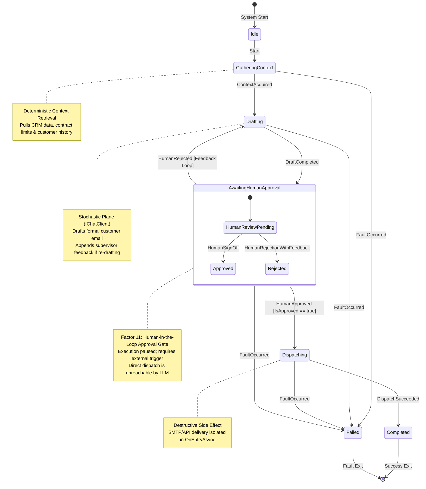
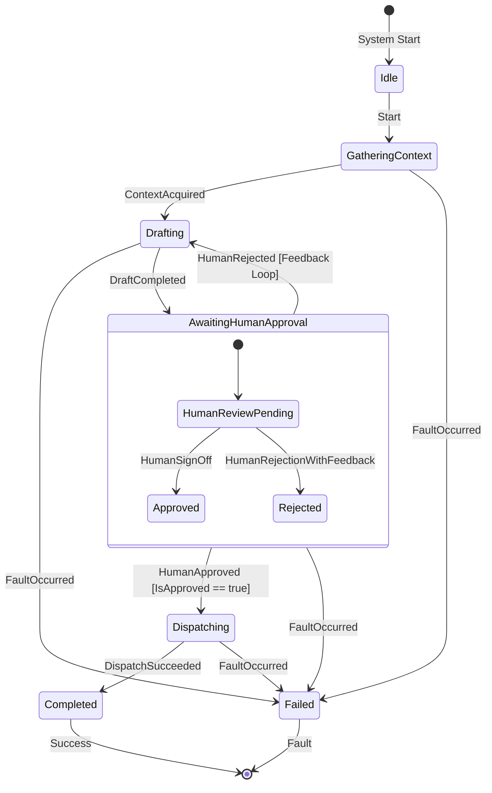
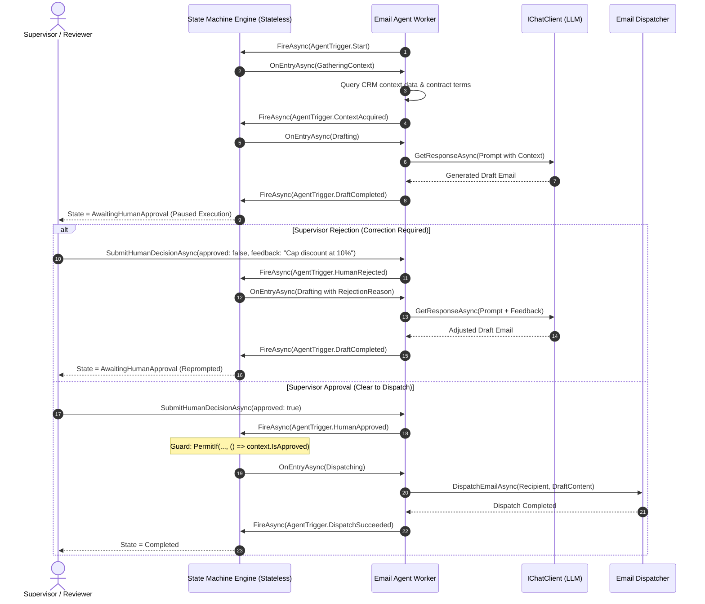
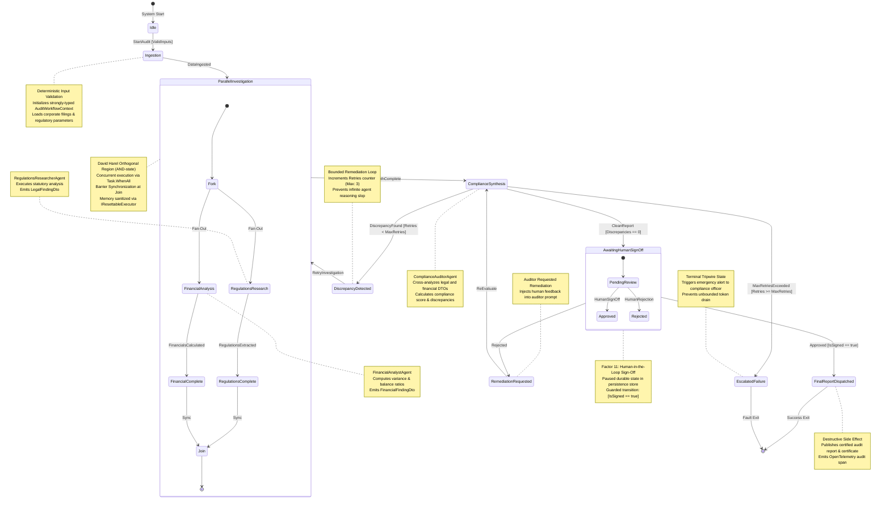
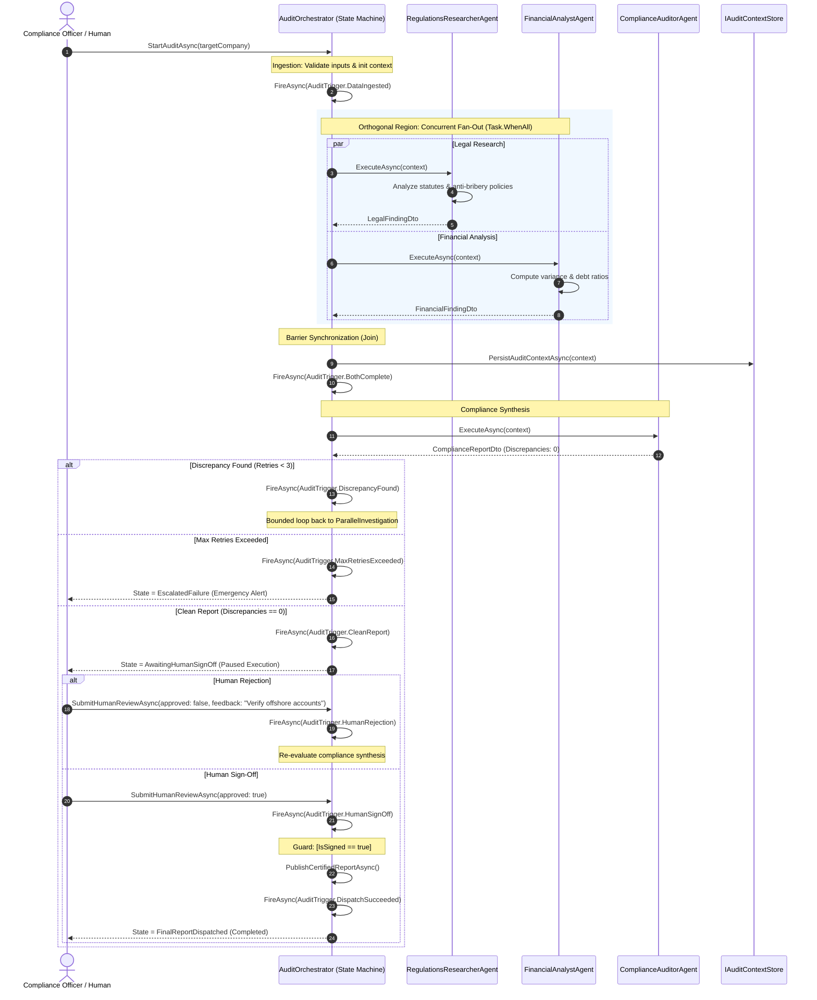

# Module 14: Advanced Multi-Agent Orchestration: Graph Workflows, State Machines, and Parallel/Sequential Execution — Study Guide and Engineering Specification

> **Status:** Official Study & Architecture Specification  
> **.NET Version:** .NET 10 (LTS)  
> **Language:** C# 14  
> **Core Packages:** `Microsoft.Agents.AI.Workflows`, `Stateless`, `Microsoft.Extensions.AI`, `MassTransit`  
> **Initial Workflow Project (14.1):** `src/Module14/EmailApprovalWorkflow/` (`EmailApprovalWorkflow.StateMachine`)  
> **Advanced Enterprise Project (14.2):** `src/Module14/EnterpriseAudit/` (`EnterpriseAudit.MultiAgentWorkflow`)  
> **Theoretical Foundations:** StateFlow (*COLM 2024*), MetaAgent (*ICML 2025*), David Harel Statecharts (*1987*)

---

## 1. Overview and Learning Goals

### 1.1 The Real-World Market Challenge
As enterprise organizations attempt to transition Artificial Intelligence from single-turn chat assistants to autonomous multi-agent systems, they face an acute reliability crisis. When multiple AI agents collaborate using traditional prompt-based supervisors (e.g., standard ReAct coordinator loops or monolithic meta-prompts), the system rapidly degrades due to **"Agent Slop"**:

1. **Stochastic Coordination Drift & Infinite Loops**: A supervisor LLM instructed in natural language to *"coordinate Agent A and Agent B until the report is satisfactory"* has no formal mathematical bounds. In practice, minor disagreements between agents cause cyclic arguments, burning thousands of dollars in tokens without reaching termination.
2. **Context Pollution & Cascading Hallucination**: When multiple agents share a single conversation thread or context window, irrelevant tool outputs, intermediate reasoning tokens, and minor hallucinations from one agent bleed into another, accelerating cognitive degradation across the entire system.
3. **Absence of Execution Guarantees & Unskippable Gates**: Regulated industries (financial auditing, healthcare, legal compliance) cannot allow autonomous agents to execute irreversible side-effects (e.g., signing off on an audit, executing transactions, or modifying databases) based merely on probabilistic text generation.
4. **Failure to Model Concurrency & Synchronization**: Real-world enterprise processes require parallel execution (**Fan-Out**) where independent agents analyze different datasets simultaneously, followed by barrier synchronization (**Fan-In**) to reconcile findings before advancing. Naive prompt chains fail to represent these topological invariants.

To solve these enterprise failures, modern AI software engineering merges the reasoning capabilities of Large Language Models with the rigorous mathematical foundations of **Finite State Machines (FSMs)** and **David Harel’s Hierarchical Statecharts**. By decoupling the **Deterministic Control Plane** (the graph topology, transition rules, loop bounds, and approval gates) from the **Stochastic Execution Plane** (agent semantic reasoning), .NET engineers build multi-agent systems with formal compliance guarantees.

### 1.2 Skills Acquired Upon Completing this Module
- Master the **StateFlow Paradigm (COLM 2024)**, formally separating *Process Grounding* from *Sub-task Solving* in C#.
- Implement **David Harel’s Statechart Formalisms (1987)** in .NET: Hierarchical Super-states (OR-states), Orthogonal Regions (AND-states for parallel fan-out/fan-in), and History States ($H$).
- Apply static graph validation principles from **MetaAgent (ICML 2025)** to detect deadlocks, unreachable states, and cyclic traps at build time.
- Orchestrate multi-agent workflows using **`Microsoft.Agents.AI.Workflows`** and [`Stateless`](https://github.com/dotnet-state-machine/stateless).
- Guarantee cross-agent context hygiene using **`IResettableExecutor`** to isolate memory across execution nodes.
- Persist long-running multi-agent workflows across distributed systems using **MassTransit Saga State Machines** with Redis/PostgreSQL backing stores.
- Instrument live state graph transitions with **OpenTelemetry** (`ActivitySource`) for real-time visualization in the **.NET Aspire Dashboard**.

### 1.3 The 5-Stage State Machine Study Workflow for AI Engineers

To systematically master the application of state machines in enterprise AI systems with C# and .NET, follow this progressive 5-stage roadmap:

```text
[Stage 1: Foundational Automata] ──► [Stage 2: Constrained Decoding] ──► [Stage 3: Workflow FSMs in C#]
                                                                                     │
[Stage 5: Self-Improving Graphs] ◄── [Stage 4: Distributed Workflows & Sagas] ◄─────┘
```

#### Stage 1: Classical Automata & Statechart Theory
* **Core Focus**: Understand the mathematical formalism of Finite State Machines (FSMs), Mealy/Moore machines, and **David Harel’s Statecharts (1987)**.
* **Key Concept**: Learn how Harel Statecharts overcome classical FSM "state explosion" through **hierarchical (nested) states**, **orthogonal (parallel) regions**, and **history states**.
* **Practical Exercise**: Diagram a multi-turn customer support lifecycle using Mermaid State Diagrams (`stateDiagram-v2`) before writing any prompt.

#### Stage 2: Token-Level Determinism & Constrained Decoding Automata
* **Core Focus**: Understand how state machines operate at the lowest layer of LLM inference (token logits sampling).
* **Key Concept**: Grammar-guided generation compiles schemas (JSON Schema, CFGs, Regex) into Deterministic Finite Automata (DFAs). At each sampling step, tokens representing invalid DFA transitions are masked to probability zero.
* **Practical Exercise**: In C#, enforce output contracts using `ChatResponseFormat.ForJsonSchema<T>` with `System.Text.Json.Schema`, proving zero JSON parse exceptions across 1,000 synthetic runs.

#### Stage 3: Workflow-Level State Machines in C# with `Stateless`
* **Core Focus**: Encapsulate single-agent and tool execution loops within explicit C# state machines using [`Stateless`](https://github.com/dotnet-state-machine/stateless).
* **Key Concept**: Decouple model invocation (`IChatClient`) into state entry actions (`OnEntryAsync`). Define strongly-typed C# enums for states and triggers, and enforce deterministic guard conditions with `.PermitIf()`.
* **Practical Exercise**: Write xUnit unit tests verifying that invoking triggers out of order throws `InvalidOperationException` and that side-effect actions cannot execute without passing guard conditions.

#### Stage 4: Enterprise Distributed Workflows & Sagas with MAF and MassTransit
* **Core Focus**: Scale in-memory state machines to durable, multi-agent enterprise workflows across distributed microservices.
* **Key Concept**:
  - Implement **`Microsoft.Agents.AI.Workflows`** and the **Semantic Kernel Process Framework** for graph-based step orchestration.
  - Integrate **`MassTransit` Saga State Machines** (`Automatonymous`) with Redis or PostgreSQL persistence, allowing agent workflows to pause for hours waiting for human approval without holding threads in memory.
* **Practical Exercise**: Implement Capstone Project 14 (`EnterpriseAudit.MultiAgentWorkflow`), coordinating parallel analysis agents with state isolation via `IResettableExecutor`.

#### Stage 5: Trace Auditing & Self-Improving State Graphs
* **Core Focus**: Turn state graphs into living, observable, and self-optimizing artifacts.
* **Key Concept**:
  - Instrument every state transition and guard evaluation with `OpenTelemetry` activity spans (`System.Diagnostics.ActivitySource`).
  - View live execution graphs in the .NET Aspire Dashboard (Module 09) to detect high-friction states and retry loops.
  - Use meta-agents to analyze execution trace datasets, identify bottlenecks, and suggest surgical graph optimizations (e.g., adding an automated validation pre-step).
* **Practical Exercise**: Build an automated telemetry evaluator that flags any state transition taking more than 3 retry iterations and alerts the FinOps dashboard.

---

## 2. In-Depth Theoretical Foundations

### 2.1 The StateFlow Paradigm: Process Grounding vs. Sub-task Solving (COLM 2024)
Published at the Conference on Language Modeling (*COLM 2024*), the **StateFlow** research paper (*Wu et al.*) provides the mathematical and architectural blueprint for reliable agent task-solving.

Traditional agents (such as ReAct or AutoGen prompt-based groups) interleave flow control, memory management, and action execution into a single, unbounded generation loop:

$$\text{NextAction} \sim P(\text{Action} \mid \text{Prompt}, \text{History})$$

StateFlow replaces this fragile pattern by modeling the agentic system as an explicit **Finite State Machine (FSM)**:

$$\mathcal{M} = \langle S, s_0, \Sigma, \delta, F \rangle$$

Where:
* $S$ is the finite set of task states.
* $s_0 \in S$ is the initial state.
* $\Sigma$ is the set of triggers/events (e.g., tool results, human decisions, validation outputs).
* $\delta: S \times \Sigma \rightarrow S$ is the deterministic transition function.
* $F \subseteq S$ is the set of terminal acceptance states.

```text
+---------------------------------------------------------------------------------------------------+
|                                       THE STATEFLOW ARCHITECTURE                                  |
|                                                                                                   |
|  ┌─────────────────────────────────────────────────────────────────────────────────────────────┐  |
|  │                       PROCESS GROUNDING (Deterministic Control Plane)                       │  |
|  │                                                                                             │  |
|  │   - Tracks current state $s_t \in S$                                                        │  |
|  │   - Evaluates Transition Rules $\delta(s_t, e) \rightarrow s_{t+1}$                         │  |
|  │   - Enforces Maximum Transition Budget (Kills infinite loop traps)                          │  |
|  │   - Governs Human-in-the-Loop Barrier Gates                                                 │  |
|  └──────────────────────────────┬───────────────────────────────────────▲──────────────────────┘  |
|                                 │ Dispatches Sub-task                   │ Emits Event $e \in \Sigma$  |
|                                 ▼                                       │ (e.g., Success, Fault)  |
|  ┌──────────────────────────────────────────────────────────────────────┴──────────────────────┐  |
|  │                         SUB-TASK SOLVING (Stochastic Execution Plane)                       │  |
|  │                                                                                             │  |
|  │   - Executes localized IChatClient prompt specific to state $s_t$                           │  |
|  │   - Consumes strictly isolated state context                                                │  |
|  │   - Returns structured output DTO validating acceptance criteria                            │  |
|  └─────────────────────────────────────────────────────────────────────────────────────────────┘  |
+---------------------------------------------------------------------------------------------------+
```

#### Dual Transition Mechanisms
StateFlow formalizes two distinct categories of state transitions:
1. **Static / Heuristic Transitions**: Deterministic rules evaluated entirely in code without model inference. For example:
   - If `tool_exit_code != 0`, transition to `State: ErrorRecovery`.
   - If `transition_count > MAX_BUDGET`, transition to `State: EscalatedFailure`.
   - If `json_schema_valid == false`, transition to `State: SyntaxSelfCorrection`.
2. **Model-Driven / Dynamic Transitions**: Semantic routing where an LLM evaluates complex, unstructured output to choose between a strictly enumerated set of allowed successor states (e.g., evaluating whether an audit finding is *Negligible*, *Material*, or *Critical*).

---

### 2.2 David Harel’s Statecharts (1987): Hierarchy, Orthogonality, and History
Standard Finite State Machines suffer from the combinatorial **"State Explosion"** problem: as an agent workflow incorporates parallel branches, errors, and interruptions, the number of required states grows exponentially:

$$|S_{\text{total}}| = \prod_{i=1}^{n} |S_i|$$

In his seminal 1987 paper, computer scientist **David Harel** solved this challenge by introducing **Statecharts**, which form the foundation of modern UML state machines and frameworks like `Stateless` and `XState`.

```text
+---------------------------------------------------------------------------------------------------+
|                        SUPER-STATE: ComplianceAudit (Hierarchical OR-State)                       |
|                                                                                                   |
|  ┌─────────────────────────────────────────────────────────────────────────────────────────────┐  |
|  │                  ORTHOGONAL REGION: ParallelInvestigation (AND-State)                       │  |
|  │                                                                                             │  |
|  │   ┌─────────────────────────────────────┐     ┌─────────────────────────────────────────┐   │  |
|  │   │     Region 1: Legal Regulations     │     │      Region 2: Financial Records        │   │  |
|  │   │                                     │     │                                         │   │  |
|  │   │  [Idle] ──► [ResearchingStatutes]   │     │  [Idle] ──► [AnalyzingBalanceSheet]     │   │  |
|  │   │                     │               │     │                     │                   │   │  |
|  │   │                     ▼               │     │                     ▼                   │   │  |
|  │   │            [RegulationsExtracted]   │     │             [LedgerAudited]             │   │  |
|  │   └─────────────────────┬───────────────┘     └─────────────────────┬───────────────────┘   │  |
|  │                         │                                           │                       │  |
|  │                         └─────────────────┬─────────────────────────┘                       │  |
|  │                                           ▼                                                 │  |
|  │                           [BARRIER SYNCHRONIZATION (Fan-In)]                                │  |
|  └───────────────────────────────────────────┬─────────────────────────────────────────────────┘  |
|                                              ▼                                                    |
|                                [ReconcilingCrossFindings]                                         |
+---------------------------------------------------------------------------------------------------+
```

#### Core Harel Statechart Concepts Applied to Multi-Agent Workflows:
1. **Hierarchy (Clustering / XOR States)**:
   - Sub-states inherit transitions from their parent Super-state.
   - *AI Engineering Application*: If a `WorkflowCancellation` or `FatalTimeout` event occurs, the parent `SuperState` handles it immediately, eliminating repetitive error-handling boilerplate across every individual agent state.
2. **Orthogonality (Concurrency / AND States)**:
   - The system resides in multiple sub-states simultaneously across parallel regions.
   - *AI Engineering Application*: **Fan-Out / Fan-In**. The `RegulationsAgent` and `FinancialAnalystAgent` execute concurrently in orthogonal regions. The parent state waits for all orthogonal sub-states to reach their completion criteria before triggering the reconciliation agent.
3. **History States ($H$ and $H^*$)**:
   - When a state is interrupted (e.g., by an urgent human clarification request), the history state remembers the exact active sub-state and resumes execution where it left off, rather than restarting from $s_0$.

---

### 2.3 MetaAgent (ICML 2025): Graph Topology Validation and Deadlock Prevention
Research published at **ICML 2025** (*MetaAgent*) demonstrates that agentic topologies must be statically validated before execution. In enterprise systems, multi-agent graphs must be verified as mathematical Directed Graphs:

$$G = (V, E)$$

The graph must be analyzed at application startup to enforce three structural guarantees:
1. **Deadlock Freedom**: For any reachable state $s \in S$, there must exist at least one valid transition path to an acceptance state $f \in F$:
   $$\forall s \in \text{Reachable}(s_0), \quad \exists \text{ path } s \rightsquigarrow f \in F$$
2. **Loop Bound Verification**: Any cyclic subgraph $C \subseteq G$ must contain at least one exit transition conditioned on a monotonically decrementing loop counter:
   $$\text{Guard}(e_{\text{exit}}) \iff \text{Iterations} \ge \text{MaxAllowed}$$
3. **No Unreachable Sinks**: No non-terminal state may have an out-degree of zero ($\text{deg}^+(v) = 0 \iff v \in F$).

---

### 2.4 State Isolation and Context Purging (`IResettableExecutor`)
In Microsoft Agent Framework (`Microsoft.Agents.AI.Workflows`), a primary vulnerability is **Context Pollution**. If Agent B receives the raw conversational history of Agent A, Agent B's prompt space becomes polluted with irrelevant reasoning tokens, increasing costs and triggering hallucinations.

MAF resolves this via **State Isolation** and the **`IResettableExecutor`** interface:
- Each node in the workflow graph maintains an independent, isolated execution sandbox.
- When an agent transitions out of an active state, `IResettableExecutor.ResetAsync()` purges ephemeral scratchpad tokens, tool call traces, and intermediate reasoning.
- Only the strongly-typed **Contract DTO** (the output artifact) is written to the shared workflow context.

---

### 2.5 Gotchas, Anti-patterns, and Production Pitfalls

| Anti-Pattern | Operational Symptom | Production Impact | Architectural Fix (.NET) |
| :--- | :--- | :--- | :--- |
| **The "Meta-Prompt Supervisor"** | Free-text prompt directing other agents via tool calls | Unpredictable routing, skipped approval steps, runaway loops | Replace prompt coordinator with a formal C# state machine (`Stateless`) |
| **Shared Unbounded Context** | Appending all agent turns into a single `List<ChatMessage>` | Token context explosion, cross-agent hallucinations, leaked secrets | Enforce state isolation via `IResettableExecutor`; share only validated DTOs |
| **Asymmetric Fan-In Starvation** | One parallel agent fails silently, stalling the barrier join | Entire workflow deadlocks indefinitely waiting for missing branch | Implement timeout guards and cancellation tokens on orthogonal regions |
| **Unbounded Self-Correction** | Re-prompting on validation error without an iteration cap | 100+ retries burning budget when an LLM is stuck | Enforce strict numeric loop guards (`PermitIf(..., () => retries < 3)`) |
| **Ephemeral In-Memory State** | Storing workflow state in local C# memory | Server restart or deployment crashes mid-workflow state | Use MassTransit Saga State Machines with Redis or SQL persistence |

---

### 2.6 Foundational Didactic Blueprint: Single-Agent State Machine with `Stateless` & `Microsoft.Extensions.AI`

Before architecting the complex multi-agent orthogonal audit orchestrator in Capstone 14, engineers should master this foundational single-agent pattern. 

In this blueprint, an enterprise email-drafting agent is governed by [`Stateless`](https://github.com/dotnet-state-machine/stateless). It is **mathematically and architecturally impossible** for the LLM to trigger email delivery without transitioning through an explicit, auditable human approval state:

```csharp
using System;
using System.Threading.Tasks;
using Microsoft.Extensions.AI;
using Stateless;

namespace EnterpriseAudit.Domain.Didactic;

// 1. Strongly-typed States and Triggers
public enum AgentState
{
    Idle,
    GatheringContext,
    Drafting,
    AwaitingHumanApproval,
    Dispatching,
    Completed,
    Failed
}

public enum AgentTrigger
{
    Start,
    ContextAcquired,
    DraftCompleted,
    HumanApproved,
    HumanRejected,
    DispatchSucceeded,
    FaultOccurred
}

// 2. Workflow Context (State Machine Memory & Invariants)
public sealed class EmailWorkflowContext
{
    public required string Recipient { get; init; }
    public required string Topic { get; init; }
    public string? ContextData { get; set; }
    public string? DraftContent { get; set; }
    public bool IsApproved { get; set; }
    public string? RejectionReason { get; set; }
}

// 3. State Machine Engine Encapsulating the IChatClient
public sealed class StateMachineGovernedEmailAgent
{
    private readonly IChatClient _chatClient;
    private readonly StateMachine<AgentState, AgentTrigger> _machine;
    private readonly EmailWorkflowContext _context;

    public StateMachineGovernedEmailAgent(IChatClient chatClient, EmailWorkflowContext context)
    {
        _chatClient = chatClient;
        _context = context;
        _machine = new StateMachine<AgentState, AgentTrigger>(AgentState.Idle);

        ConfigureStateMachine();
    }

    public AgentState CurrentState => _machine.State;

    private void ConfigureStateMachine()
    {
        _machine.Configure(AgentState.Idle)
            .Permit(AgentTrigger.Start, AgentState.GatheringContext);

        _machine.Configure(AgentState.GatheringContext)
            .OnEntryAsync(async () => await GatherContextAsync())
            .Permit(AgentTrigger.ContextAcquired, AgentState.Drafting)
            .Permit(AgentTrigger.FaultOccurred, AgentState.Failed);

        _machine.Configure(AgentState.Drafting)
            .OnEntryAsync(async () => await GenerateDraftAsync())
            .Permit(AgentTrigger.DraftCompleted, AgentState.AwaitingHumanApproval)
            .Permit(AgentTrigger.FaultOccurred, AgentState.Failed);

        _machine.Configure(AgentState.AwaitingHumanApproval)
            // GUARDED TRANSITION: Cannot transition to Dispatching unless IsApproved is true
            .PermitIf(AgentTrigger.HumanApproved, AgentState.Dispatching, () => _context.IsApproved)
            .Permit(AgentTrigger.HumanRejected, AgentState.Drafting) // Returns to Drafting with supervisor feedback
            .Permit(AgentTrigger.FaultOccurred, AgentState.Failed);

        _machine.Configure(AgentState.Dispatching)
            .OnEntryAsync(async () => await DispatchEmailAsync())
            .Permit(AgentTrigger.DispatchSucceeded, AgentState.Completed)
            .Permit(AgentTrigger.FaultOccurred, AgentState.Failed);
    }

    public async Task StartAsync() => await _machine.FireAsync(AgentTrigger.Start);

    private async Task GatherContextAsync()
    {
        // Deterministic internal fetch / DB query (outside LLM influence)
        _context.ContextData = "Account #1094: Contract Renewal pending; Discount limit: 15%.";
        await _machine.FireAsync(AgentTrigger.ContextAcquired);
    }

    private async Task GenerateDraftAsync()
    {
        var prompt = $"Draft a formal renewal email to {_context.Recipient} regarding {_context.Topic}.\nContext: {_context.ContextData}";
        if (!string.IsNullOrEmpty(_context.RejectionReason))
        {
            prompt += $"\nPREVIOUS DRAFT REJECTED BY SUPERVISOR: {_context.RejectionReason}. Please adjust the draft.";
        }

        var response = await _chatClient.GetResponseAsync(prompt);
        _context.DraftContent = response.Text;

        await _machine.FireAsync(AgentTrigger.DraftCompleted);
    }

    public async Task SubmitHumanDecisionAsync(bool approved, string? feedback = null)
    {
        _context.IsApproved = approved;
        _context.RejectionReason = feedback;

        if (approved)
        {
            await _machine.FireAsync(AgentTrigger.HumanApproved);
        }
        else
        {
            await _machine.FireAsync(AgentTrigger.HumanRejected);
        }
    }

    private async Task DispatchEmailAsync()
    {
        // CRITICAL INVARIANT: This side-effect method is private and ONLY invoked upon entry to Dispatching.
        // It is physically impossible for the LLM prompt to invoke this method directly.
        Console.WriteLine($"[EMAIL DISPATCHED TO {_context.Recipient}]:\n{_context.DraftContent}");
        await _machine.FireAsync(AgentTrigger.DispatchSucceeded);
    }
}
```

---

## 3. Architectural Principles and Patterns Mapping

### 3.1 SOLID in Multi-Agent State Machine Architecture

| Principle | Meaning in Classical OOP | Application to Multi-Agent State Machines (.NET 10) |
| :--- | :--- | :--- |
| **Single Responsibility (SRP)** | A class should have only one reason to change. | Each agent node implements only its specific sub-task (e.g., regulations extraction). Flow control and transition logic are isolated entirely in the State Machine configuration. |
| **Open/Closed (OCP)** | Software entities should be open for extension, closed for modification. | New states and specialized agent personas are added to the workflow graph by configuring new states and triggers without altering existing agent implementations. |
| **Liskov Substitution (LSP)** | Subtypes must be substitutable for their base types without altering program correctness. | Any agent node implementing `IAgentNode<TIn, TOut>` can be swapped (e.g., swapping a local Ollama model for an Azure OpenAI endpoint) without altering the state machine transition invariants. |
| **Interface Segregation (ISP)** | Clients should not be forced to depend on interfaces they do not use. | Clear segregation of interfaces: `IAgentNode` (execution), `IWorkflowEngine` (state transitions), `IResettableExecutor` (context purging), and `IHumanApprovalGate` (HITL). |
| **Dependency Inversion (DIP)** | Depend on abstractions, not concretions. | The workflow engine depends on .NET abstractions (`IChatClient`, `IWorkflowStorage`), never on proprietary vendor SDKs. |

### 3.2 Applied Design Patterns

```text
┌─────────────────────────────────┐
│     Finite State Machine /      │ ── Formalizes all valid agent states, transitions,
│      Harel Statecharts          │    and guards in strongly-typed C# code.
└────────────────┬────────────────┘
                 │
┌────────────────▼────────────────┐
│   Saga Pattern (Orchestrated)   │ ── Coordinates multi-step distributed transactions
│                                 │    with compensatory actions on failure.
└────────────────┬────────────────┘
                 │
┌────────────────▼────────────────┐
│ Barrier / Fan-Out Fan-In Pattern│ ── Executes orthogonal agent tasks concurrently
│                                 │    and synchronizes at a deterministic join point.
└────────────────┬────────────────┘
                 │
┌────────────────▼────────────────┐
│  Human-in-the-Loop (HITL) Gate  │ ── Pauses workflow execution in a persistent state
│                                 │    until an explicit, authenticated human event occurs.
└─────────────────────────────────┘
```

### 3.3 Twelve-Factor App & Twelve-Factor Agent Mapping
- **Factor 1 (Model vs. Deterministic Logic Separation)**: The state machine holds the deterministic business logic; the LLM handles stochastic language generation within state bounds.
- **Factor 2 (Stateless Agent Runtime)**: State machine instances serialize their current state and context to external stores (Redis/PostgreSQL). Individual worker threads remain stateless.
- **Factor 3 (Event-Driven & Graph State Transitions)**: Every state advancement is triggered by an explicit, strongly-typed event (`AgentTrigger`).
- **Factor 8 (Comprehensive Observability & Traceability)**: Every state transition emits an OpenTelemetry `Activity`, recording state entry, exit, duration, and transition guards.
- **Factor 11 (Human-in-the-Loop & Approval Gates)**: Destructive actions reside in states reachable only via an explicit `HumanApproved` trigger.

### 3.4 Architectural Diagrams (Mermaid)

#### 3.4.1 Project 14.1 State Diagram: Email Approval Workflow (`EmailApprovalWorkflow.StateMachine`)

The diagram below illustrates the deterministic lifecycle of the Email Approval Workflow Agent. Notice that destructive email dispatch is protected by an explicit guard condition (`[IsApproved == true]`) and is physically separated from prompt generation.



#### 3.4.2 Project 14.2 State Diagram: Enterprise Multi-Agent Audit Workflow (`EnterpriseAudit.MultiAgentWorkflow`)

The diagram below models the hierarchical statechart with an orthogonal parallel region (`AND-state`) for legal and financial research, barrier synchronization (`Join`), and loop-bounded remediation.


---

## 4. Cognitive Learning Checkpoints

Review and self-assess against these six architectural scenarios before writing code:

### Checkpoint 1: StateFlow Mechanics
* **Question**: Why does the StateFlow paradigm separate *Process Grounding* from *Sub-task Solving*, and what happens when they are coupled?
* **Answer & Rationale**: Coupling process grounding (flow control) with sub-task solving (prompt text generation) forces the model to decide *what to do* and *where to go next* in the same token stream. This introduces prompt drift, tool-calling hallucinations, and cyclic traps. By decoupling them, flow control is enforced deterministically by code (Process Grounding), while the LLM is only tasked with executing the isolated prompt for the active state (Sub-task Solving).

### Checkpoint 2: Harel Statecharts vs. Classical FSMs
* **Question**: In an enterprise audit workflow with 4 parallel agents, each having 3 states, how does a Harel Statechart prevent state explosion?
* **Answer & Rationale**: In a classical flat FSM, 4 concurrent components with 3 states each require $3^4 = 81$ discrete combinations. In Harel Statecharts, **Orthogonal Regions (AND-states)** allow modeling each component independently within a concurrent super-state, requiring only $3 \times 4 = 12$ state definitions.

### Checkpoint 3: Loop Bound Verification
* **Question**: How do we prevent an autonomous multi-agent system from looping infinitely when two agents disagree on an audit finding?
* **Answer & Rationale**: The StateFlow paradigm mandates numeric transition bounds on cyclic subgraphs. In C#, the transition guard `.PermitIf(AgentTrigger.DiscrepancyFound, AgentState.Remediation, () => context.AttemptCount < MaxAttempts)` enforces that if `AttemptCount >= MaxAttempts`, the machine can only transition to `AgentState.EscalatedFailure`.

### Checkpoint 4: State Isolation & `IResettableExecutor`
* **Question**: Why must intermediate tool call history and scratchpad reasoning be purged when transitioning from a Research Agent to a Compliance Auditor Agent?
* **Answer & Rationale**: LLM attention degrades linearly as the context window fills with raw, verbose intermediate outputs (e.g., thousands of lines of raw SEC filing text). `IResettableExecutor` resets the agent's internal memory between tasks, passing only the strongly-typed, validated summary DTO to the downstream agent.

### Checkpoint 5: Distributed Sagas with MassTransit
* **Question**: What happens to an in-memory C# state machine when an agent enters `AwaitingHumanApproval` and the human takes 48 hours to respond?
* **Answer & Rationale**: An in-memory state machine holding a thread or connection in memory risks loss during server restarts, deployments, or node crashes. An enterprise **Saga State Machine** (via MassTransit) persists the workflow state and correlation ID into a database (PostgreSQL/Redis) and dehydrates the instance. When the human submits their approval via webhook 48 hours later, MassTransit rehydrates the exact state and resumes execution.

### Checkpoint 6: MetaAgent Static Topology Verification
* **Question**: How can an engineering team verify at build time that a custom multi-agent workflow cannot dead-end in a non-terminal state?
* **Answer & Rationale**: By implementing a topological graph validator (inspired by MetaAgent) in C# that constructs the adjacency matrix of the state machine. The validator performs a Depth-First Search (DFS) from the initial state $s_0$, asserting that every reachable node has at least one path to a designated terminal state in $F$.

---

## 5. Recommended Reading & Academic Grounding

### 5.1 Pivotal Academic Papers

| Paper | Authors / Venue | Year | Core Contribution to AI Engineering |
| :--- | :--- | :--- | :--- |
| **[StateFlow: Enhancing LLM Task-Solving through State-Driven Workflows](https://arxiv.org/abs/2403.11322)** | Y. Wu et al. (*COLM*) | 2024 | Formalizes LLM agents as Finite State Machines. Introduces the separation between *Process Grounding* (state transitions) and *Sub-task Solving* (LLM generation), outperforming ReAct while cutting token costs. |
| **[MetaAgent: Auto-Constructing FSM-based Multi-Agent Systems](https://arxiv.org/abs/2410.03816)** | ICML | 2025 | Automatically generates and optimizes multi-agent collaboration topologies using finite state machines, preventing deadlocks and redundant loops. |
| **[Efficient Guided Generation for Large Language Models](https://arxiv.org/abs/2307.09702)** | B. Willard & R. Louf | 2023 | The paper behind *Outlines*. Compiles regular expressions and context-free grammars into DFAs to mask invalid logits during sampling, guaranteeing 100% syntactic compliance. |
| **[Statecharts: A Visual Formalism for Complex Systems](https://www.sciencedirect.com/science/article/pii/0167642387900359)** | David Harel (*Sci. Comput. Program.*) | 1987 | The seminal paper that solved FSM state explosion by inventing hierarchical states, orthogonal (parallel) regions, and history mechanisms. The basis of UML statecharts and modern state engines. |
| **[SGLang: Efficient Execution of Structured Language Model Programs](https://arxiv.org/abs/2312.07104)** | L. Zheng et al. | 2023 | Explores KV-cache sharing, multi-call branching, and interpreter runtimes over structured state graphs. |

### 5.2 Canonical Textbooks

* **[Practical UML Statecharts in C/C++: Event-Driven Programming for Embedded Systems](https://www.state-machine.com/psicc2)** (2nd Edition, 2008) — *Miro Samek*  
  The definitive guide to implementing Harel statecharts and event-driven architectures in production. The architectural patterns (inversion of control, run-to-completion, hierarchical event processors) apply directly to constructing deterministic shells for AI agents.
* **[Artificial Intelligence: A Modern Approach (AIMA)](https://aima.cs.berkeley.edu/)** (4th Edition, 2020) — *Stuart Russell & Peter Norvig*  
  *Chapters 2, 17, and 22*: Foundational theory of reflex agents with state, goal-based agents, and Markov Decision Processes (MDPs / POMDPs) for modeling agent state under uncertainty.
* **[Designing Data-Intensive Applications](https://dataintensive.net/)** (2017) — *Martin Kleppmann*  
  *Chapters 10 & 11*: Event sourcing, stream processing, and state machine replication. Critical for persisting agent state, event logs, and building durable, replayable multi-agent systems.
* **[Object-Oriented Software Construction](https://se.inf.ethz.ch/people/meyer/publications/online/eiffel/oosc/)** (2nd Edition, 1997) — *Bertrand Meyer*  
  The origin of **Design by Contract (DbC)**. Establishes the formal definitions of Preconditions, Invariants, and Postconditions used in Module 15 to govern agent execution.

### 5.3 Production Frameworks & Ecosystem Matrix

| Framework / Tool | Ecosystem | Purpose & Architectural Role |
| :--- | :--- | :--- |
| **[`Stateless`](https://github.com/dotnet-state-machine/stateless)** | **.NET / C#** | Lightweight, fluent hierarchical state machine library for C#. Ideal for single-agent deterministic control planes and guarded execution. |
| **[`Microsoft.Agents.AI.Workflows`](https://learn.microsoft.com/agent-framework/)** | **.NET / C#** | Official Microsoft Agent Framework graph workflow engine. Manages state isolation, node resetting (`IResettableExecutor`), and multi-agent coordination. |
| **[`MassTransit (Automatonymous)`](https://masstransit.io/documentation/patterns/saga/state-machine)** | **.NET / C#** | Enterprise distributed Saga State Machine framework. Connects to RabbitMQ/Azure Service Bus and persists state across distributed agent microservices in Redis or SQL. |
| **[`Semantic Kernel Process Framework`](https://learn.microsoft.com/semantic-kernel/concepts/process/)** | **.NET / C#** | Stepwise graph and event-driven process modeling in Semantic Kernel, connecting plugins, kernel functions, and agents. |
| **[`XState / Stately.ai`](https://stately.ai)** | Cross-platform | Modern implementation of W3C SCXML / Harel statecharts. Provides visual modeling, actor orchestration, and trace inspection for complex systems. |
| **[`Outlines`](https://github.com/dottxt-ai/outlines)** | Python / C++ | DFA-guided generation compiler enforcing JSON schemas, regular expressions, and context-free grammars at the logit level. |
| **[`Temporal.io`](https://temporal.io)** | Distributed / Polyglot | Durable execution engine guaranteeing deterministic code replay, state persistence, and long-running distributed workflow orchestration. |

---

## 6. Technical Specifications for the Module Projects

This module guides the progressive engineering of **two distinct projects**:
1. **Project 14.1 (Initial Workflow Project)**: `EmailApprovalWorkflow.StateMachine` — A focused, single-agent workflow implementing the StateFlow paradigm with `Stateless` and `Microsoft.Extensions.AI`. It establishes the foundational concepts of process grounding, guarded transitions, and unskippable human approval gates.
2. **Project 14.2 (Advanced Enterprise Multi-Agent Project)**: `EnterpriseAudit.MultiAgentWorkflow` — A production-grade multi-agent orchestrator implementing David Harel's hierarchical statecharts, orthogonal parallel regions (AND-states with fan-out/fan-in), loop-bounded discrepancy remediation, and `IResettableExecutor` state isolation.

---

### 6.1 Project 14.1 Technical Specification: `EmailApprovalWorkflow.StateMachine`

#### 6.1.1 Project Metadata
- **Project Name**: `EmailApprovalWorkflow.StateMachine`
- **Solution Path**: `src/Module14/EmailApprovalWorkflow/`
- **Execution Target**: C# .NET 10 LTS Console Application & Unit Tests
- **Core Dependencies**: `Stateless`, `Microsoft.Extensions.AI`, `Microsoft.Extensions.DependencyInjection`

#### 6.1.2 Scope & Business Problem
Simulate an enterprise email automation agent. Given a recipient and high-level topic, the agent gathers customer account context, drafts a formal email using `IChatClient`, enters a paused human-review state, and only executes the email dispatch upon receiving explicit supervisor sign-off. If rejected, the supervisor provides feedback, triggering a re-drafting transition.

#### 6.1.3 Functional & Non-Functional Requirements
- **FR-01 (Explicit State Machine)**: The agent must model its lifecycle using `Stateless.StateMachine<AgentState, AgentTrigger>`.
- **FR-02 (Guarded Dispatch Transition)**: The transition from `AwaitingHumanApproval` to `Dispatching` must be guarded by `.PermitIf(AgentTrigger.HumanApproved, AgentState.Dispatching, () => context.IsApproved)`.
- **FR-03 (Supervisor Feedback Loop)**: When rejected, the trigger `AgentTrigger.HumanRejected` transitions the machine back to `AgentState.Drafting`, injecting the rejection rationale into the next prompt.
- **FR-04 (Terminal Invariant)**: Destructive dispatch logic (`DispatchEmailAsync`) must be physically isolated in the `OnEntryAsync` of `AgentState.Dispatching`, ensuring it cannot be invoked directly by prompt generation.
- **NFR-01 (Determinism & Auditability)**: The agent must maintain an auditable state transition log.

#### 6.1.4 Directory Structure
```text
src/Module14/EmailApprovalWorkflow/
├── EmailApprovalWorkflow.slnx
├── src/
│   ├── EmailApprovalWorkflow.Domain/
│   │   ├── Enums/
│   │   │   ├── AgentState.cs
│   │   │   └── AgentTrigger.cs
│   │   └── Models/
│   │       └── EmailWorkflowContext.cs
│   ├── EmailApprovalWorkflow.Engine/
│   │   └── StateMachineGovernedEmailAgent.cs
│   └── EmailApprovalWorkflow.Cli/
│       └── Program.cs
└── tests/
    └── EmailApprovalWorkflow.Tests/
        └── StateMachineGuardTests.cs
```

#### 6.1.5 Visual Statechart & Runtime Sequence (Mermaid)

##### Statechart Topology


##### Runtime Human-in-the-Loop Interaction Sequence


#### 6.1.6 Core Contracts and C# Blueprint
```csharp
namespace EmailApprovalWorkflow.Domain.Enums;

public enum AgentState
{
    Idle,
    GatheringContext,
    Drafting,
    AwaitingHumanApproval,
    Dispatching,
    Completed,
    Failed
}

public enum AgentTrigger
{
    Start,
    ContextAcquired,
    DraftCompleted,
    HumanApproved,
    HumanRejected,
    DispatchSucceeded,
    FaultOccurred
}
```

```csharp
namespace EmailApprovalWorkflow.Domain.Models;

public sealed class EmailWorkflowContext
{
    public required string Recipient { get; init; }
    public required string Topic { get; init; }
    public string? ContextData { get; set; }
    public string? DraftContent { get; set; }
    public bool IsApproved { get; set; }
    public string? RejectionReason { get; set; }
}
```

```csharp
namespace EmailApprovalWorkflow.Engine;

using Microsoft.Extensions.AI;
using Stateless;
using EmailApprovalWorkflow.Domain.Enums;
using EmailApprovalWorkflow.Domain.Models;

public sealed class StateMachineGovernedEmailAgent
{
    private readonly IChatClient _chatClient;
    private readonly StateMachine<AgentState, AgentTrigger> _machine;
    private readonly EmailWorkflowContext _context;

    public StateMachineGovernedEmailAgent(IChatClient chatClient, EmailWorkflowContext context)
    {
        _chatClient = chatClient;
        _context = context;
        _machine = new StateMachine<AgentState, AgentTrigger>(AgentState.Idle);

        ConfigureStateMachine();
    }

    public AgentState CurrentState => _machine.State;

    private void ConfigureStateMachine()
    {
        _machine.Configure(AgentState.Idle)
            .Permit(AgentTrigger.Start, AgentState.GatheringContext);

        _machine.Configure(AgentState.GatheringContext)
            .OnEntryAsync(async () => await GatherContextAsync())
            .Permit(AgentTrigger.ContextAcquired, AgentState.Drafting)
            .Permit(AgentTrigger.FaultOccurred, AgentState.Failed);

        _machine.Configure(AgentState.Drafting)
            .OnEntryAsync(async () => await GenerateDraftAsync())
            .Permit(AgentTrigger.DraftCompleted, AgentState.AwaitingHumanApproval)
            .Permit(AgentTrigger.FaultOccurred, AgentState.Failed);

        _machine.Configure(AgentState.AwaitingHumanApproval)
            .PermitIf(AgentTrigger.HumanApproved, AgentState.Dispatching, () => _context.IsApproved)
            .Permit(AgentTrigger.HumanRejected, AgentState.Drafting)
            .Permit(AgentTrigger.FaultOccurred, AgentState.Failed);

        _machine.Configure(AgentState.Dispatching)
            .OnEntryAsync(async () => await DispatchEmailAsync())
            .Permit(AgentTrigger.DispatchSucceeded, AgentState.Completed)
            .Permit(AgentTrigger.FaultOccurred, AgentState.Failed);
    }

    public async Task StartAsync() => await _machine.FireAsync(AgentTrigger.Start);

    private async Task GatherContextAsync()
    {
        _context.ContextData = "Account #1094: Contract Renewal pending; Discount limit: 15%.";
        await _machine.FireAsync(AgentTrigger.ContextAcquired);
    }

    private async Task GenerateDraftAsync()
    {
        var prompt = $"Draft a formal renewal email to {_context.Recipient} regarding {_context.Topic}.\nContext: {_context.ContextData}";
        if (!string.IsNullOrEmpty(_context.RejectionReason))
        {
            prompt += $"\nPREVIOUS DRAFT REJECTED: {_context.RejectionReason}. Please adjust the draft.";
        }

        var response = await _chatClient.GetResponseAsync(prompt);
        _context.DraftContent = response.Text;
        await _machine.FireAsync(AgentTrigger.DraftCompleted);
    }

    public async Task SubmitHumanDecisionAsync(bool approved, string? feedback = null)
    {
        _context.IsApproved = approved;
        _context.RejectionReason = feedback;

        if (approved)
            await _machine.FireAsync(AgentTrigger.HumanApproved);
        else
            await _machine.FireAsync(AgentTrigger.HumanRejected);
    }

    private async Task DispatchEmailAsync()
    {
        Console.WriteLine($"[EMAIL DISPATCHED TO {_context.Recipient}]:\n{_context.DraftContent}");
        await _machine.FireAsync(AgentTrigger.DispatchSucceeded);
    }
}
```

---

### 6.2 Project 14.2 Technical Specification: `EnterpriseAudit.MultiAgentWorkflow`

#### 6.2.1 Project Metadata
- **Project Name**: `EnterpriseAudit.MultiAgentWorkflow`
- **Solution Path**: `src/Module14/EnterpriseAudit/`
- **Output Target**: C# .NET 10 LTS Console Application & Domain Library

#### 6.2.2 Scope & Business Problem
Simulate a corporate **Enterprise Compliance & Financial Audit Workflow**. The organization must audit corporate entities for both **Regulatory Compliance** (anti-bribery, statutory laws) and **Financial Integrity** (balance sheet variance, debt ratios).
The workflow coordinates three specialized agents:
1. `RegulationsResearcherAgent`: Analyzes corporate legal statutes.
2. `FinancialAnalystAgent`: Audits financial ratios and balance sheets.
3. `ComplianceAuditorAgent`: Synthesizes findings, detects discrepancies, and flags violations.

The system must run legal and financial audits concurrently in an **Orthogonal (AND-state) Region**, join results at a **Barrier Synchronization Point**, loop back for remediation if discrepancies exist (bounded by a maximum retry count of 3), and require an explicit **Human-in-the-Loop Sign-Off** before publishing the final audit certificate.

#### 6.2.3 Functional Requirements (FRs)
- **FR-01 (Process Grounding via State Machine)**: The system must enforce workflow state transitions using `Stateless.StateMachine<AuditState, AuditTrigger>`.
- **FR-02 (Orthogonal Parallel Execution)**: Legal research and financial analysis must execute concurrently using .NET `Task.WhenAll`.
- **FR-03 (State Isolation & Memory Purging)**: The system must implement `IResettableExecutor` to purge ephemeral reasoning tokens between agent turns, persisting only strongly-typed DTOs to `AuditWorkflowContext`.
- **FR-04 (Bounded Remediation Loops)**: If the `ComplianceAuditorAgent` detects discrepancies, it must re-trigger investigation up to a hard cap of 3 attempts. Upon reaching attempt 3, it must transition to `EscalatedFailure`.
- **FR-05 (Human-in-the-Loop Approval Gate)**: Transition to `FinalReportDispatched` must be guarded by `AuditTrigger.HumanSignOff` and `context.IsApprovedByHuman == true`.
- **FR-06 (Topological Static Validation)**: At startup, the workflow engine must analyze the state graph and verify that no reachable states are deadlocks.

#### 6.2.4 Non-Functional Requirements (NFRs)
- **NFR-01 (Type Safety)**: 100% strongly-typed states, triggers, and payload DTOs.
- **NFR-02 (Observability)**: Every state transition must emit an OpenTelemetry activity span with tags for `source.state`, `target.state`, `trigger`, and `duration_ms`.
- **NFR-03 (Concurrency Safety)**: Workflow context updates during parallel execution must be thread-safe.
- **NFR-04 (Testability)**: All states, guards, and transition rules must be 100% testable using mocked `IChatClient` instances.

#### 6.2.5 Clean Architecture Directory Structure
```text
src/Module14/EnterpriseAudit/
├── EnterpriseAudit.slnx
├── src/
│   ├── EnterpriseAudit.Domain/
│   │   ├── Enums/
│   │   │   ├── AuditState.cs
│   │   │   └── AuditTrigger.cs
│   │   ├── Models/
│   │   │   ├── AuditWorkflowContext.cs
│   │   │   ├── LegalFindingDto.cs
│   │   │   ├── FinancialFindingDto.cs
│   │   │   └── ComplianceReportDto.cs
│   │   ├── Contracts/
│   │   │   ├── IAgentNode.cs
│   │   │   ├── IResettableExecutor.cs
│   │   │   ├── IWorkflowGraphValidator.cs
│   │   │   └── IAuditWorkflowOrchestrator.cs
│   │   └── Exceptions/
│   │       ├── DeadlockDetectedException.cs
│   │       └── MaxLoopBudgetExceededException.cs
│   │
│   ├── EnterpriseAudit.Application/
│   │   ├── Agents/
│   │   │   ├── RegulationsResearcherAgent.cs
│   │   │   ├── FinancialAnalystAgent.cs
│   │   │   └── ComplianceAuditorAgent.cs
│   │   ├── Orchestration/
│   │   │   ├── AuditWorkflowOrchestrator.cs
│   │   │   └── WorkflowGraphValidator.cs
│   │   └── Services/
│   │       └── AuditTelemetryNotifier.cs
│   │
│   ├── EnterpriseAudit.Infrastructure/
│   │   ├── AI/
│   │   │   └── MockedAuditChatClient.cs
│   │   └── Persistence/
│   │       └── InMemoryAuditContextStore.cs
│   │
│   └── EnterpriseAudit.Cli/
│       ├── Program.cs
│       └── appsettings.json
│
└── tests/
    └── EnterpriseAudit.Tests/
        ├── Unit/
        │   ├── StateMachineTransitionTests.cs
        │   ├── LoopBoundAssertionTests.cs
        │   └── GraphTopologyValidationTests.cs
        └── Integration/
            └── EndToEndAuditWorkflowTests.cs
```

#### 6.2.6 Visual Statechart & Multi-Agent Sequence (Mermaid)

##### Hierarchical Statechart Topology (with Architectural Notes)


##### Multi-Agent Orchestration Sequence (Parallel Fan-Out & Barrier Synchronization)


#### 6.2.7 Core Domain Contracts and Orchestrator Blueprint
```csharp
namespace EnterpriseAudit.Domain.Enums;

public enum AuditState
{
    Idle,
    IngestingData,
    ParallelInvestigation,
    ReconcilingFindings,
    AwaitingHumanSignOff,
    FinalReportDispatched,
    RemediationLoop,
    EscalatedFailure
}

public enum AuditTrigger
{
    StartAudit,
    DataIngested,
    InvestigationCompleted,
    DiscrepancyDetected,
    CleanReportGenerated,
    HumanSignedOff,
    HumanRejected,
    MaxRetriesExceeded,
    FaultOccurred
}
```

```csharp
namespace EnterpriseAudit.Domain.Models;

public sealed class AuditWorkflowContext
{
    public required string AuditId { get; init; }
    public required string CompanyName { get; init; }
    
    public LegalFindingDto? LegalFindings { get; set; }
    public FinancialFindingDto? FinancialFindings { get; set; }
    public ComplianceReportDto? ComplianceReport { get; set; }
    
    public int RemediationAttempts { get; set; }
    public const int MaxRemediationBudget = 3;
    
    public bool IsApprovedByHuman { get; set; }
    public string? HumanSignOffNotes { get; set; }
}

public record LegalFindingDto(bool HasSanctionsRisk, string JurisdictionSummary, double RiskScore);
public record FinancialFindingDto(double DebtToEquityRatio, bool AnomalousVarianceDetected, double LiquidityRatio);
public record ComplianceReportDto(bool IsCompliant, int DiscrepancyCount, string ExecutiveSummary);
```

```csharp
namespace EnterpriseAudit.Domain.Contracts;

public interface IResettableExecutor
{
    Task ResetAsync(CancellationToken cancellationToken = default);
}

public interface IAgentNode<in TInput, TOutput> : IResettableExecutor
{
    string AgentName { get; }
    Task<TOutput> ExecuteAsync(TInput input, CancellationToken cancellationToken = default);
}

public interface IWorkflowGraphValidator
{
    void ValidateTopologyOrThrow();
}

public interface IAuditWorkflowOrchestrator
{
    AuditState CurrentState { get; }
    AuditWorkflowContext Context { get; }
    Task StartAsync(CancellationToken cancellationToken = default);
    Task SubmitHumanDecisionAsync(bool approved, string notes, CancellationToken cancellationToken = default);
}
```

```csharp
namespace EnterpriseAudit.Application.Orchestration;

using Stateless;
using EnterpriseAudit.Domain.Enums;
using EnterpriseAudit.Domain.Models;
using EnterpriseAudit.Domain.Contracts;

public sealed class AuditWorkflowOrchestrator : IAuditWorkflowOrchestrator
{
    private readonly StateMachine<AuditState, AuditTrigger> _machine;
    private readonly AuditWorkflowContext _context;
    private readonly IAgentNode<string, LegalFindingDto> _legalAgent;
    private readonly IAgentNode<string, FinancialFindingDto> _financialAgent;
    private readonly IAgentNode<AuditWorkflowContext, ComplianceReportDto> _auditorAgent;

    public AuditWorkflowOrchestrator(
        AuditWorkflowContext context,
        IAgentNode<string, LegalFindingDto> legalAgent,
        IAgentNode<string, FinancialFindingDto> financialAgent,
        IAgentNode<AuditWorkflowContext, ComplianceReportDto> auditorAgent)
    {
        _context = context;
        _legalAgent = legalAgent;
        _financialAgent = financialAgent;
        _auditorAgent = auditorAgent;
        _machine = new StateMachine<AuditState, AuditTrigger>(AuditState.Idle);

        ConfigureStateMachine();
    }

    public AuditState CurrentState => _machine.State;
    public AuditWorkflowContext Context => _context;

    private void ConfigureStateMachine()
    {
        _machine.Configure(AuditState.Idle)
            .Permit(AuditTrigger.StartAudit, AuditState.IngestingData);

        _machine.Configure(AuditState.IngestingData)
            .OnEntryAsync(async () => await IngestDataAsync())
            .Permit(AuditTrigger.DataIngested, AuditState.ParallelInvestigation);

        _machine.Configure(AuditState.ParallelInvestigation)
            .OnEntryAsync(async () => await ExecuteParallelInvestigationAsync())
            .Permit(AuditTrigger.InvestigationCompleted, AuditState.ReconcilingFindings);

        _machine.Configure(AuditState.ReconcilingFindings)
            .OnEntryAsync(async () => await ReconcileFindingsAsync())
            .PermitIf(AuditTrigger.CleanReportGenerated, AuditState.AwaitingHumanSignOff, 
                () => _context.ComplianceReport?.DiscrepancyCount == 0)
            .PermitIf(AuditTrigger.DiscrepancyDetected, AuditState.RemediationLoop, 
                () => _context.ComplianceReport?.DiscrepancyCount > 0 && _context.RemediationAttempts < AuditWorkflowContext.MaxRemediationBudget)
            .PermitIf(AuditTrigger.MaxRetriesExceeded, AuditState.EscalatedFailure, 
                () => _context.RemediationAttempts >= AuditWorkflowContext.MaxRemediationBudget);

        _machine.Configure(AuditState.RemediationLoop)
            .OnEntryAsync(async () =>
            {
                _context.RemediationAttempts++;
                await _legalAgent.ResetAsync();
                await _financialAgent.ResetAsync();
                await _machine.FireAsync(AuditTrigger.DataIngested);
            })
            .Permit(AuditTrigger.DataIngested, AuditState.ParallelInvestigation);

        _machine.Configure(AuditState.AwaitingHumanSignOff)
            .PermitIf(AuditTrigger.HumanSignedOff, AuditState.FinalReportDispatched, () => _context.IsApprovedByHuman)
            .Permit(AuditTrigger.HumanRejected, AuditState.EscalatedFailure);

        _machine.Configure(AuditState.FinalReportDispatched)
            .OnEntry(() => Console.WriteLine($"[AUDIT CERTIFICATE PUBLISHED FOR {_context.CompanyName}]"));

        _machine.Configure(AuditState.EscalatedFailure)
            .OnEntry(() => Console.WriteLine($"[AUDIT ESCALATED TO BOARD: Unresolved Discrepancies or Rejection]"));
    }

    public async Task StartAsync(CancellationToken cancellationToken = default)
        => await _machine.FireAsync(AuditTrigger.StartAudit);

    private async Task IngestDataAsync()
    {
        await _machine.FireAsync(AuditTrigger.DataIngested);
    }

    private async Task ExecuteParallelInvestigationAsync()
    {
        // ORTHOGONAL REGION: Fan-Out execution
        var legalTask = _legalAgent.ExecuteAsync(_context.CompanyName);
        var financialTask = _financialAgent.ExecuteAsync(_context.CompanyName);

        await Task.WhenAll(legalTask, financialTask);

        // BARRIER SYNCHRONIZATION: Join results
        _context.LegalFindings = await legalTask;
        _context.FinancialFindings = await financialTask;

        await _machine.FireAsync(AuditTrigger.InvestigationCompleted);
    }

    private async Task ReconcileFindingsAsync()
    {
        _context.ComplianceReport = await _auditorAgent.ExecuteAsync(_context);

        if (_context.ComplianceReport.DiscrepancyCount == 0)
            await _machine.FireAsync(AuditTrigger.CleanReportGenerated);
        else if (_context.RemediationAttempts >= AuditWorkflowContext.MaxRemediationBudget)
            await _machine.FireAsync(AuditTrigger.MaxRetriesExceeded);
        else
            await _machine.FireAsync(AuditTrigger.DiscrepancyDetected);
    }

    public async Task SubmitHumanDecisionAsync(bool approved, string notes, CancellationToken cancellationToken = default)
    {
        _context.IsApprovedByHuman = approved;
        _context.HumanSignOffNotes = notes;

        if (approved)
            await _machine.FireAsync(AuditTrigger.HumanSignedOff);
        else
            await _machine.FireAsync(AuditTrigger.HumanRejected);
    }
}
```

#### 6.2.8 Acceptance Criteria & Definition of Done (DoD)
- [ ] **State Machine Enforcement**: State machine strictly dictates the workflow; bypassing states throws `InvalidOperationException`.
- [ ] **Parallel Execution**: Legal and Financial analysis run concurrently via `Task.WhenAll`.
- [ ] **Context Resetting**: `IResettableExecutor.ResetAsync()` is invoked between remediation loops, proving zero memory retention of intermediate steps.
- [ ] **Loop Bounds Proven**: Discrepancies loop exactly 3 times before transitioning directly to `EscalatedFailure`.
- [ ] **Static Graph Validation**: `IWorkflowGraphValidator` runs at CLI startup and confirms deadlock freedom.
- [ ] **Observability**: OpenTelemetry spans record all state transitions and durations.

#### 6.2.9 Minimum Testing Plan
1. **Unit Tests (`EnterpriseAudit.Tests/Unit/`)**:
   - `StateMachineTransitionTests.cs`: Assert that illegal transitions (e.g. `Idle` $\rightarrow$ `FinalReportDispatched`) throw `InvalidOperationException`.
   - `LoopBoundAssertionTests.cs`: Mock the compliance agent to always return discrepancies; verify that the engine halts at `EscalatedFailure` after exactly 3 retries.
   - `GraphTopologyValidationTests.cs`: Create an artificial graph with an isolated disconnected node and assert that `ValidateTopologyOrThrow()` throws `DeadlockDetectedException`.
2. **Integration Tests (`EnterpriseAudit.Tests/Integration/`)**:
   - `EndToEndAuditWorkflowTests.cs`: Simulate a full run with parallel execution, successful reconciliation, and human sign-off.

---

## 7. Step-by-Step Build Roadmap

### 7.1 Phase 1: Building Project 14.1 (`EmailApprovalWorkflow.StateMachine`)

Follow this sequence to build and test the initial single-agent state machine workflow:

```bash
# 1. Create project directories
mkdir -p src/Module14/EmailApprovalWorkflow/src
mkdir -p src/Module14/EmailApprovalWorkflow/tests

# 2. Create solution
dotnet new sln -n EmailApprovalWorkflow -o src/Module14/EmailApprovalWorkflow

# 3. Create Domain class library
dotnet new classlib -n EmailApprovalWorkflow.Domain -o src/Module14/EmailApprovalWorkflow/src/EmailApprovalWorkflow.Domain -f net10.0

# 4. Create Engine class library
dotnet new classlib -n EmailApprovalWorkflow.Engine -o src/Module14/EmailApprovalWorkflow/src/EmailApprovalWorkflow.Engine -f net10.0

# 5. Create CLI Console application
dotnet new console -n EmailApprovalWorkflow.Cli -o src/Module14/EmailApprovalWorkflow/src/EmailApprovalWorkflow.Cli -f net10.0

# 6. Create Tests project
dotnet new xunit -n EmailApprovalWorkflow.Tests -o src/Module14/EmailApprovalWorkflow/tests/EmailApprovalWorkflow.Tests -f net10.0

# 7. Add projects to solution
dotnet sln src/Module14/EmailApprovalWorkflow/EmailApprovalWorkflow.sln add \
  src/Module14/EmailApprovalWorkflow/src/EmailApprovalWorkflow.Domain/EmailApprovalWorkflow.Domain.csproj \
  src/Module14/EmailApprovalWorkflow/src/EmailApprovalWorkflow.Engine/EmailApprovalWorkflow.Engine.csproj \
  src/Module14/EmailApprovalWorkflow/src/EmailApprovalWorkflow.Cli/EmailApprovalWorkflow.Cli.csproj \
  src/Module14/EmailApprovalWorkflow/tests/EmailApprovalWorkflow.Tests/EmailApprovalWorkflow.Tests.csproj

# 8. Install NuGet packages
dotnet add src/Module14/EmailApprovalWorkflow/src/EmailApprovalWorkflow.Engine/EmailApprovalWorkflow.Engine.csproj package Stateless
dotnet add src/Module14/EmailApprovalWorkflow/src/EmailApprovalWorkflow.Engine/EmailApprovalWorkflow.Engine.csproj package Microsoft.Extensions.AI
dotnet add src/Module14/EmailApprovalWorkflow/src/EmailApprovalWorkflow.Cli/EmailApprovalWorkflow.Cli.csproj package Microsoft.Extensions.AI
dotnet add src/Module14/EmailApprovalWorkflow/tests/EmailApprovalWorkflow.Tests/EmailApprovalWorkflow.Tests.csproj package FluentAssertions
dotnet add src/Module14/EmailApprovalWorkflow/tests/EmailApprovalWorkflow.Tests/EmailApprovalWorkflow.Tests.csproj package Moq

# 9. Configure project references
dotnet add src/Module14/EmailApprovalWorkflow/src/EmailApprovalWorkflow.Engine/EmailApprovalWorkflow.Engine.csproj reference src/Module14/EmailApprovalWorkflow/src/EmailApprovalWorkflow.Domain/EmailApprovalWorkflow.Domain.csproj
dotnet add src/Module14/EmailApprovalWorkflow/src/EmailApprovalWorkflow.Cli/EmailApprovalWorkflow.Cli.csproj reference src/Module14/EmailApprovalWorkflow/src/EmailApprovalWorkflow.Engine/EmailApprovalWorkflow.Engine.csproj
dotnet add src/Module14/EmailApprovalWorkflow/src/EmailApprovalWorkflow.Cli/EmailApprovalWorkflow.Cli.csproj reference src/Module14/EmailApprovalWorkflow/src/EmailApprovalWorkflow.Domain/EmailApprovalWorkflow.Domain.csproj
dotnet add src/Module14/EmailApprovalWorkflow/tests/EmailApprovalWorkflow.Tests/EmailApprovalWorkflow.Tests.csproj reference src/Module14/EmailApprovalWorkflow/src/EmailApprovalWorkflow.Engine/EmailApprovalWorkflow.Engine.csproj
```

#### Run & Test Project 14.1
```bash
# Run interactive CLI
dotnet run --project src/Module14/EmailApprovalWorkflow/src/EmailApprovalWorkflow.Cli

# Run test suite
dotnet test src/Module14/EmailApprovalWorkflow/EmailApprovalWorkflow.sln
```

---

### 7.2 Phase 2: Building Project 14.2 (`EnterpriseAudit.MultiAgentWorkflow`)

Follow this sequence to build the advanced Clean Architecture multi-agent orchestrator:

```bash
# 1. Create directory structure
mkdir -p src/Module14/EnterpriseAudit/src
mkdir -p src/Module14/EnterpriseAudit/tests

# 2. Create solution file
dotnet new sln -n EnterpriseAudit -o src/Module14/EnterpriseAudit

# 3. Create Clean Architecture layers
dotnet new classlib -n EnterpriseAudit.Domain -o src/Module14/EnterpriseAudit/src/EnterpriseAudit.Domain -f net10.0
dotnet new classlib -n EnterpriseAudit.Application -o src/Module14/EnterpriseAudit/src/EnterpriseAudit.Application -f net10.0
dotnet new classlib -n EnterpriseAudit.Infrastructure -o src/Module14/EnterpriseAudit/src/EnterpriseAudit.Infrastructure -f net10.0
dotnet new console -n EnterpriseAudit.Cli -o src/Module14/EnterpriseAudit/src/EnterpriseAudit.Cli -f net10.0
dotnet new xunit -n EnterpriseAudit.Tests -o src/Module14/EnterpriseAudit/tests/EnterpriseAudit.Tests -f net10.0

# 4. Add projects to solution
dotnet sln src/Module14/EnterpriseAudit/EnterpriseAudit.sln add \
  src/Module14/EnterpriseAudit/src/EnterpriseAudit.Domain/EnterpriseAudit.Domain.csproj \
  src/Module14/EnterpriseAudit/src/EnterpriseAudit.Application/EnterpriseAudit.Application.csproj \
  src/Module14/EnterpriseAudit/src/EnterpriseAudit.Infrastructure/EnterpriseAudit.Infrastructure.csproj \
  src/Module14/EnterpriseAudit/src/EnterpriseAudit.Cli/EnterpriseAudit.Cli.csproj \
  src/Module14/EnterpriseAudit/tests/EnterpriseAudit.Tests/EnterpriseAudit.Tests.csproj

# 5. Install NuGet dependencies
dotnet add src/Module14/EnterpriseAudit/src/EnterpriseAudit.Domain/EnterpriseAudit.Domain.csproj package Stateless
dotnet add src/Module14/EnterpriseAudit/src/EnterpriseAudit.Application/EnterpriseAudit.Application.csproj package Stateless
dotnet add src/Module14/EnterpriseAudit/src/EnterpriseAudit.Application/EnterpriseAudit.Application.csproj package Microsoft.Extensions.AI
dotnet add src/Module14/EnterpriseAudit/src/EnterpriseAudit.Application/EnterpriseAudit.Application.csproj package System.Diagnostics.DiagnosticSource
dotnet add src/Module14/EnterpriseAudit/src/EnterpriseAudit.Infrastructure/EnterpriseAudit.Infrastructure.csproj package Microsoft.Extensions.AI
dotnet add src/Module14/EnterpriseAudit/tests/EnterpriseAudit.Tests/EnterpriseAudit.Tests.csproj package Moq
dotnet add src/Module14/EnterpriseAudit/tests/EnterpriseAudit.Tests/EnterpriseAudit.Tests.csproj package FluentAssertions

# 6. Add Project References
dotnet add src/Module14/EnterpriseAudit/src/EnterpriseAudit.Application/EnterpriseAudit.Application.csproj reference src/Module14/EnterpriseAudit/src/EnterpriseAudit.Domain/EnterpriseAudit.Domain.csproj
dotnet add src/Module14/EnterpriseAudit/src/EnterpriseAudit.Infrastructure/EnterpriseAudit.Infrastructure.csproj reference src/Module14/EnterpriseAudit/src/EnterpriseAudit.Domain/EnterpriseAudit.Domain.csproj
dotnet add src/Module14/EnterpriseAudit/src/EnterpriseAudit.Cli/EnterpriseAudit.Cli.csproj reference src/Module14/EnterpriseAudit/src/EnterpriseAudit.Application/EnterpriseAudit.Application.csproj
dotnet add src/Module14/EnterpriseAudit/src/EnterpriseAudit.Cli/EnterpriseAudit.Cli.csproj reference src/Module14/EnterpriseAudit/src/EnterpriseAudit.Infrastructure/EnterpriseAudit.Infrastructure.csproj
dotnet add src/Module14/EnterpriseAudit/tests/EnterpriseAudit.Tests/EnterpriseAudit.Tests.csproj reference src/Module14/EnterpriseAudit/src/EnterpriseAudit.Application/EnterpriseAudit.Application.csproj
```

#### Run & Test Project 14.2
```bash
# Run multi-agent orchestrator CLI
dotnet run --project src/Module14/EnterpriseAudit/src/EnterpriseAudit.Cli

# Run unit and integration tests
dotnet test src/Module14/EnterpriseAudit/EnterpriseAudit.sln
```
