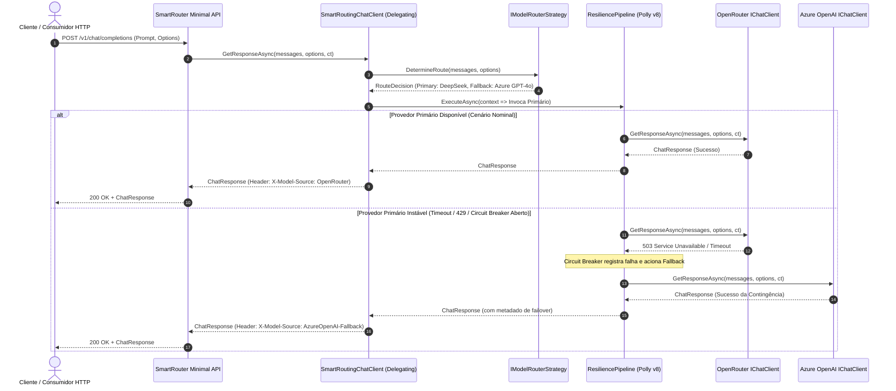

# Módulo 02: Gateway Unificado de Modelos, Roteamento Dinâmico e OpenRouter — Guia de Estudo e Especificação de Engenharia

> **Status:** Especificação Oficial de Estudo & Arquitetura  
> **Versão do .NET:** .NET 10 (LTS)  
> **Linguagem:** C# 14  
> **Pacotes Centrais:** `Microsoft.Extensions.AI`, `Microsoft.Extensions.Resilience`, `Polly.Core`  
> **Projeto Integrador Associado:** `src/Modulo02/SmartRouter/` (`SmartRouter.Gateway`)

---

## 1. Visão Geral e Metas de Aprendizado

### 1.1 O Problema Real de Mercado
Em ambientes corporativos de missão crítica, depender de um único provedor de Inteligência Artificial para todas as cargas de trabalho é uma falha grave de desenho arquitetural. As organizações enfrentam três desafios simultâneos:

1. **Instabilidade e Flutuação de Disponibilidade (Downtime & Throttling)**: Provedores líderes de nuvem e startups de IA sofrem com frequência com picos de tráfego, manutenções imprevistas e limites agressivos de taxa (*HTTP 429 Too Many Requests* e *HTTP 503 Service Unavailable*). Se uma aplicação crítica estiver amarrada a um único endpoint, o negócio é interrompido.
2. **Ineficiência Financeira (FinOps Inadequado)**: Tratar todas as perguntas da mesma forma — enviando desde um simples "Classifique este texto como Positivo/Negativo" até uma análise complexa de balanço patrimonial para modelos caros de última geração (como GPT-4o ou Claude 3.5 Sonnet) — explode os custos operacionais. Consultas de baixa complexidade devem ser direcionadas a modelos ultrarrápidos e de baixo custo (como Llama 3.3 70B, DeepSeek Chat ou GPT-4o-mini).
3. **Complexidade de Integração Multi-Provedor**: Manter dezenas de clientes HTTP, autenticações e regras de payload distintas para cada fornecedor de IA gera código espaguete, duplicação e alto custo de manutenção.

A resposta da engenharia moderna a esses desafios é o **AI Gateway com Roteamento Dinâmico e Resiliência Semântica**. Utilizando o agregador unificado **OpenRouter** em conjunto com as abstrações do **`Microsoft.Extensions.AI` (MEAI)** e as políticas modernas do **Polly v8 (`Microsoft.Extensions.Resilience`)**, é possível construir um Gateway que opera como um middleware inteligente e transparente: ele avalia a complexidade do prompt, despacha a carga para o modelo mais econômico e, se houver qualquer degradação de SLA ou falha de infraestrutura, comuta a requisição (*failover*) de forma imperceptível para uma nuvem de redundância (como Azure OpenAI).

### 1.2 Habilidades Adquiridas ao Concluir Este Módulo
Ao concluir o estudo e o projeto integrador deste módulo, você estará apto a:
- Dominar o padrão **Decorator** na pilha de IA do .NET por meio da classe base `DelegatingChatClient` e do `ChatClientBuilder`.
- Integrar o ecossistema aberto do **OpenRouter** como um Backing Service de inferência usando contratos compatíveis com `IChatClient`.
- Implementar **Roteamento Inteligente em Tempo de Execução (Dynamic Model Routing)** baseado em tamanho de contexto, complexidade da tarefa e restrições de latência.
- Aplicar o **Polly v8 / .NET Resilience Pipelines** em nível semântico (camada de aplicação de IA), configurando políticas de **Circuit Breaker**, **Retry com Jitter Exponencial**, **Timeout** e **Fallback Transparente**.
- Compreender a diferença crítica entre resiliência no nível de transporte HTTP versus resiliência no nível semântico de IA (`IChatClient`).
- Desenhar e expor uma **API WebMinimal (.NET 10)** corporativa que atua como proxy reverso de IA com streaming reativo (`text/event-stream`).
- Aplicar Clean Architecture e princípios SOLID em gateways de IA corporativos com observabilidade e testabilidade desacoplada.

---

## 2. Fundamentação Teórica Aprofundada

### 2.1 Anatomia do Pipeline Composicional: `DelegatingChatClient` e `ChatClientBuilder`

No `Microsoft.Extensions.AI`, a composição de comportamentos é inspirada diretamente no design bem-sucedido de `HttpMessageHandler` do ASP.NET Core. Toda a extensibilidade gira em torno de duas abstrações:

```csharp
public abstract class DelegatingChatClient : IChatClient
{
    protected DelegatingChatClient(IChatClient innerClient)
    {
        InnerClient = innerClient ?? throw new ArgumentNullException(nameof(innerClient));
    }

    protected IChatClient InnerClient { get; }

    public virtual Task<ChatResponse> GetResponseAsync(
        IEnumerable<ChatMessage> chatMessages, 
        ChatOptions? options = null, 
        CancellationToken cancellationToken = default)
        => InnerClient.GetResponseAsync(chatMessages, options, cancellationToken);

    public virtual IAsyncEnumerable<StreamingChatCompletionUpdate> GetStreamingResponseAsync(
        IEnumerable<ChatMessage> chatMessages, 
        ChatOptions? options = null, 
        CancellationToken cancellationToken = default)
        => InnerClient.GetStreamingResponseAsync(chatMessages, options, cancellationToken);

    public virtual object? GetService(Type serviceType, object? serviceKey = null)
        => InnerClient.GetService(serviceType, serviceKey);

    public virtual void Dispose() => InnerClient.Dispose();
}
```

A classe `ChatClientBuilder` permite encadear múltiplos decorators formando uma esteira de execução linear:

```csharp
IChatClient client = new ChatClientBuilder(baseChatClient)
    .UseLogging()
    .UseOpenTelemetry()
    .Use(inner => new SmartRoutingChatClient(inner, fallbackClient, routerStrategy))
    .Build();
```

Cada elo dessa cadeia tem a oportunidade de inspecionar a coleção `chatMessages`, modificar `ChatOptions` (ex.: alterar o `ModelId`), medir latência, interceptar erros ou abortar a chamada antes que ela atinja a rede.

```
[ Requisição do Domínio ]
         │
         ▼
┌───────────────────────────────┐
│ LoggingChatClient (Decorator) │ ── Registra início e payload
└──────────────┬────────────────┘
               │
               ▼
┌───────────────────────────────┐
│ SmartRoutingChatClient        │ ── Avalia prompt e decide rota:
│ (Custom DelegatingChatClient) │    - Primário: OpenRouter (DeepSeek/Llama)
└──────────────┬────────────────┘    - Fallback: Azure OpenAI (GPT-4o)
               │
      ┌────────┴────────┐
  (Sucesso)         (Falha / Timeout / Circuit Breaker Aberto)
      ▼                 ▼
[ OpenRouter API ]  [ Azure OpenAI API ]
```

### 2.2 O Ecossistema OpenRouter como Agregador Universal

O **OpenRouter** opera como uma camada unificada de roteamento de modelos públicos e privados. Ele padroniza a API REST da OpenAI (`/v1/chat/completions`), expondo centenas de modelos abertos e proprietários sob um mesmo protocolo de transporte.

#### Particularidades Técnicas do OpenRouter
1. **Identificadores de Modelo Qualificados**: Os modelos utilizam o formato `provedor/nome-do-modelo` (ex.: `deepseek/deepseek-chat`, `meta-llama/llama-3.3-70b-instruct`, `anthropic/claude-3.5-haiku`).
2. **Headers Obrigatórios de Governança**:
   - `HTTP-Referer`: Identifica o domínio ou aplicação consumidora para estatísticas no painel de controle.
   - `X-Title`: Título legível da aplicação exibido nos logs corporativos do agregador.
3. **Roteamento Dinâmico Remoto via `openrouter/auto`**: O OpenRouter disponibiliza um endpoint pseudo-modelo que seleciona automaticamente o provedor mais rápido e barato para uma dada consulta. No entanto, em engenharia de sistemas enterprise, o roteamento local determinístico é superior, pois mantém as regras de governança e auditoria sob posse da organização.

### 2.3 Resiliência no .NET: Polly v8 vs Resiliência Semântica de IA

O .NET 8, 9 e 10 integram o **Polly v8** por meio da biblioteca oficial `Microsoft.Extensions.Resilience`. O novo motor do Polly foi reconstruído do zero com foco em **Zero Allocation** e **Performance Nativa**, baseado no conceito unificado de `ResiliencePipeline`.

Existe uma distinção fundamental que todo Arquiteto de IA em .NET precisa dominar:

| Dimensão | Resiliência em Nível de Transporte (HTTP) | Resiliência Semântica em Nível de IA (`IChatClient`) |
| :--- | :--- | :--- |
| **Onde Atua** | `HttpMessageHandler` / `IHttpClientFactory` | `DelegatingChatClient` ou Caso de Uso da Aplicação |
| **Escopo de Ação** | Retries do mesmo pacote HTTP para a mesma URL | Comutação completa de modelo, parâmetros e credenciais de nuvem |
| **Consciência de Domínio** | Vê apenas *status codes* (ex.: 503, 429) e bytes | Vê histórico de mensagens, contagem de tokens e intenção do usuário |
| **Capacidade de Failover** | Não consegue mudar de provedor sem hacks no HttpClient | Comuta de `deepseek/deepseek-chat` (OpenRouter) para `gpt-4o-mini` (Azure) nativamente |
| **Tratamento de Streaming** | Difícil de recuperar se o stream SSE quebrar na metade | Pode descartar chunks parciais e reiniciar o stream no cliente de backup |

#### Estratégias do ResiliencePipeline Aplicáveis a Gateways de IA
1. **Circuit Breaker**: Interrompe o envio de requisições a um provedor que começou a falhar consistentemente, evitando chamadas inúteis que aumentam a latência do usuário final.
   - *Estado Closed*: Operação normal. Todas as requisições passam.
   - *Estado Open*: Falhas consecutivas ultrapassaram a taxa de tolerância. As requisições são rejeitadas imediatamente com `BrokenCircuitException`, disparando o fallback instantâneo.
   - *Estado Half-Open*: Após um período de resfriamento (*BreakDuration*), requisições de teste (*canary requests*) são enviadas para verificar se o serviço se recuperou.
2. **Timeout Estratégico**: Define o teto aceitável de espera. Chamadas de inferência de modelos econômicos via OpenRouter devem responder rapidamente; se excederem o limiar de SLA (ex.: 4 segundos para o primeiro token), a chamada é cancelada e o provedor reserva assume.
3. **Fallback Strategy**: Se a execução primária lançar exceção tratável (`HttpRequestException`, `TimeoutRejectedException` ou `BrokenCircuitException`), o pipeline executa um delegado de contingência que consome o `IChatClient` secundário.

### 2.4 Padrões de Roteamento Dinâmico de Modelos

O roteador dinâmico opera avaliando heurísticas determinísticas antes de invocar o modelo. As principais estratégias implementadas em produção incluem:

1. **Roteamento por Custo / Complexidade Sintática**:
   - Avalia o número total de caracteres ou estimativa de tokens do prompt (`chatMessages`).
   - Se o histórico total for curto (< 500 tokens) e não contiver palavras-chave que demandem raciocínio analítico profundo, despacha para um modelo ultrarrápido (ex.: `meta-llama/llama-3.3-70b-instruct` via OpenRouter).
   - Se o prompt for longo ou exigir raciocínio extenso, direciona para o modelo carro-chefe corporativo (Azure OpenAI).
2. **Roteamento por Intenção do Sistema (System Directive Routing)**:
   - Inspeciona mensagens com `ChatRole.System`. Metadados explícitos configurados nas opções de requisição (`ChatOptions.AdditionalProperties["route-tier"] = "premium"`) forçam o bypass da rota econômica.
3. **Roteamento Baseado em SLA e Histórico de Saúde (Health-Adaptive Routing)**:
   - O gateway monitora uma janela deslizante de latência média e taxa de erro dos provedores. Se a latência média do OpenRouter nos últimos 60 segundos superar 2.500 ms, novas requisições prioritárias são preemptivamente desviadas para o Azure OpenAI.

### 2.5 Trade-offs, Vantagens e Armadilhas de Produção (*Gotchas & Anti-patterns*)

> [!WARNING]
> **Anti-Pattern 1: Hedging Agressivo com Custos Duplicados**  
> O padrão *Hedging* consiste em disparar a mesma requisição para dois provedores simultaneamente e consumir o primeiro que responder, cancelando o outro. Em chamadas HTTP tradicionais, isso é comum. Em LLMs comerciais, **ambos os provedores cobrarão pelos tokens de entrada (prompt tokens)** mesmo se a conexão for abortada logo após o início do processamento. Em cenários FinOps de IA, o padrão recomendado é **Fallback em Timeout**, e não Hedging cego.

> [!WARNING]
> **Anti-Pattern 2: Fallback Parcial Quebrando Streaming SSE**  
> Se o cliente HTTP do usuário estiver consumindo um stream `text/event-stream` e a conexão com o provedor primário falhar após 10 tokens terem sido enviados, não é trivial comutar para o provedor secundário e continuar a geração da mesma palavra sem gerar duplicação ou texto incoerente.  
> **Solução Recomendada**: Utilizar buffering inicial dos primeiros chunks (ex.: aguardar os primeiros 50 caracteres antes de iniciar o flush HTTP ou implementar detecção de erro com reinício gracioso de stream informando um evento sentinela no protocolo SSE).

> [!WARNING]
> **Anti-Pattern 3: Ignorar o Formato de Identificação de Modelos do OpenRouter**  
> Enviar apenas `gpt-4o-mini` para a API do OpenRouter pode resultar em falha ou resolução ambígua, pois múltiplos data centers e provedores empacotam o mesmo modelo. Sempre utilize identificadores canônicos completos (ex.: `openai/gpt-4o-mini` ou `deepseek/deepseek-chat`).

---

## 3. Mapeamento de Princípios e Padrões Arquiteturais

### 3.1 Os Princípios SOLID Aplicados

| Princípio | Aplicação Prática no Módulo 02 |
| :--- | :--- |
| **SRP (Single Responsibility)** | Separação estrita de responsabilidades: (1) `SmartRoutingChatClient` gerencia exclusivamente a delegação e o ciclo de fallback; (2) `IModelRouterStrategy` analisa a requisição e define a rota ideal; (3) `IProviderHealthTracker` rastreia métricas de disponibilidade e latência; (4) `OpenRouterClientFactory` cuida da configuração HTTP e headers. |
| **OCP (Open/Closed)** | Novas heurísticas de roteamento (ex.: roteamento baseado em embeddings ou classificação semântica) são adicionadas implementando novas classes derivadas de `IModelRouterStrategy`, sem modificar o código do `SmartRoutingChatClient`. |
| **LSP (Liskov Substitution)** | Tanto o cliente de borda OpenRouter quanto o cliente Azure OpenAI e o próprio cliente composto `SmartRoutingChatClient` implementam a interface `IChatClient`. A camada de API (Minimal API) consome qualquer um deles de forma intercambiável sem conhecer a topologia interna. |
| **ISP (Interface Segregation)** | Criação de interfaces coesas: `IModelRouterStrategy` expõe apenas o método de resolução de rota; `IChatClient` cuida apenas da conversação; não há contratos "gordos" misturando telemetria com geração de texto. |
| **DIP (Dependency Inversion)** | A Minimal API e os serviços de aplicação dependem exclusivamente de `IChatClient` registrado no contêiner de Injeção de Dependências, isolando os SDKs do Azure OpenAI ou clientes HTTP do OpenRouter na camada de infraestrutura. |

### 3.2 Padrões de Projeto (Design Patterns)

1. **Decorator Pattern (`DelegatingChatClient`)**: O gateway envelopa os clientes concretos de IA com camadas sucessivas de interceptação (Roteamento Dinâmico, Polly Resilience, Logging e Telemetria).
2. **Strategy Pattern (`IModelRouterStrategy`)**: O algoritmo de escolha de rota (econômica vs desempenho vs balanceada) é desacoplado do cliente de execução, permitindo alternância configurável em tempo de execução via `appsettings.json`.
3. **Circuit Breaker Pattern (Polly v8)**: Isola instabilidades de provedores remotos protegendo a infraestrutura corporativa contra consumo de threads ociosas e falhas em cascata.
4. **Fallback Pattern**: Mecanismo garantido de contingência que aciona a nuvem secundária em caso de esgotamento de tentativas ou circuitos abertos.

### 3.3 The Twelve-Factor App & The Twelve-Factor Agent

- **Factor III (Config)**: Todas as URLs de gateways, chaves de API do OpenRouter e endpoints do Azure OpenAI são carregados estritamente via variáveis de ambiente (`OPENROUTER_API_KEY`, `AZURE_OPENAI_ENDPOINT`).
- **Factor IV (Backing Services)**: O OpenRouter e o Azure OpenAI são tratados como recursos vinculados anexados. Se o OpenRouter for substituído por outro agregador local (ex.: vLLM corporativo), nenhuma alteração estrutural no código é necessária.
- **Factor IX (Disposability)**: Inicialização rápida e encerramento gracioso via tokens de cancelamento cooperativo no ASP.NET Core e nos pipelines do Polly.
- **Factor XI (Logs as Event Streams)**: Cada decisão de roteamento (rota primária escolhida, desvios de fallback, tempo de circuit breaker aberto) é emitida como log estruturado contendo tags padronizadas para análise de telemetria.
- **Twelve-Factor Agent - Factor 1 (Lógica Determinística vs Modelo Probabilístico)**: As regras de comutação de rota, contingência e circuit breaker são 100% determinísticas e auditáveis em código C#, garantindo que o agente nunca tome decisões de infraestrutura por alucinação.
- **Twelve-Factor Agent - Factor 10 (Idempotência e Tolerância a Falhas)**: O gateway assegura que falhas transitórias sejam absorvidas com transparência e rastreabilidade através de identificadores de correlação (*Correlation ID*).

### 3.4 Diagrama Arquitetural de Roteamento e Resiliência



---

## 4. Checkpoints Cognitivos de Aprendizagem

Antes de iniciar a implementação do projeto integrador, valide o seu entendimento respondendo aos seguintes desafios técnicos:

### Checkpoint 1: Nível de Resiliência — Transporte HTTP vs `IChatClient`
**Pergunta:** Por que configurar uma política de retry tradicional no `HttpClient` que conecta ao OpenRouter pode não ser suficiente para resolver uma indisponibilidade corporativa de IA?  
> **Gabarito Técnico:** O retry no `HttpClient` repete a mesma requisição HTTP contra o mesmo endpoint e a mesma URL. Se o modelo específico no OpenRouter estiver indisponível (out of capacity) ou se a chave de API atingir o limite de quota da conta, todos os retries HTTP falharão repetidamente, consumindo tempo e mantendo a indisponibilidade. A resiliência semântica no nível do `IChatClient` permite interceptar o erro e redirecionar a requisição para um provedor totalmente distinto (ex.: Azure OpenAI), mudando endpoint, autenticação e formato de modelo.

### Checkpoint 2: Como o `DelegatingChatClient` lida com o Streaming
**Pergunta:** Se implementarmos um `DelegatingChatClient` para capturar a duração total da chamada, qual o erro comum ao implementar o método `GetStreamingResponseAsync`?  
> **Gabarito Técnico:** O erro comum é tentar medir o tempo total encapsulando a chamada `InnerClient.GetStreamingResponseAsync` em um bloco `try/finally` com `Stopwatch.Stop()` imediatamente após o retorno do método. Como o método retorna um `IAsyncEnumerable<T>`, a chamada ao método retorna imediatamente um iterador assíncrono antes que os tokens comecem a ser gerados. O `Stopwatch` só pode ser finalizado após a exaustão de todos os chunks do iterador através de um loop assíncrono `await foreach` que reemite os elementos com `yield return`.

### Checkpoint 3: O Funcionamento Interno do Circuit Breaker do Polly v8
**Pergunta:** Quais são os três estados do Circuit Breaker e qual é a consequência direta de mantê-lo no estado *Open* para o custo operacional da aplicação?  
> **Gabarito Técnico:** Os estados são: *Closed* (circuito fechado, tráfego normal), *Open* (circuito aberto, tráfego bloqueado de imediato após exceder o limite de falhas) e *Half-Open* (circuito semi-aberto, permite poucas requisições de teste para validar a recuperação do serviço). A consequência de estar no estado *Open* é a rejeição imediata da chamada primária com `BrokenCircuitException` sem efetuar roundtrips de rede inúteis. Isso economiza latência e permite que o fallback seja acionado em menos de 1 milissegundo, preservando o SLA do cliente final.

### Checkpoint 4: Resolução de Headers Especiais no OpenRouter
**Pergunta:** Qual o impacto técnico de omitir os cabeçalhos `HTTP-Referer` e `X-Title` em requisições de grande volume direcionadas ao OpenRouter?  
> **Gabarito Técnico:** O OpenRouter utiliza esses cabeçalhos para categorizar, auditar e aplicar políticas de roteamento e rankings de modelos na plataforma. A omissão desses cabeçalhos pode resultar em taxas de limitação mais restritivas (throttling), perda de visibilidade analítica no dashboard de gerenciamento de custos corporativos e, em determinados modelos gratuitos ou promocionais, bloqueio imediato da requisição.

### Checkpoint 5: Preservação de Contexto e Opções no Failover
**Pergunta:** Ao comutar uma requisição de um modelo do OpenRouter (ex.: `deepseek/deepseek-chat`) para o Azure OpenAI (ex.: `gpt-4o-mini`), quais ajustes devem ser feitos nas `ChatOptions`?  
> **Gabarito Técnico:** O identificador do modelo (`ChatOptions.ModelId`) deve ser atualizado para o nome do *Deployment* registrado no recurso do Azure OpenAI. Além disso, se o modelo de destino não suportar determinados hiperparâmetros (como `TopK` ou sementes proprietárias), o adaptador de contingência deve higienizar ou sobrescrever as propriedades incompatíveis para evitar rejeições com status *HTTP 400 Bad Request*.

### Checkpoint 6: Injeção de Dependências de Múltiplos `IChatClient`
**Pergunta:** Como registrar múltiplos `IChatClient` no contêiner nativo do .NET (`IServiceCollection`) sem causar colisão de tipos na resolução de dependências?  
> **Gabarito Técnico:** Deve-se utilizar **Keyed Services** (`AddKeyedSingleton` / `AddKeyedTransient`), funcionalidade nativa do .NET desde o .NET 8 e aprimorada no .NET 10. Registram-se os clientes com chaves nominais específicas (ex.: `builder.Services.AddKeyedSingleton<IChatClient>("openrouter", ...)` e `builder.Services.AddKeyedSingleton<IChatClient>("azure", ...)`), injetando o cliente principal unificado como a implementação padrão não-chaveada (`IChatClient`), a qual encapsula o `SmartRoutingChatClient`.

---

## 5. Leituras Recomendadas & Grounding no Microsoft Learn

Aprofunde-se nos conceitos oficiais por meio da documentação da Microsoft e da comunidade .NET:

1. **Abstração e Middlewares do `Microsoft.Extensions.AI`**:
   - [Documentação Oficial de Custom IChatClient Middleware](https://learn.microsoft.com/dotnet/ai/ichatclient#custom-ichatclient-middleware)
   - [Conceitos de ChatClientBuilder no .NET](https://learn.microsoft.com/dotnet/api/microsoft.extensions.ai.chatclientbuilder)
2. **Resiliência e Políticas de Falha com Polly v8 no .NET**:
   - [Visão Geral de Resiliência HTTP no .NET com Microsoft.Extensions.Resilience](https://learn.microsoft.com/dotnet/core/resilience/http-resilience)
   - [Padrões de Circuit Breaker e Retry com Polly](https://learn.microsoft.com/dotnet/architecture/microservices/implement-resilient-applications/implement-circuit-breaker-pattern)
3. **Construção de APIs Modernas e Injeção de Dependência**:
   - [Minimal APIs no ASP.NET Core](https://learn.microsoft.com/aspnet/core/fundamentals/minimal-apis)
   - [Injeção de Dependências com Keyed Services no .NET](https://learn.microsoft.com/dotnet/core/extensions/dependency-injection#keyed-services)
4. **Documentação de Provedores e Agregadores**:
   - [Documentação de Integração da API do OpenRouter](https://openrouter.ai/docs/quick-start)
   - [Azure OpenAI Service REST API reference](https://learn.microsoft.com/azure/ai-services/openai/reference)

---

## 6. Especificação Técnica do Projeto Integrador

### 6.1 Nome e Propósito do Projeto
- **Identificador:** `SmartRouter.Gateway`
- **Caminho da Solução:** `src/Modulo02/SmartRouter/`
- **Cenário de Negócio:** Uma corporação de serviços financeiros processa milhares de requisições de texto diárias de múltiplos departamentos internos (atendimento ao cliente, triagem de chamados, suporte técnico e análise jurídica). A diretoria de tecnologia exige:
  1. Redução drástica de custos operacionais (FinOps) redirecionando prompts rotineiros para modelos abertos e econômicos via OpenRouter.
  2. SLA garantido de 99.9% de uptime para a aplicação através de um fallback transparente para o cluster privado corporativo no Azure OpenAI.
  3. Uma API HTTP unificada compatível com o padrão de mercado para consumo por microsserviços legados e novos agentes.

### 6.2 Requisitos Funcionais (RFs)
- **RF-01 (Gateway Unificado)**: Expor endpoints REST em Minimal API para geração de conversação tradicional (`POST /v1/chat/completions`) e reativa via streaming SSE (`POST /v1/chat/stream`).
- **RF-02 (Roteamento Dinâmico Heurístico)**: Implementar um `IModelRouterStrategy` que avalie as mensagens recebidas. Se a contagem total de caracteres do prompt for inferior ao limiar configurado (ex.: < 1.000 caracteres) e não houver flag de alta complexidade, a rota primária é o modelo econômico do OpenRouter (ex.: `deepseek/deepseek-chat`). Prompts grandes ou complexos são roteados diretamente para o modelo corporativo (Azure OpenAI).
- **RF-03 (Fallback Automático com Polly v8)**: Se a chamada ao provedor primário (OpenRouter) falhar devido a erro de rede, timeout (SLA > 4 segundos) ou status de erro HTTP (429, 500, 502, 503), o gateway deve comutar imediatamente a execução para o provedor secundário (Azure OpenAI), completando a solicitação do usuário com sucesso.
- **RF-04 (Circuit Breaker Inteligente)**: Configurar um circuito que se abra caso a taxa de falhas do provedor primário atinja 50% em uma janela amostral de 30 segundos com mínimo de 5 chamadas. Enquanto o circuito estiver aberto, as requisições devem ir diretamente para a contingência sem sequer tentar o provedor primário.
- **RF-05 (Metadados de Roteamento nos Headers)**: A resposta HTTP gerada deve incluir cabeçalhos diagnósticos:
  - `X-SmartRouter-Target`: Identificador do modelo e provedor efetivamente utilizado na resposta final.
  - `X-SmartRouter-FallbackApplied`: Valor booleano (`true`/`false`) informando se o mecanismo de contingência foi acionado.
  - `X-SmartRouter-Latency-Ms`: Tempo total de processamento no gateway.
- **RF-06 (Endpoint de Saúde e Telemetria)**: Expor um endpoint de diagnóstico (`GET /health/circuit`) que informe o estado em tempo real do Circuit Breaker do OpenRouter e as estatísticas acumuladas de falhas e sucessos.

### 6.3 Requisitos Não-Funcionais (RNFs)
- **RNF-01 (Plataforma Alvo)**: .NET 10 LTS compilado em C# 14 com `<Nullable>enable</Nullable>` e tratamento de warnings como erros em modo Release.
- **RNF-02 (Clean Architecture)**: Isolamento rigoroso entre domínio, regras de roteamento (Application), adaptadores de IA e resiliência (Infrastructure) e a camada de apresentação (Gateway Minimal API).
- **RNF-03 (Resiliência Sem Alocação Excessiva)**: O pipeline do Polly v8 deve ser configurado via `ResiliencePipelineBuilder` com reutilização estática de instâncias, sem criar pipelines descartáveis por requisição.
- **RNF-04 (Gerenciamento Seguro de Segredos)**: Nenhuma chave privada de API hardcoded. Utilização estrita de Variáveis de Ambiente e `.NET User Secrets` com mapeamento tipado (`IOptions<SmartRouterOptions>`).
- **RNF-05 (Testabilidade Automatizada)**: Capacidade de testar todas as rotas e regras de fallback unitariamente através de injeção de mocks (`IChatClient` simulado que lança exceções controladas).

### 6.4 Estrutura de Diretórios da Solução

```
src/Modulo02/SmartRouter/
├── SmartRouter.sln
├── src/
│   ├── SmartRouter.Domain/                   # Modelos puros, Enums, Interfaces de Estratégia
│   │   ├── Enums/
│   │   │   ├── RouteTier.cs
│   │   │   └── ProviderKind.cs
│   │   ├── Models/
│   │   │   ├── RoutingDecision.cs
│   │   │   └── ProviderHealthSnapshot.cs
│   │   └── Strategies/
│   │       └── IModelRouterStrategy.cs
│   │
│   ├── SmartRouter.Application/              # Casos de Uso, DTOs de Entrada e Saída
│   │   ├── Common/
│   │   │   └── ISmartRouterService.cs
│   │   ├── DTOs/
│   │   │   ├── ChatRequestDto.cs
│   │   │   ├── ChatResponseDto.cs
│   │   │   └── CircuitStatusDto.cs
│   │   └── UseCases/
│   │       └── ExecuteChatCompletionUseCase.cs
│   │
│   ├── SmartRouter.Infrastructure/           # Middlewares, Polly, Fábricas e Adaptação MEAI
│   │   ├── Clients/
│   │   │   └── SmartRoutingChatClient.cs     # DelegatingChatClient customizado
│   │   ├── Configuration/
│   │   │   ├── SmartRouterOptions.cs
│   │   │   ├── OpenRouterOptions.cs
│   │   │   └── AzureOpenAiOptions.cs
│   │   ├── Resilience/
│   │   │   └── SmartRouterResilienceFactory.cs
│   │   ├── Strategies/
│   │   │   └── HeuristicModelRouterStrategy.cs
│   │   └── Extensions/
│   │       └── ServiceCollectionExtensions.cs
│   │
│   └── SmartRouter.Gateway/                  # Minimal API, Swagger/OpenAPI, Middlewares HTTP
│       ├── Program.cs
│       ├── Endpoints/
│       │   ├── ChatEndpoints.cs
│       │   └── DiagnosticEndpoints.cs
│       ├── appsettings.json
│       └── appsettings.Development.json
│
└── tests/
    └── SmartRouter.Tests/                    # Testes Unitários e de Integração
        ├── Clients/
        │   └── SmartRoutingChatClientTests.cs
        ├── Strategies/
        │   └── HeuristicModelRouterStrategyTests.cs
        └── Resilience/
            └── CircuitBreakerFallbackTests.cs
```

### 6.5 Contratos de Interfaces e Entidades Principais (Domain & Infrastructure)

Abaixo estão os contratos fundamentais em C# que estabelecem a espinha dorsal arquitetural do sistema:

#### Enums e Records de Domínio
```csharp
namespace SmartRouter.Domain.Enums;

public enum RouteTier
{
    Economy,    // Modelos baratos, alta velocidade (OpenRouter: DeepSeek / Llama)
    Premium     // Modelos de raciocínio avançado corporativo (Azure OpenAI: GPT-4o)
}

public enum ProviderKind
{
    OpenRouter,
    AzureOpenAi,
    FallbackCircuit
}
```

```csharp
namespace SmartRouter.Domain.Models;

using SmartRouter.Domain.Enums;

public record RoutingDecision(
    RouteTier SelectedTier,
    ProviderKind TargetProvider,
    string ModelIdentifier,
    string Reason);

public record ProviderHealthSnapshot(
    ProviderKind Provider,
    bool IsCircuitOpen,
    int ConsecutiveFailures,
    DateTimeOffset LastCheckedUtc);
```

#### Contrato de Estratégia de Roteamento
```csharp
namespace SmartRouter.Domain.Strategies;

using Microsoft.Extensions.AI;
using SmartRouter.Domain.Models;

public interface IModelRouterStrategy
{
    RoutingDecision ResolveRoute(
        IEnumerable<ChatMessage> messages, 
        ChatOptions? options);
}
```

#### O Middleware Decorator de Roteamento e Resiliência
```csharp
namespace SmartRouter.Infrastructure.Clients;

using System.Runtime.CompilerServices;
using Microsoft.Extensions.AI;
using Polly;
using SmartRouter.Domain.Enums;
using SmartRouter.Domain.Models;
using SmartRouter.Domain.Strategies;

public class SmartRoutingChatClient : DelegatingChatClient
{
    private readonly IChatClient _fallbackClient;
    private readonly IModelRouterStrategy _routerStrategy;
    private readonly ResiliencePipeline _resiliencePipeline;

    public SmartRoutingChatClient(
        IChatClient primaryClient,
        IChatClient fallbackClient,
        IModelRouterStrategy routerStrategy,
        ResiliencePipeline resiliencePipeline) 
        : base(primaryClient)
    {
        _fallbackClient = fallbackClient ?? throw new ArgumentNullException(nameof(fallbackClient));
        _routerStrategy = routerStrategy ?? throw new ArgumentNullException(nameof(routerStrategy));
        _resiliencePipeline = resiliencePipeline ?? throw new ArgumentNullException(nameof(resiliencePipeline));
    }

    // Sobrescrita do método síncrono/monolítico com resiliência semântica e fallback
    public override async Task<ChatResponse> GetResponseAsync(
        IEnumerable<ChatMessage> chatMessages, 
        ChatOptions? options = null, 
        CancellationToken cancellationToken = default)
    {
        var messagesList = chatMessages.ToList();
        var decision = _routerStrategy.ResolveRoute(messagesList, options);

        // Se a estratégia já recomendar a rota Premium diretamente, vai para o cliente de fallback (Azure)
        if (decision.SelectedTier == RouteTier.Premium)
        {
            return await _fallbackClient.GetResponseAsync(messagesList, options, cancellationToken);
        }

        // Executa através do ResiliencePipeline do Polly v8
        return await _resiliencePipeline.ExecuteAsync(
            async state =>
            {
                try
                {
                    var response = await InnerClient.GetResponseAsync(state.Messages, state.Opts, state.Ct);
                    response.AdditionalProperties ??= new AdditionalPropertiesDictionary();
                    response.AdditionalProperties["X-SmartRouter-Applied"] = ProviderKind.OpenRouter.ToString();
                    return response;
                }
                catch (Exception)
                {
                    // Falha no primário: aciona fallback explícito
                    var fallbackResponse = await _fallbackClient.GetResponseAsync(state.Messages, state.Opts, state.Ct);
                    fallbackResponse.AdditionalProperties ??= new AdditionalPropertiesDictionary();
                    fallbackResponse.AdditionalProperties["X-SmartRouter-Applied"] = ProviderKind.AzureOpenAi.ToString();
                    fallbackResponse.AdditionalProperties["X-SmartRouter-FallbackTriggered"] = true;
                    return fallbackResponse;
                }
            },
            new { Messages = messagesList, Opts = options, Ct = cancellationToken },
            cancellationToken);
    }

    // Sobrescrita do streaming reativo com controle de contingência
    public override async IAsyncEnumerable<StreamingChatCompletionUpdate> GetStreamingResponseAsync(
        IEnumerable<ChatMessage> chatMessages, 
        ChatOptions? options = null, 
        [EnumeratorCancellation] CancellationToken cancellationToken = default)
    {
        var messagesList = chatMessages.ToList();
        var decision = _routerStrategy.ResolveRoute(messagesList, options);

        if (decision.SelectedTier == RouteTier.Premium)
        {
            await foreach (var update in _fallbackClient.GetStreamingResponseAsync(messagesList, options, cancellationToken))
            {
                yield return update;
            }
            yield break;
        }

        IAsyncEnumerator<StreamingChatCompletionUpdate>? enumerator = null;
        var primaryFailed = false;

        try
        {
            enumerator = InnerClient.GetStreamingResponseAsync(messagesList, options, cancellationToken)
                                    .GetAsyncEnumerator(cancellationToken);
        }
        catch (Exception)
        {
            primaryFailed = true;
        }

        if (!primaryFailed && enumerator != null)
        {
            bool hasMore;
            try
            {
                hasMore = await enumerator.MoveNextAsync();
            }
            catch (Exception)
            {
                primaryFailed = true;
                hasMore = false;
            }

            if (!primaryFailed && hasMore)
            {
                do
                {
                    yield return enumerator.Current;
                    try
                    {
                        hasMore = await enumerator.MoveNextAsync();
                    }
                    catch (Exception)
                    {
                        // Se falhar no meio do streaming, encerra de forma graciosa ou registra o erro
                        yield break;
                    }
                } while (hasMore);

                await enumerator.DisposeAsync();
                yield break;
            }

            if (enumerator != null)
            {
                await enumerator.DisposeAsync();
            }
        }

        // Execução do Fallback caso o primário falhe no início do streaming
        await foreach (var update in _fallbackClient.GetStreamingResponseAsync(messagesList, options, cancellationToken))
        {
            yield return update;
        }
    }
}
```

#### Contrato das Configurações de Opções (Options Pattern)
```csharp
namespace SmartRouter.Infrastructure.Configuration;

public record SmartRouterOptions
{
    public const string SectionName = "SmartRouter";

    public OpenRouterOptions OpenRouter { get; init; } = new();
    public AzureOpenAiOptions AzureOpenAi { get; init; } = new();
    public int CharacterThresholdForPremiumTier { get; init; } = 1000;
    public double CircuitBreakerFailureRatio { get; init; } = 0.5;
    public int CircuitBreakerSamplingDurationSeconds { get; init; } = 30;
    public int TimeoutSeconds { get; init; } = 5;
}

public record OpenRouterOptions
{
    public string ApiKey { get; init; } = string.Empty;
    public string BaseUrl { get; init; } = "https://openrouter.ai/api/v1";
    public string DefaultModel { get; init; } = "deepseek/deepseek-chat";
    public string HttpReferer { get; init; } = "https://mafmastery.local";
    public string AppTitle { get; init; } = "MafMastery-SmartRouter";
}

public record AzureOpenAiOptions
{
    public string Endpoint { get; init; } = string.Empty;
    public string ApiKey { get; init; } = string.Empty;
    public string DeploymentName { get; init; } = "gpt-4o-mini";
}
```

### 6.6 Critérios de Aceite & Definição de Pronto (*Definition of Done - DoD*)

- [ ] **Compilação Estrita**: A solução completa compila em .NET 10 LTS sem avisos (*warnings as errors* habilitados em Release).
- [ ] **Configuração Via Ambiente**: As chaves de acesso do OpenRouter e do Azure OpenAI são lidas estritamente via `IConfiguration` e variáveis de ambiente ou User Secrets.
- [ ] **Roteamento Heurístico Funcional**: Prompts com volume de caracteres abaixo de 1.000 são encaminhados para a rota econômica; prompts acima de 1.000 caracteres vão para a rota Premium.
- [ ] **Fallback Transparente Testado**: Quando o cliente primário do OpenRouter simula um erro 429 ou 503, o gateway completa a requisição com sucesso retornando a resposta do Azure OpenAI com o cabeçalho `X-SmartRouter-FallbackApplied: true`.
- [ ] **Circuit Breaker Operacional**: Após o número estipulado de falhas consecutivas, novas requisições não tentam contatar o OpenRouter, comutando imediatamente para a contingência.
- [ ] **Streaming SSE Homologado**: O endpoint `POST /v1/chat/stream` emite tokens no padrão `text/event-stream` com sucesso para ambos os provedores.
- [ ] **Suíte de Testes Automatizados**: Atingimento de cobertura superior a 80% na camada de `Infrastructure/Clients` e `Infrastructure/Strategies`, com testes unitários cobrindo falhas simuladas via mocks.

### 6.7 Plano Mínimo de Testes

1. **Testes Unitários da Estratégia de Roteamento (`HeuristicModelRouterStrategyTests`)**:
   - `ResolveRoute_PromptCurto_RetornaRotaEconomicaOpenRouter()`
   - `ResolveRoute_PromptLongoAcimaDoLimiar_RetornaRotaPremiumAzure()`
   - `ResolveRoute_OpcaoComDirectiveExplicit_SobrescreveHeuristica()`
2. **Testes Unitários do Decorator (`SmartRoutingChatClientTests`)**:
   - `GetResponseAsync_ProvedorPrimarioSucesso_NaoChamaFallback()`
   - `GetResponseAsync_ProvedorPrimarioLancaHttpException_ChamaFallbackComSucesso()`
   - `GetResponseAsync_ProvedorPrimarioFalha_AdicionaMetadadosDeFallbackNaResposta()`
   - `GetStreamingResponseAsync_PrimarioFalhaNoInicio_ExecutaStreamDoFallbackIntegralmente()`
3. **Testes de Integração de Resiliência (`CircuitBreakerFallbackTests`)**:
   - Disparo de um lote de 10 chamadas simulando falha no cliente primário. Verificar se o circuito abre e as chamadas subsequentes não invocam o método `GetResponseAsync` do cliente primário.

---

## 7. Roteiro Passo a Passo de Construção (Build Roadmap)

Para implementar o projeto integrador de forma metódica e incremental, siga a esteira de construção recomendada:

### Etapa 1: Setup da Solução e Estrutura de Projetos
1. Crie a pasta `src/Modulo02/SmartRouter/` e inicialize a solução:
   ```bash
   mkdir -p src/Modulo02/SmartRouter
   cd src/Modulo02/SmartRouter
   dotnet new sln -n SmartRouter
   ```
2. Crie os quatro projetos correspondentes às camadas da Clean Architecture:
   ```bash
   dotnet new classlib -n SmartRouter.Domain -f net10.0
   dotnet new classlib -n SmartRouter.Application -f net10.0
   dotnet new classlib -n SmartRouter.Infrastructure -f net10.0
   dotnet new web -n SmartRouter.Gateway -f net10.0
   dotnet new xunit -n SmartRouter.Tests -f net10.0
   ```
3. Adicione os projetos à solução e estabeleça as referências de dependência unidirecionais:
   - `SmartRouter.Gateway` referencia `Application` e `Infrastructure`.
   - `SmartRouter.Infrastructure` referencia `Domain` e `Application`.
   - `SmartRouter.Application` referencia `Domain`.
   - `SmartRouter.Tests` referencia `Infrastructure` e `Application`.
4. Instale os pacotes NuGet fundamentais:
   - Em `SmartRouter.Domain` e `Application`: `Microsoft.Extensions.AI.Abstractions`.
   - Em `SmartRouter.Infrastructure`: `Microsoft.Extensions.AI`, `Microsoft.Extensions.Resilience`, `Polly.Core`, `Azure.AI.OpenAI`.
   - Em `SmartRouter.Gateway`: `Microsoft.AspNetCore.OpenApi`, `Scalar.AspNetCore` (ou Swagger).
   - Em `SmartRouter.Tests`: `NSubstitute`, `FluentAssertions`, `Microsoft.NET.Test.Sdk`.

### Etapa 2: Modelagem de Domínio e Contratos de Estratégia
1. Na pasta `SmartRouter.Domain`, implemente os enums `RouteTier` e `ProviderKind`.
2. Crie os records `RoutingDecision` e `ProviderHealthSnapshot`.
3. Defina a interface `IModelRouterStrategy`.
4. Crie testes unitários para validar a estratégia heurística na camada de testes.

### Etapa 3: Implementação da Camada de Infraestrutura e Resiliência
1. Implemente as classes de opções (`SmartRouterOptions`, `OpenRouterOptions`, `AzureOpenAiOptions`).
2. Implemente a classe `HeuristicModelRouterStrategy` na pasta `SmartRouter.Infrastructure/Strategies`.
3. Configure a classe `SmartRouterResilienceFactory` para construir o `ResiliencePipeline` combinando:
   - Timeout de execução (ex.: 5 segundos).
   - Circuit Breaker configurado com taxa de falha de 50% e duração de quebra de 30 segundos.
4. Implemente a classe `SmartRoutingChatClient` herdando de `DelegatingChatClient`, implementando o tratamento síncrono e de streaming.

### Etapa 4: Configuração da Injeção de Dependências
1. Crie o método de extensão `AddSmartRouterInfrastructure(this IServiceCollection services, IConfiguration config)` em `SmartRouter.Infrastructure/Extensions/ServiceCollectionExtensions.cs`.
2. Registre as instâncias nomeadas usando Keyed Services:
   - Cliente OpenRouter: configurado com a URL base `https://openrouter.ai/api/v1` e a chave de API via `OpenAIClient`.
   - Cliente Azure OpenAI: configurado via `AzureOpenAIClient`.
3. Registre o `SmartRoutingChatClient` como a implementação singleton/scoped padrão de `IChatClient`.

### Etapa 5: Desenvolvimento dos Endpoints Minimal API (Apresentação)
1. No projeto `SmartRouter.Gateway`, configure o `Program.cs`.
2. Mapeie os endpoints no arquivo `ChatEndpoints.cs`:
   - `app.MapPost("/v1/chat/completions", async (ChatRequestDto request, IChatClient chatClient, CancellationToken ct) => ...)`
   - `app.MapPost("/v1/chat/stream", async (ChatRequestDto request, IChatClient chatClient, HttpContext httpContext, CancellationToken ct) => ...)`
3. Mapeie o endpoint de monitoramento em `DiagnosticEndpoints.cs`:
   - `app.MapGet("/health/circuit", (SmartRoutingChatClient client) => ...)`
4. Adicione os cabeçalhos diagnósticos de resposta (`X-SmartRouter-Target`, `X-SmartRouter-FallbackApplied`).

### Etapa 6: Validação, Execução e Testes Automatizados
1. Escreva os testes unitários cobrindo todos os cenários de fallback e circuit breaker com `NSubstitute`.
2. Execute a suíte de testes unitários:
   ```bash
   dotnet test src/Modulo02/SmartRouter/SmartRouter.sln
   ```
3. Execute o gateway Minimal API:
   ```bash
   dotnet run --project src/Modulo02/SmartRouter/src/SmartRouter.Gateway
   ```
4. Teste a Minimal API localmente disparando requisições com `curl` ou arquivo `.http`:
   ```bash
   curl -X POST http://localhost:5000/v1/chat/completions \
     -H "Content-Type: application/json" \
     -d '{"messages": [{"role": "user", "content": "Olá, qual a sua função?"}]}'
   ```
