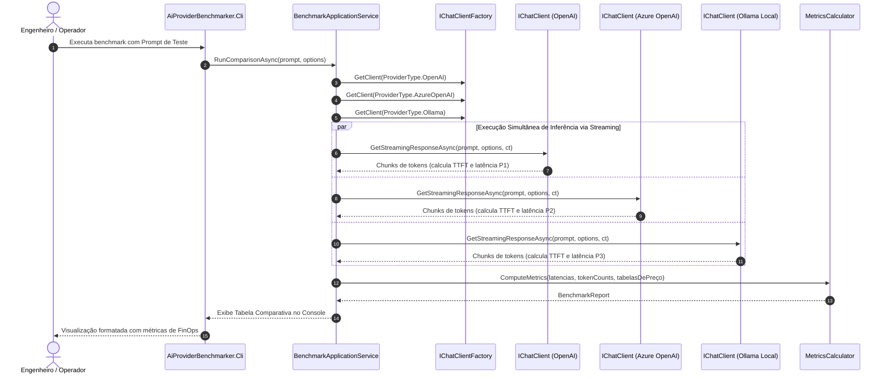

# Módulo 01: Fundamentos de Conectividade e Abstração Unificada com `Microsoft.Extensions.AI` — Guia de Estudo e Especificação de Engenharia

> **Status:** Especificação Oficial de Estudo & Arquitetura  
> **Versão do .NET:** .NET 10 (LTS)  
> **Linguagem:** C# 14  
> **Pacote Central:** `Microsoft.Extensions.AI.Abstractions` / `Microsoft.Extensions.AI`  
> **Projeto Integrador Associado:** `src/Modulo01_AiProviderBenchmarker/` (`AiProviderBenchmarker.Cli`)

---

## 1. Visão Geral e Metas de Aprendizado

### 1.1 O Problema Real de Mercado
Historicamente, sistemas que consom modelos de linguagem no ecossistema de software sofrem com **Vendor Lock-in** severo. Desenvolvedores acoplam diretamente seus códigos aos SDKs oficiais proprietários (ex.: SDK da OpenAI, biblioteca proprietária da Anthropic ou SDK do Google Cloud). 

Quando a organização precisa:
1. Trocar de modelo para cortar custos operacionais (FinOps);
2. Implementar failover dinâmico em caso de indisponibilidade de um datacenter;
3. Comparar empiricamente latência, qualidade e custo entre múltiplos fornecedores;

A equipe se depara com a necessidade de refatorar dezenas de classes de negócio, converter DTOs incompatíveis e reescrever pipelines de streaming. 

A biblioteca unificada **`Microsoft.Extensions.AI` (MEAI)**, consolidada no .NET 10 LTS, resolve este problema na camada de infraestrutura, fornecendo a interface padrão da indústria **`IChatClient`**, análoga ao que `ILogger` e `IHttpClientFactory` representam para logging e chamadas HTTP no ecossistema .NET.

### 1.2 Habilidades Adquiridas ao Concluir Este Módulo
- Dominar o funcionamento, métodos e ciclo de vida da interface `IChatClient`.
- Configurar e instanciar provedores heterogêneos (OpenAI, Azure OpenAI, Ollama, Anthropic) sob uma mesma abstração.
- Compreender a anatomia completa de `ChatOptions` e o impacto estatístico e financeiro de parâmetros de amostragem (`Temperature`, `TopP`, `TopK`, `MaxTokens`, `Seed`).
- Consumir respostas de modelos via Streaming assíncrono (`IAsyncEnumerable<StreamingChatCompletionUpdate>`) com alocação quase nula no Garbage Collector (GC).
- Calcular empiricamente métricas de engenharia de IA: **TTFT (Time To First Token)**, **TPS (Tokens Per Second)**, **Latência Total** e **Custo por Requisição**.
- Modelar uma solução em Clean Architecture aplicando Factory, Strategy e os princípios SOLID no consumo de IA.

---

## 2. Fundamentação Teórica Aprofundada

### 2.1 A Arquitetura do `Microsoft.Extensions.AI` (MEAI)
O MEAI é dividido conceitualmente em dois blocos fundamentais:
1. **`Microsoft.Extensions.AI.Abstractions`**: Contém interfaces puras, DTOs e abstrações essenciais (`IChatClient`, `ChatMessage`, `ChatResponse`, `ChatOptions`, `IEmbeddingGenerator`). Não possui dependências pesadas, permitindo que bibliotecas de domínio dependam exclusivamente deste pacote.
2. **`Microsoft.Extensions.AI`**: Implementa o pipeline composicional via `ChatClientBuilder`, middlewares delegados (`DelegatingChatClient`), caching distribuído, rate limiting e instrumentação nativa com OpenTelemetry.

```
+-------------------------------------------------------------------------------+
|                       SEU DOMÍNIO / CASO DE USO                                |
|                                   │                                           |
|                                   ▼  Consome                                  |
|                         [ IChatClient ]                                       |
+───────────────────────────────────┼───────────────────────────────────────────+
                                    │ Implementado por / Adaptado para
                                    ▼
       ┌────────────────────────────┼───────────────────────────┐
       ▼                            ▼                           ▼
[ OpenAIClientAdapter ]    [ AzureOpenAIAdapter ]     [ OllamaChatClient ]
       │                            │                           │
       ▼                            ▼                           ▼
 OpenAI API (Cloud)        Azure AI Foundry (Cloud)     Ollama Runtime (Local)
```

### 2.2 Anatomia do Contrato `IChatClient`
A interface define dois métodos fundamentais para geração conversacional:

```csharp
public interface IChatClient : IDisposable
{
    // Execução Monolítica (Buffered): Aguarda toda a resposta ser gerada
    Task<ChatResponse> GetResponseAsync(
        IEnumerable<ChatMessage> chatMessages,
        ChatOptions? options = null,
        CancellationToken cancellationToken = default);

    // Execução Streaming (Reativa): Emite chunks conforme os tokens são sintetizados
    IAsyncEnumerable<StreamingChatCompletionUpdate> GetStreamingResponseAsync(
        IEnumerable<ChatMessage> chatMessages,
        ChatOptions? options = null,
        CancellationToken cancellationToken = default);

    // Retorna serviços subjacentes ou metadados de capacidades suportadas
    object? GetService(Type serviceType, object? serviceKey = null);
}
```

### 2.3 Parâmetros de Inferência e Hiperparâmetros em `ChatOptions`
Cada inferência enviada a uma LLM pode ser modulada para controlar determinismo, criatividade e custos:

| Parâmetro | Tipo | Comportamento Técnico e Impacto |
| :--- | :--- | :--- |
| **`Temperature`** | `float?` (0.0 a 2.0) | Controla a entropia da distribuição de probabilidade dos logits. Valores próximos a `0.0` tornam a amostragem quase *greedy* (determinística e focada nas palavras de maior probabilidade). Valores altos (> `0.8`) aumentam a variabilidade e a aleatoriedade. |
| **`TopP` (Nucleus Sampling)** | `float?` (0.0 a 1.0) | Filtra os tokens candidatos cuja soma cumulativa de probabilidades atinge o limiar $P$. Ex.: `0.9` descarta os 10% de tokens mais improváveis da cauda longa. Recomendação de engenharia: altere `Temperature` **OU** `TopP`, raramente ambos simultaneamente. |
| **`TopK`** | `int?` | Restringe a amostragem exclusivamente aos $K$ tokens mais prováveis no vocabulário. (Muito utilizado em modelos Anthropic e Gemini). |
| **`MaxOutputTokens`** | `int?` | Teto absoluto de tokens que a LLM tem permissão de sintetizar antes de interromper a chamada com `FinishReason.Length`. Protege contra loops infinitos de geração e custos astronômicos. |
| **`StopSequences`** | `IList<string>` | Lista de strings sentinelas. Se o modelo emitir qualquer um desses padrões, a geração é imediatamente interrompida. |
| **`Seed`** | `long?` | Semente pseudoaleatória para incentivar determinismo e reprodutibilidade em testes de regressão (disponível em provedores como OpenAI e Azure). |

### 2.4 Métricas Fundamentais de Performance e FinOps de LLM

Ao avaliar um provedor de inferência, quatro métricas quantitativas formam o SLA da aplicação:

1. **TTFT (Time To First Token)**:
   $$TTFT = T_{\text{primeiro\_token}} - T_{\text{início\_da\_requisição}}$$
   - Mede o tempo de processamento de entrada (*prompt prefill*), tráfego de rede e enfileiramento no provedor. É o fator determinante para a percepção humana de responsividade.
2. **Latência Total ($T_{\text{total}}$)**:
   $$T_{\text{total}} = T_{\text{fim\_da\_resposta}} - T_{\text{início\_da\_requisição}}$$
3. **Throughput de Geração (TPS - Tokens Por Segundo)**:
   $$TPS = \frac{\text{Tokens de Saída (Completion Tokens)}}{T_{\text{total}} - TTFT}$$
   - Mede a velocidade bruta de decodificação do motor de inferência (GPUs/NPUs) descartando a latência inicial de conexão.
4. **Custo Financeiro da Inferência**:
   $$\text{Custo Total} = \left(\frac{\text{PromptTokens}}{1000} \times \text{Preço}_{\text{in}}\right) + \left(\frac{\text{CompletionTokens}}{1000} \times \text{Preço}_{\text{out}}\right)$$

### 2.5 Funcionamento Interno no Runtime .NET 10: Concorrência e Alocação
- **Streaming de Baixa Alocação**: No .NET 10, o uso de `IAsyncEnumerable<StreamingChatCompletionUpdate>` permite que a aplicação processe e exiba tokens à medida que chegam via SSE (*Server-Sent Events*), sem precisar alocar um buffer contíguo de strings na memória gerenciada (*Large Object Heap - LOH*).
- **Concorrência não-bloqueante**: Ao comparar 3 provedores, a chamada não deve ser sequencial. Utiliza-se `Task.WhenAll` sobre múltiplos canais assíncronos, permitindo que a `ThreadPool` do .NET processe as streams de forma cooperativa sem contenção de threads.
- **Ciclo de Vida do Cliente**: Instâncias de `IChatClient` são thread-safe para invocações simultâneas de `GetResponseAsync`, mas instâncias de `ChatOptions` **não** devem ser compartilhadas concorrentemente se houver mutação de propriedades.

### 2.6 Armadilhas Comuns de Produção (*Gotchas*)
> [!WARNING]
> **Anti-Pattern 1: Bloquear chamadas assíncronas com `.Result` ou `.Wait()`.**  
> Chamadas a LLMs são inerentemente I/O intensivas e sujeitas a picos de latência (de centenas de milissegundos a vários segundos). Bloquear a thread síncrona causa esgotamento do ThreadPool (*Thread Starvation*) sob carga. Sempre use `await`.

> [!WARNING]
> **Anti-Pattern 2: Não propagar o `CancellationToken`.**  
> Se o usuário cancelar uma tela ou desconectar a requisição HTTP e o token não for repassado para `GetResponseAsync(..., ct)`, a LLM continuará gerando tokens no provedor e você continuará pagando por eles.

> [!WARNING]
> **Anti-Pattern 3: Chaves de API hardcoded no código ou repositório.**  
> Chaves devem residir exclusivamente em variáveis de ambiente, `.NET User Secrets` (em desenvolvimento) ou Azure Key Vault (em produção), respeitando o Fator III do Twelve-Factor App.

---

## 3. Mapeamento de Princípios e Padrões Arquiteturais

### 3.1 Os Princípios SOLID Aplicados

| Princípio | Aplicação Prática no Módulo 01 |
| :--- | :--- |
| **SRP (Single Responsibility)** | Classes distintas para: (1) Orquestrar a execução comparativa (`BenchmarkRunner`); (2) Calcular estatísticas e custos (`MetricsCalculator`); (3) Renderizar resultados na UI/Console (`ConsoleMetricsRenderer`). |
| **OCP (Open/Closed)** | O motor de benchmark aceita qualquer novo provedor de IA que implemente `IChatClient` sem necessitar de alteração em nenhuma linha do código de execução. |
| **LSP (Liskov Substitution)** | Um `OllamaApiClient`, um `AzureOpenAIClient` ou um `OpenAIChatClient` podem ser intercambiados livremente sob a referência `IChatClient`, mantendo o comportamento funcional idêntico perante o domínio. |
| **ISP (Interface Segregation)** | A aplicação depende estritamente da interface `IChatClient` (para chat), não se acoplando a `IEmbeddingGenerator` ou interfaces completas de SDKs proprietários. |
| **DIP (Dependency Inversion)** | Módulos de alto nível dependem da abstração `IChatClient` e de uma fábrica `IChatClientFactory`, registradas no contêiner de Injeção de Dependências nativo do .NET. |

### 3.2 Padrões de Projeto (Design Patterns)
- **Factory Pattern (`IChatClientFactory`)**: Encapsula a lógica de instanciação dos diferentes clientes a partir de configurações de ambiente e parâmetros específicos de cada SDK.
- **Strategy Pattern (`ICostCalculationStrategy`)**: Estratégias desacopladas para calcular os custos com base na tabela de preços específica de cada provedor e modelo.

### 3.3 The Twelve-Factor App & Agent
- **Factor III (Config)**: Configurações como `API_KEY`, `ENDPOINT` e `MODEL_ID` são lidas de variáveis de ambiente com fallback para `appsettings.Development.json`.
- **Factor IV (Backing Services)**: Provedores de IA são tratados como recursos vinculados substituíveis sem alteração do código.
- **Twelve-Factor Agent - Factor 1 (Lógica Determinística vs Modelo Probabilístico)**: O cálculo de métricas de engenharia (latência, custos, TPS) é 100% determinístico e auditável via código C#, enquanto a resposta gerada é tratada como carga útil estocástica.

### 3.4 Diagrama Arquitetural



---

## 4. Checkpoints Cognitivos de Aprendizagem

Antes de iniciar a escrita de código no Projeto Integrador, faça uma autoavaliação com as seguintes questões fundamentais:

### Checkpoint 1: Diferença entre `GetResponseAsync` e `GetStreamingResponseAsync`
**Pergunta:** Em qual cenário corporativo é mandatório utilizar `GetStreamingResponseAsync` em vez de `GetResponseAsync`, e qual é a armadilha de memória a evitar ao exibir dados na UI?  
> **Gabarito Técnico:** O streaming é mandatório em interfaces voltadas a usuários humanos (chatbots, assistentes) para reduzir a latência percebida: o usuário lê o primeiro token em centenas de milissegundos (baixo TTFT) em vez de aguardar a geração completa por dezenas de segundos. A armadilha de memória é concatenar strings primitivas repetidamente via operador `+` em loops de streaming, gerando fragmentação no Garbage Collector. A abordagem correta é utilizar buffers de caracteres (`ValueStringBuilder` / `StringBuilder`) ou redirecionar os chunks diretamente para o stream de saída.

### Checkpoint 2: O papel do Nucleus Sampling (`TopP`) vs `Temperature`
**Pergunta:** Se o seu modelo em produção está gerando respostas muito dispersas e ocasionalmente fictícias em relatórios de auditoria financeira, qual parâmetro você ajusta prioritariamente e por quê?  
> **Gabarito Técnico:** Deve-se reduzir `Temperature` para valores próximos a `0.0` (tornando a geração estritamente focada nos tokens de maior verossimilhança) e/ou fixar `TopP` em valores como `0.1` a `0.2` (restringindo o vocabulário aos tokens mais prováveis). Modelos para tarefas financeiras exigem baixo índice de estocasticidade.

### Checkpoint 3: Isolamento e Intercambialidade com `IChatClient`
**Pergunta:** Se a sua aplicação utiliza `Microsoft.Extensions.AI`, o que deve ser modificado nas camadas de aplicação e domínio se a empresa decidir migrar da OpenAI direta para a nuvem privada Azure OpenAI?  
> **Gabarito Técnico:** Absolutamente nenhuma linha de código de domínio ou aplicação deve ser alterada. Apenas a camada de infraestrutura/composição de dependências (o método `ConfigureServices` ou a fábrica `IChatClientFactory`) altera a instanciação do cliente concreto de `new OpenAIClient(...).AsChatClient(...)` para `new AzureOpenAIClient(...).AsChatClient(...)`. Isso comprova a adesão estrita ao princípio de Substituição de Liskov (LSP) e Inversão de Dependência (DIP).

### Checkpoint 4: Resiliência e Timeouts
**Pergunta:** Por que é um erro confiar apenas no timeout padrão do `HttpClient` ao efetuar chamadas a modelos de linguagem avançados?  
> **Gabarito Técnico:** Modelos de raciocínio complexo (como o OpenAI o1 / o3 ou DeepSeek R1) geram dezenas de "tokens de pensamento" antes de emitir a resposta, o que pode exceder o timeout padrão de 100 segundos do `HttpClient` clássico. O timeout deve ser configurado explicitamente por caso de uso via `CancellationTokenSource.CancelAfter(TimeSpan)` e ajustado dinamicamente com base no `MaxOutputTokens` solicitado.

### Checkpoint 5: Cálculo Preciso de Throughput (TPS)
**Pergunta:** Por que a fórmula $TPS = \frac{\text{TotalTokens}}{\text{LatênciaTotal}}$ é tecnicamente imprecisa para medir a velocidade do motor de inferência?  
> **Gabarito Técnico:** Porque a latência total inclui o tempo de rede inicial e o processamento de todo o prompt de entrada (*prompt evaluation time / TTFT*). Para mensurar a velocidade de decodificação de saída da GPU, deve-se subtrair o TTFT do tempo total e considerar apenas os tokens gerados na resposta (*completion tokens*): $TPS = \frac{\text{CompletionTokens}}{T_{\text{total}} - TTFT}$.

---

## 5. Leituras Recomendadas & Grounding no Microsoft Learn

Consulte a documentação técnica oficial para aprofundamento:

1. **Abstração Oficial de Chat no .NET**:
   - [Documentação do IChatClient no .NET](https://learn.microsoft.com/dotnet/ai/ichatclient)
   - [Referência da API Microsoft.Extensions.AI.IChatClient](https://learn.microsoft.com/dotnet/api/microsoft.extensions.ai.ichatclient?view=net-11.0-pp)
2. **Parâmetros e Opções de Inferência**:
   - [Referência da Classe ChatOptions](https://learn.microsoft.com/dotnet/api/microsoft.extensions.ai.chatoptions?view=net-11.0-pp)
   - [Definição de ChatMessage e ChatRole](https://learn.microsoft.com/dotnet/api/microsoft.extensions.ai.chatmessage?view=net-11.0-pp)
3. **Padrões Assíncronos no .NET**:
   - [IAsyncEnumerable e Fluxos Assíncronos no C#](https://learn.microsoft.com/dotnet/csharp/asynchronous-programming/generate-consume-asynchronous-stream)
   - [Injeção de Dependências no .NET Moderno](https://learn.microsoft.com/dotnet/core/extensions/dependency-injection)

---

## 6. Especificação Técnica do Projeto Integrador

### 6.1 Nome e Propósito do Projeto
- **Identificador:** `AiProviderBenchmarker.Cli`
- **Cenário de Negócio:** A área de Engenharia e FinOps de uma fintech precisa selecionar o modelo de IA ideal para seu novo assistente de atendimento. A aplicação deve disparar prompts de teste concorrentemente para três fornecedores distintos (ex.: OpenAI `gpt-4o-mini`, Azure OpenAI e Ollama local `phi-4`), exibindo os tokens em tempo real e imprimindo um consolidado analítico comparativo com métricas de SLA e custo.

### 6.2 Requisitos Funcionais (RFs)
- **RF-01 (Múltiplos Provedores):** Suportar a configuração de no mínimo três provedores heterogêneos (ex.: OpenAI, Azure OpenAI e Ollama) através da interface comum `IChatClient`.
- **RF-02 (Parametrização Unificada):** Permitir a definição de `ChatOptions` comuns a todos os provedores (`Temperature`, `TopP`, `MaxOutputTokens`).
- **RF-03 (Execução Paralela):** Disparar o mesmo prompt para os provedores configurados de forma concorrente sem que a lentidão de um provedor afete a coleta de métricas dos demais.
- **RF-04 (Streaming e Medição):** Capturar os chunks de tokens via `GetStreamingResponseAsync`, coletando o timestamp exato do primeiro token para cálculo do TTFT.
- **RF-05 (Cálculo de Custos FinOps):** Calcular o custo estimado em dólares de cada inferência com base no consumo de tokens de entrada e saída reportados pelo modelo ou calculados localmente.
- **RF-06 (Relatório Comparativo):** Apresentar no console uma tabela formatada exibindo: Provedor/Modelo, TTFT (ms), Latência Total (s), Tokens de Entrada, Tokens de Saída, TPS (Tokens/s) e Custo Estimado ($).

### 6.3 Requisitos Não-Funcionais (RNFs)
- **RNF-01 (Plataforma Alvo):** .NET 10 (LTS) utilizando C# 14.
- **RNF-02 (Clean Architecture):** Separação estrita em projetos de camada (Domain, Application, Infrastructure, Presentation).
- **RNF-03 (Segurança de Chaves):** As credenciais de API não devem estar codificadas no repositório; devem ser lidas via variáveis de ambiente ou User Secrets.
- **RNF-04 (Cancelamento Gracioso):** Suporte integral a cancelamento via `Ctrl+C` (`CancellationToken`) abortando as requisições HTTP pendentes.
- **RNF-05 (Testabilidade):** Os serviços de negócio e cálculo devem ser 100% testáveis com testes de unidade usando mocks de `IChatClient`.

### 6.4 Estrutura de Diretórios da Solução Recomendada

```
src/Modulo01_AiProviderBenchmarker/
├── AiProviderBenchmarker.sln
├── src/
│   ├── AiProviderBenchmarker.Domain/              # Entidades, Enums, Interfaces de Domínio
│   │   ├── Model/
│   │   │   ├── BenchmarkResult.cs
│   │   │   ├── ProviderMetric.cs
│   │   │   └── ProviderType.cs
│   │   └── Services/
│   │       └── ICostEstimator.cs
│   │
│   ├── AiProviderBenchmarker.Application/         # Casos de Uso, DTOs, Orquestração
│   │   ├── Common/
│   │   │   └── IChatClientFactory.cs
│   │   └── UseCases/
│   │       ├── RunBenchmarkCommand.cs
│   │       └── RunBenchmarkHandler.cs
│   │
│   ├── AiProviderBenchmarker.Infrastructure/      # Implementações dos Adaptadores e Clientes
│   │   ├── Configuration/
│   │   │   └── AiProvidersOptions.cs
│   │   ├── Factories/
│   │   │   └── ChatClientFactory.cs
│   │   └── Pricing/
│   │       └── ModelPricingCatalog.cs
│   │
│   └── AiProviderBenchmarker.Cli/                 # Console App, Injeção de Dependência, UI Spectre
│       ├── Program.cs
│       ├── appsettings.json
│       └── UI/
│           └── TableRenderer.cs
│
└── tests/
    └── AiProviderBenchmarker.Tests/               # Testes Unitários xUnit
        ├── UseCases/
        │   └── RunBenchmarkHandlerTests.cs
        └── Pricing/
            └── CostEstimatorTests.cs
```

### 6.5 Contratos de Interfaces e Entidades (Domain & Application)

Abaixo estão os contratos C# fundamentais que regem o design da solução:

#### Enum de Provedores Homologados
```csharp
namespace AiProviderBenchmarker.Domain.Model;

public enum ProviderType
{
    OpenAi,
    AzureOpenAi,
    Ollama,
    Anthropic
}
```

#### Modelo de Resultado de Métrica do Provedor
```csharp
namespace AiProviderBenchmarker.Domain.Model;

public record ProviderMetric(
    ProviderType Provider,
    string ModelName,
    TimeSpan TimeToFirstToken,
    TimeSpan TotalDuration,
    int InputTokens,
    int OutputTokens,
    decimal EstimatedCostUsd,
    string GeneratedTextSnippet,
    bool Success,
    string? ErrorMessage = null)
{
    public double TokensPerSecond => 
        TotalDuration.TotalSeconds > TimeToFirstToken.TotalSeconds && OutputTokens > 0
            ? OutputTokens / (TotalDuration.TotalSeconds - TimeToFirstToken.TotalSeconds)
            : 0.0;
}
```

#### Contrato da Fábrica de Clientes de IA
```csharp
using Microsoft.Extensions.AI;
using AiProviderBenchmarker.Domain.Model;

namespace AiProviderBenchmarker.Application.Common;

public interface IChatClientFactory
{
    IChatClient CreateClient(ProviderType providerType);
    IEnumerable<ProviderType> GetConfiguredProviders();
}
```

#### Contrato do Estimador de Custo (FinOps)
```csharp
using AiProviderBenchmarker.Domain.Model;

namespace AiProviderBenchmarker.Domain.Services;

public interface ICostEstimator
{
    decimal CalculateCost(ProviderType provider, string modelName, int inputTokens, int outputTokens);
}
```

#### Contrato do Caso de Uso de Benchmark
```csharp
using AiProviderBenchmarker.Domain.Model;
using Microsoft.Extensions.AI;

namespace AiProviderBenchmarker.Application.UseCases;

public record RunBenchmarkCommand(
    string Prompt,
    ChatOptions Options,
    IReadOnlyList<ProviderType> ProvidersToBenchmark);

public interface IRunBenchmarkUseCase
{
    Task<IReadOnlyList<ProviderMetric>> ExecuteAsync(
        RunBenchmarkCommand command, 
        IProgress<(ProviderType Provider, string Chunk)>? streamProgress = null,
        CancellationToken cancellationToken = default);
}
```

### 6.6 Definição de Pronto (*Definition of Done - DoD*)
- [ ] A solução compila em .NET 10 sem *warnings* ou erros de compilação com `<Nullable>enable</Nullable>`.
- [ ] O projeto integra pelo menos três provedores distintos (ex.: OpenAI, Azure OpenAI e Ollama local) através da interface `IChatClient`.
- [ ] A execução simultânea é confirmada via logs ou saída visual, sem chamadas bloqueantes em série.
- [ ] As métricas de TTFT, TPS, Latência e Custo são calculadas de acordo com as fórmulas matemáticas da Seção 2.4.
- [ ] O encerramento via `CancellationToken` (Ctrl+C) cancela os fluxos em execução imediatamente sem gerar exceções não tratadas (*unhandled exceptions*).
- [ ] A suíte de testes unitários cobre os casos de sucesso, cálculo de custo e tolerância a falhas quando um provedor falha (isolando o erro sem derrubar o benchmark dos demais).

---

## 7. Roteiro Passo a Passo de Construção (Build Roadmap)

Siga este passo a passo para desenvolver o projeto integrador de forma incremental:

1. **Fase 1: Inicialização da Solução e Estrutura**
   - Criar a solução .NET 10: `dotnet new sln -n AiProviderBenchmarker`.
   - Criar os projetos de biblioteca de classes e console com separação de pastas (`Domain`, `Application`, `Infrastructure`, `Cli`, `Tests`).
   - Instalar os pacotes essenciais:
     - `Microsoft.Extensions.AI` e `Microsoft.Extensions.AI.Abstractions`
     - `Microsoft.Extensions.Hosting` e `Microsoft.Extensions.Configuration`
     - `Spectre.Console` (para exibição profissional de tabelas no terminal)
     - `xUnit`, `FluentAssertions` e `NSubstitute` nos testes.

2. **Fase 2: Camada de Domínio e Custos**
   - Implementar os records e enums (`ProviderType`, `ProviderMetric`).
   - Implementar a tabela de preços e o serviço `CostEstimator` com testes unitários cobrindo as regras financeiras de precificação de tokens.

3. **Fase 3: Camada de Infraestrutura e Adaptação de Clientes**
   - Configurar o `AiProvidersOptions` com binding via `appsettings.json` e variáveis de ambiente.
   - Implementar a `ChatClientFactory` instanciando os adaptadores concretos para OpenAI, Azure e Ollama (`OllamaChatClient`).

4. **Fase 4: Caso de Uso de Execução Concorrente**
   - Implementar o `RunBenchmarkHandler` utilizando `Task.WhenAll`.
   - Criar o wrapper que encapsula a medição de tempo:
     - Iniciar `Stopwatch`.
     - Chamar `client.GetStreamingResponseAsync(...)`.
     - Capturar a chegada do primeiro chunk para fixar o `TimeToFirstToken`.
     - Iterar sobre os demais chunks acumulando tokens e texto.
     - Parar o `Stopwatch` e calcular as métricas.

5. **Fase 5: Interface de Console e Apresentação**
   - Implementar a CLI com `Spectre.Console`.
   - Criar a visualização que exibe os provedores rodando e imprime a tabela final ordenada pelo menor tempo de resposta ou custo.

6. **Fase 6: Testes e Validação Final**
   - Criar testes com mocks garantindo que, se um provedor lançar `HttpRequestException` (queda de rede), os demais provedores continuam executando e o relatório exibe a falha sem abortar a aplicação.
